---


---

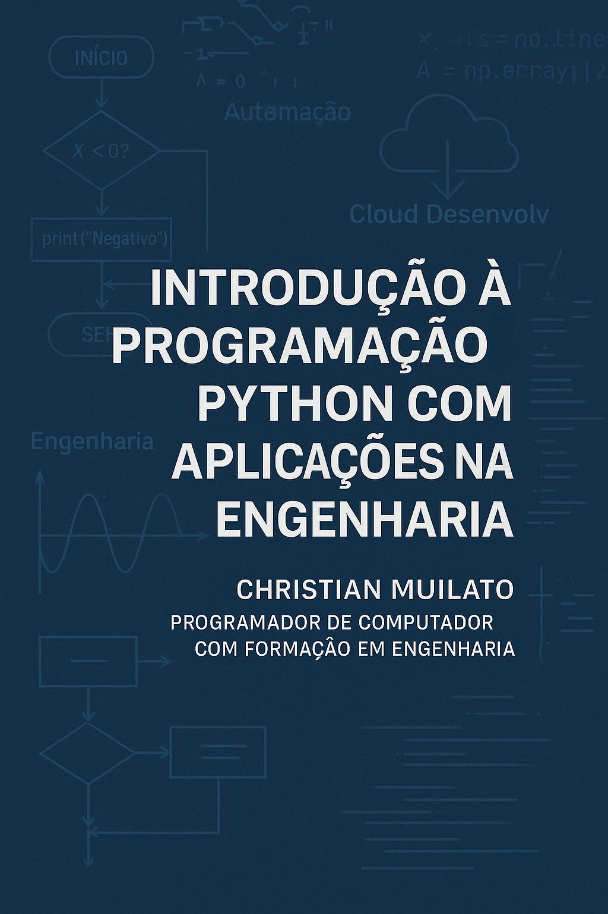

---

### Título: Introdução à Programação Python Aplicada à Engenharia
### Autor: Christian Vladimir Uhdre Mulato

### Sumário

1. [Apresentação](#1-apresentação)

2. [Fundamentos da Programação em Python](#2-fundamentos-da-programação-em-python)
   - [2.1. Tipos de Dados em Python](#21-tipos-de-dados-em-python)
   - [2.2. Operadores Aritméticos e Lógicos em Python](#22-operadores-aritméticos-e-lógicos-em-python)
   - [2.3. Entrada e Saída de Dados em Python](#23-entrada-e-saída-de-dados-em-python)
   - [2.4. Primeiros Cálculos Aplicados à Engenharia](#24-primeiros-cálculos-aplicados-à-engenharia)
   - [2.5. Conclusão](#25-conclusão)

3. [Estruturas de Controle](#3-estruturas-de-controle)
   - [3.1. Condicionais: IF, ELIF, ELSE](#31-condicionais-if-elif-else)
   - [3.2. Laços de Repetição: FOR, WHILE](#32-laços-de-repetição-for-while)
   - [3.3. Aplicações Práticas em Verificação de Condições Operacionais](#33-aplicações-práticas-em-verificação-de-condições-operacionais)
   - [3.4. Conclusão](#34-conclusão)

4. [Funções e Modularização](#4-funções-e-modularização)
   - [4.1. Definição de Funções](#41-definição-de-funções)
   - [4.2. Parâmetros e Retorno](#42-parâmetros-e-retorno)
   - [4.3. Organização de Código em Módulos Reutilizáveis](#43-organização-de-código-em-módulos-reutilizáveis)
   - [4.4. Conclusão](#44-conclusão)

5. [Estruturas de Dados](#5-estruturas-de-dados)
   - [5.1. Listas, Tuplas e Dicionários](#51-listas-tuplas-e-dicionários)
   - [5.2. Iteração e Manipulação de Dados](#52-iteração-e-manipulação-de-dados)
   - [5.3. Aplicações em Vetores de Parâmetros de Processo](#53-aplicações-em-vetores-de-parâmetros-de-processo)
   - [5.4. Conclusão](#54-conclusão)

6. [Manipulação de Arquivos e Dados](#6-manipulação-de-arquivos-e-dados)
   - [6.1. Leitura e Escrita de Arquivos .txt e .csv](#61-leitura-e-escrita-de-arquivos-txt-e-csv)
   - [6.2. Introdução à Biblioteca PANDAS](#62-introdução-à-biblioteca-pandas)
   - [6.3. Análise de Dados Experimentais e Simulações Computacionais](#63-análise-de-dados-experimentais-e-simulações-computacionais)
   - [6.4. Conclusão](#64-conclusão)

7. [Visualização de Dados](#7-visualização-de-dados)
   - [7.1. MAT_PLOT_LIB e SEABORN: Ferramentas Essenciais para Visualização de Dados em Python](#71-mat_plot_lib-e-seaborn-ferramentas-essenciais-para-visualização-de-dados-em-python)
   - [7.2. Tipos de Gráficos: Escolhendo a Representação Visual Adequada](#72-tipos-de-gráficos-escolhendo-a-representação-visual-adequada)
   - [7.3. Visualização de Curvas e Resultado de Processos](#73-visualização-de-curvas-e-resultado-de-processos)
   - [7.4. Conclusão](#74-conclusão)

8. [Cálculo Numérico com NUMPY](#8-cálculo-numérico-com-numpy)
   - [8.1. Arrays e Operações Vetoriais](#81-arrays-e-operações-vetoriais)
   - [8.2. Matrizes e Álgebra Linear](#82-matrizes-e-álgebra-linear)
   - [8.3. Aplicações em Balanços e Sistemas Lineares](#83-aplicações-em-balanços-e-sistemas-lineares)
   - [8.4. Conclusão](#84-conclusão)

9. [Modelagem Matemática Simples](#9-modelagem-matemática-simples)
   - [9.1. Equações Algébricas e Sistemas Lineares](#91-equações-algébricas-e-sistemas-lineares)
   - [9.2. Equações Diferenciais Ordinárias (EDOs)](#92-equações-diferenciais-ordinárias-edos)
   - [9.3. Simulações de Tanques, Reatores e Processos Dinâmicos](#93-simulações-de-tanques-reatores-e-processos-dinâmicos)
   - [9.4. Otimização de Funções com scipy.optimize](#94-otimização-de-funções-com-scipyoptimize)
   - [9.5. Conclusão](#95-conclusão)

10. [Mini Projetos Aplicados à Engenharia](#10-mini-projetos-aplicados-à-engenharia)
    - [10.1. Estudo de Caso: Tanque com Entrada e Saída](#101-estudo-de-caso-tanque-com-entrada-e-saída)
    - [10.2. Balanço de Massa e Energia com Dados Reais ou Simulados](#102-balanço-de-massa-e-energia-com-dados-reais-ou-simulados)
    - [10.3. Integração de Módulos Anteriores em Soluções Práticas](#103-integração-de-módulos-anteriores-em-soluções-práticas)
    - [10.4. Conclusão](#104-conclusão)

11. [Finalização e Agradecimentos](#11-finalização-e-agradecimentos)

12. [Configuração do Ambiente Python e VS Code](#12-configuração-do-ambiente-python-e-vs-code)
    - [12.1. Python](#121-python)
    - [12.2. Visual Studio Code (VS Code)](#122-visual-studio-code-vs-code)

13. [Referências Bibliográficas](#13-referências-bibliográficas)

---

# 1. Apresentação

A presente apostila tem como objetivo introduzir os conceitos fundamentais de programação em linguagem Python com foco na aplicação em problemas práticos de engenharia. Python é uma linguagem moderna, acessível e amplamente adotada nas áreas de ciência, tecnologia e automação de processos industriais. Seu ecossistema rico em bibliotecas permite que engenheiros realizem desde simples análises numéricas até simulações e otimizações complexas com rapidez e precisão.
O conteúdo foi organizado em módulos progressivos, partindo dos fundamentos da programação até aplicações reais por meio de projetos. A ideia é desenvolver a lógica de programação, incentivar a experimentação e fortalecer a capacidade de modelar problemas de engenharia utilizando ferramentas computacionais.

Ao final, o leitor será capaz de:

- Compreender os principais conceitos da linguagem Python.
- Resolver problemas matemáticos aplicados à engenharia com auxílio de bibliotecas como NUM_PY, PANDAS, MAT_PLOT_LIB e SCI_PY.
- Modelar, simular e visualizar sistemas físicos e processos.
- Desenvolver soluções computacionais práticas com uma abordagem estruturada.

Esta apostila é indicada para estudantes de cursos técnicos e superiores em engenharia e áreas afins, bem como profissionais que desejam iniciar no uso da programação para aplicações técnicas.

Boa leitura e bons estudos!

- Christian V. Uhdre Mulato
- Engenheiro Químico e Desenvolvedor de Sistemas

Campo Largo – PR

---

# 2. Fundamentos da Programação em Python

Este primeiro módulo tem como objetivo estabelecer uma base sólida em programação Python, essencial para todas as aplicações que veremos ao longo desta apostila. Dominar os fundamentos da linguagem é crucial para compreender e desenvolver soluções computacionais eficazes para problemas de engenharia.

Neste módulo, vamos explorar os tipos de dados fundamentais em Python, como números inteiros (INT), números de ponto flutuante (FLOAT), cadeias de caracteres (STR) e valores booleanos (BOOL). Entender como representar e manipular esses diferentes tipos de dados é o primeiro passo para realizar cálculos e processar informações em Python.

Além disso, abordaremos os operadores aritméticos e lógicos, que nos permitem realizar operações matemáticas e tomar decisões lógicas dentro dos nossos programas. A capacidade de realizar cálculos e avaliar condições é fundamental para resolver problemas de engenharia, desde a análise de dados experimentais até a modelagem de sistemas físicos.

Finalmente, introduziremos os conceitos de entrada e saída de dados, ensinando como interagir com o usuário e como ler e escrever informações. Também daremos os primeiros passos na aplicação desses conhecimentos em cálculos simples voltados para a engenharia, preparando o terreno para problemas mais complexos nos módulos seguintes.

Ao concluir estes módulos, você estará apto a escrever programas Python simples, mas poderosos, que podem realizar cálculos, manipular dados e interagir com o mundo exterior, lançando as bases para sua jornada na programação aplicada à engenharia.

---

## 2.1. Tipos de Dados em Python

Em Python, assim como em outras linguagens de programação, os dados são classificados em diferentes tipos. Cada tipo de dado possui características e comportamentos específicos, o que permite ao computador interpretar e manipular as informações corretamente.

Nesta seção, vamos explorar os quatro tipos de dados fundamentais:
- inteiros (INT),
- números de ponto flutuante (FLOAT),
- cadeias de caracteres (STR) e
- booleanos (BOOL).

### 2.1.1. Inteiros (INT)

O tipo de dado int representa números inteiros, ou seja, números que não possuem parte decimal. Eles podem ser positivos, negativos ou zero. 

Exemplos em engenharia: 

- Número de peças em um sistema: numero_pecas = 150
- Quantidade de andares de um edifício: andares = 12
- Número de iterações em um cálculo: iteracoes = 1000

### 2.1.2. Números de Ponto Flutuante (FLOAT)

O tipo de dado `float` representa números reais, ou seja, números que podem possuir uma parte decimal.

Exemplos em engenharia:

- Aceleração da gravidade: `gravidade = 9.81` (m/s²)
- Tensão em um circuito elétrico: `tensao = 220.5` (V)
- Coeficiente de atrito: `atrito = 0.25`
- Vazão de um fluido: `vazao = 2.75` (m³/s)
- Temperatura de um processo: `temperatura = 37.5` (°C)

### 2.1.3. Cadeias de Caracteres (STR)

O tipo de dado `str` representa texto, ou seja, uma sequência de caracteres. As cadeias de caracteres são delimitadas por aspas simples (') ou aspas duplas (").

Exemplos em engenharia:

- Nome de um material: `material = "Aço Carbono"`
- Descrição de um componente: `componente = "Válvula de Segurança"`
- Unidade de medida: `unidade = "MPa"` (MegaPascal)
- Resultado de um ensaio: `resultado_ensaio = "Aprovado"`

### 2.1.4. Booleanos (BOOL)

O tipo de dado `bool` representa valores lógicos, ou seja, verdadeiro (True) ou falso (False). Eles são fundamentais para realizar testes condicionais e controlar o fluxo de execução de um programa.

Exemplos em engenharia:

- Status de um sensor: `sensor_ligado = True`
- Verificação de um limite: `temperatura_acima_limite = False`
- Condição de falha: `falha_detectada = False`
- Estado de uma válvula: `valvula_aberta = True`

Compreender esses tipos de dados é essencial para escrever programas que manipulem informações de forma correta e eficiente em aplicações de engenharia.

### 2.1.5. Exemplo: Cálculo da Tensão em um Resistor

Imagine que você precisa calcular a tensão em um resistor usando a Lei de Ohm (V = I * R), onde:
- **V** é a tensão (em Volts)
- **I** é a corrente (em Amperes)
- **R** é a resistência (em Ohms)

Além disso, vamos verificar se a potência dissipada no resistor (P = V * I) excede um valor limite.

**Código em Python:**

```python
# Definição das variáveis

# Corrente elétrica (float)
corrente = 2.0  # Amperes

# Resistência elétrica (float)
resistencia = 10.0  # Ohms

# Limite de potência (float)
potencia_limite = 20.0  # Watts

# Nome do resistor (string)
nome_resistor = "R1"

# Cálculo da tensão (float)
tensao = corrente * resistencia

# Cálculo da potência (float)
potencia = tensao * corrente

# Verificação da potência (bool)
potencia_excede_limite = potencia > potencia_limite

# Exibição dos resultados
print("Cálculo da Tensão e Potência em um Resistor")
print("------------------------------------------")
print("Nome do Resistor:", nome_resistor)
print("Corrente (A):", corrente)
print("Resistência (Ω):", resistencia)
print("Tensão (V):", tensao)
print("Potência (W):", potencia)
print("Potência excede o limite?", potencia_excede_limite)

# Conversão de tipo (demonstração)
# Converter a tensão para inteiro (truncando a parte decimal)
tensao_inteira = int(tensao)
print("Tensão (V, inteiro):", tensao_inteira)
```

**Como usar este código no Visual Studio Code:**

1. Abra o Visual Studio Code.
2. Crie um arquivo e salve-o como `01_codigo_calculo_resistor.py`.
3. Copie e cole o código acima no arquivo.
4. Execute o código:
    - Clique com o botão direito no editor e selecione "Executar Python no Terminal".
    - Ou abra o terminal integrado e digite:  
      `python 01_codigo_calculo_resistor.py`
5. Observe a saída no terminal.

**Explicação do Código:**

- **Tipos de Dados:**  
  O código demonstra o uso de `float` para grandezas físicas, `str` para o nome do resistor e `bool` para o resultado da comparação.
- **Cálculos:**  
  Realiza cálculos típicos de engenharia elétrica usando operadores aritméticos.
- **Tomada de Decisão:**  
  Utiliza uma expressão booleana para simular uma verificação de segurança.
- **Saída Formatada:**  
  Imprime os resultados de forma clara.
- **Conversão de Tipo:**  
  Demonstra como converter um valor `float` para `int`.

**Resultado:**

```plaintext
Cálculo da Tensão e Potência em um Resistor
------------------------------------------
Nome do Resistor: R1
Corrente (A): 2.0
Resistência (Ω): 10.0
Tensão (V): 20.0
Potência (W): 40.0
Potência excede o limite? True
Tensão (V, inteiro): 20
```

Este exemplo prático mostra como os tipos de dados fundamentais são aplicados em um problema simples de engenharia, combinando cálculo, lógica e representação de informações do mundo real.

---

### 2.1.6. Exemplo: Simulação da Trajetória de um Projétil

Neste exemplo, vamos simular a trajetória de um projétil lançado sob um ângulo e com uma velocidade inicial, e gerar um gráfico da trajetória. Este exemplo combina física básica com a visualização de dados.

**Código em Python:**
```python
import matplotlib.pyplot as plt
import math

# Dados de entrada (tipos float e int)
velocidade_inicial = 20.0  # m/s
angulo_graus = 45       # graus
angulo_radianos = math.radians(angulo_graus) # conversão para radianos
gravidade = 9.81       # m/s²
tempo_total = (2 * velocidade_inicial * math.sin(angulo_radianos)) / gravidade

# Listas para armazenar os pontos da trajetória (listas de floats)
tempos = []
posicoes_x = []
posicoes_y = []

# Cálculo da trajetória
intervalo_tempo = 0.1  # segundos
tempo = 0.0

while tempo <= tempo_total:
    tempos.append(tempo)
    posicao_x = velocidade_inicial * math.cos(angulo_radianos) * tempo
    posicao_y = velocidade_inicial * math.sin(angulo_radianos) * tempo - 0.5 * gravidade * tempo**2
    posicoes_x.append(posicao_x)
    posicoes_y.append(posicao_y)
    tempo += intervalo_tempo

# Nome do projétil (string)
nome_projétil = "Projétil A"

# Geração do gráfico
plt.plot(posicoes_x, posicoes_y)
plt.title("Trajetória de um Projétil")
plt.xlabel("Distância Horizontal (m)")
plt.ylabel("Altura (m)")
plt.grid(True)

# Adicionando informações textuais ao gráfico
plt.text(0, max(posicoes_y) * 0.9, f"Velocidade Inicial: {velocidade_inicial} m/s", fontsize=9)
plt.text(0, max(posicoes_y) * 8, f"Ângulo: {angulo_graus} graus", fontsize=9)
plt.text(0, max(posicoes_y) * 0.7, nome_projétil, fontsize=12, color='red')

plt.show()

# Imprimindo informações relevantes (demonstração de uso de tipos)
print(f"Tempo total de voo: {tempo_total:.2f} s")  # Formatação de float
print(f"Tipo da variável 'nome_projétil': {type(nome_projétil)}") # Mostrando o tipo
print(f"A altura máxima atingida foi: {max(posicoes_y):.2f} m")
```

**Resultado:**
```plaintext
Tempo total de voo: 2.04 s
Tipo da variável 'nome_projétil': <class 'str'>
A altura máxima atingida foi: 10.20 m
```

**Como usar este código no Visual Studio Code:**
1. **Abra o Visual Studio Code.**
2. **Crie um arquivo** e salve-o como 02_codigo_trajetoria_projetil.py.
3. **Copie e cole o código** acima no arquivo.
4. **Certifique-se de ter o Matplotlib instalado.** Se não tiver, abra o terminal no VS Code e digite: pip install matplotlib e pressione Enter.
5. **Execute o código** da mesma forma que no exemplo anterior.
6. **Observe a saída:** Além da saída no terminal, uma janela com o gráfico da trajetória do projétil será exibida.

**Explicação do Código:**

**Tipos de Dados:**
- **FLOAT:** Usado para velocidade, ângulo (em radianos), gravidade, tempo e as posições x e y.
- **INT:** Usado para o ângulo em graus.
- **STR:** Usado para o nome do projétil.
- **LIST:** Usado para armazenar sequências de valores de tempo, posições x e posições y. Listas são estruturas de dados que armazenam múltiplos valores do mesmo tipo (neste caso, float).

**Cálculos:** O código realiza cálculos de física para determinar a trajetória do projétil, decompondo a velocidade inicial em componentes horizontal e vertical e usando as equações do movimento uniformemente variado.

**Visualização:** A biblioteca matplotlib.pyplot é usada para criar o gráfico da trajetória. plt.plot() desenha a linha, plt.title(), plt.xlabel(), plt.ylabel() e plt.grid() definem o título, rótulos dos eixos e a grade do gráfico, respectivamente. plt.show() exibe o gráfico. plt.text() adiciona texto informativo ao gráfico.

**Estruturas de Dados:** As listas tempos, posicoes_x e posicoes_y são usadas para armazenar múltiplos valores de dados, o que é essencial para plotar o gráfico.

**Conversão de Tipo:** A função math.radians() converte o ângulo de graus para radianos, demonstrando a conversão entre tipos relacionados.

**Formatação de Saída:** O uso de f-strings (strings formatadas) com especificadores de formatação (:.2f) permite controlar o número de casas decimais na saída. type() é usado para exibir o tipo de uma variável.

Este exemplo é mais complexo e demonstra como os tipos de dados são usados em conjunto com cálculos matemáticos e bibliotecas de visualização para resolver e apresentar um problema de engenharia de forma completa.

**Resultado:**

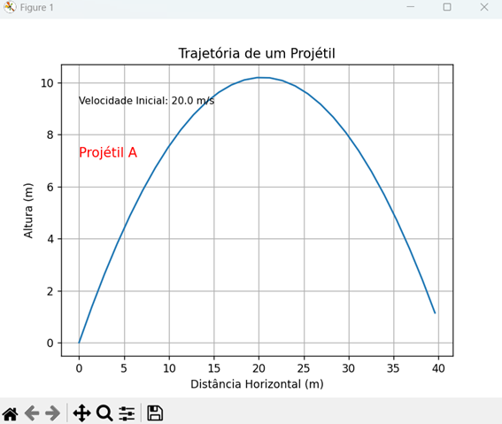

---

## 2.2. Operadores Aritméticos e Lógicos em Python

Em Python, operadores são símbolos especiais que realizam operações em valores (chamados de operandos). Eles são essenciais para realizar cálculos, comparações e manipular dados em geral. Nesta seção, vamos explorar os operadores aritméticos e lógicos, que são fundamentais para a programação em engenharia.

### 2.2.1. Operadores Aritméticos

**Código Python:**
```python
# Exemplo de uso de operadores aritméticos
a = 10
b = 5

soma = a + b
subtracao = a - b
multiplicacao = a * b
divisao = a / b

print("Soma:", soma)
print("Subtração:", subtracao)
print("Multiplicação:", multiplicacao)
print("Divisão:", divisao)
```

**Resultado:**
```plaintext
Soma: 15
Subtração: 5
Multiplicação: 50
Divisão: 2.0
```

Os operadores aritméticos são usados para realizar operações matemáticas básicas.

**Adição (+):** Soma dois valores. 
        Exemplo: forca1 + forca2
 (soma de duas forças)

**Subtração (-):** Subtrai o segundo valor do primeiro. 
        Exemplo: temperatura_final - temperatura_inicial
 (variação de temperatura)

**Multiplicação (*):** Multiplica dois valores. 
        Exemplo: comprimento * largura
(área de uma superfície)

**Divisão (/):** Divide o primeiro valor pelo segundo (sempre retorna um FLOAT). 
        Exemplo: distancia / tempo
 (velocidade média)

**Divisão Inteira (//):** Divide o primeiro valor pelo segundo e retorna a parte inteira do resultado (truncando a parte decimal). 
        Exemplo: total_pecas // pecas_por_caixa
 (número de caixas completas)

**Módulo (%):** Retorna o resto da divisão do primeiro valor pelo segundo. 
        Exemplo: total_segundos % 60
 (obter os segundos restantes após dividir por 60)

**Exponenciação (**):** Eleva o primeiro valor à potência do segundo valor. 
        Exemplo: base ** altura

### 2.2.2. Operadores Lógicos

Os operadores lógicos são usados para combinar ou negar expressões lógicas (valores booleanos True ou False).

**AND (and):** Retorna True se ambas as expressões forem True. 
        Exemplo: temperatura > temperatura_minima and pressao < pressao_maxima
 (verificar se a temperatura está dentro da faixa e a pressão também)

**OR (or):** Retorna True se pelo menos uma das expressões for True. 
        Exemplo: nivel_tanque < nivel_minimo or valvula_emergencia_aberta
 (verificar se o nível do tanque está baixo ou a válvula de emergência está aberta)
 
**NOT (not):** Nega uma expressão (inverte seu valor lógico). 
        Exemplo: not sensor_ativado
 (verificar se o sensor não está ativado)

 ---

 ### 2.2.3. Exemplos Aplicados à Engenharia

**1) Cálculo da Área de um Retângulo:**

```python
comprimento = 10.5  # metros (float)
largura = 5.0     # metros (float)
area = comprimento * largura  # metros quadrados (float)
print("Área do retângulo:", area, "m²")
```

**Resultado:**
```plaintext
Área do retângulo: 52.5 m²
```
**2) Verificação de Condições de Segurança:**

```python
pressao = 250.0  # PSI (float)
temperatura = 120.0 # graus Celsius (float)
pressao_maxima = 240.0 # PSI (float)
temperatura_maxima = 110.0 # graus Celsius (float)

seguro = pressao <= pressao_maxima and temperatura <= temperatura_maxima # bool

print("Condições de operação seguras:", seguro)
```
**Resultado:**
```plaintext
Condições de operação seguras: False
```
**3) Cálculo de Força Resultante:**
```python
massa = 5.0  # kg (float)
aceleracao = 9.8  # m/s² (float)
forca_resultante = massa * aceleracao  # N (float)
print("Força resultante:", forca_resultante, "N")
```
**Resultado:**
```plaintext
Força resultante: 49.0 N
```

Este texto fornece uma base sólida sobre operadores aritméticos e lógicos, juntamente com exemplos práticos de como eles são usados em contextos de engenharia.

---

### 2.2.4. Exercício Proposto: Cálculo de Área e Perímetro de um Terreno e Verificação de Viabilidade

**Descrição:**

Um engenheiro civil precisa desenvolver um programa em Python para auxiliar no cálculo da área e perímetro de um terreno retangular e verificar se ele atende a certos critérios de viabilidade para construção.

**Requisitos:**

1. **Entrada de Dados:**
    - O programa deve solicitar ao usuário que insira o comprimento e a largura do terreno em metros.
    - O programa deve solicitar ao usuário a área mínima permitida para construção no local.

2. **Cálculos:**
    - Calcular a área do terreno (`área = comprimento * largura`).
    - Calcular o perímetro do terreno (`perímetro = 2 * (comprimento + largura)`).

3. **Verificação de Viabilidade:**
    - Verificar se a área do terreno é maior ou igual à área mínima permitida para construção.
    - Verificar se o perímetro do terreno é menor que um valor máximo (por exemplo, 100 metros - este valor pode ser fixo no programa).

4. **Saída de Dados:**
    - Exibir a área e o perímetro do terreno com duas casas decimais.
    - Exibir uma mensagem indicando se o terreno é viável para construção, com base nos critérios de área e perímetro.

**Exemplo de Interação:**

```plaintext
Digite o comprimento do terreno (m): 50
Digite a largura do terreno (m): 30
Digite a área mínima permitida para construção (m²): 1000
Área do terreno: 1500.00 m²
Perímetro do terreno: 160.00 m
Terreno viável para construção: Sim
```

**Dicas:**
- Use os tipos de dados `float` para representar as medidas do terreno e a área mínima.
- Use os operadores aritméticos `*`, `+` e `/` para realizar os cálculos.
- Use os operadores lógicos `>=` e `<` e o operador `and` para realizar as verificações de viabilidade.
- Use a função `input()` para obter os dados do usuário.
- Use a função `print()` para exibir os resultados.
- Use f-strings para formatar a saída com duas casas decimais.

**Código Python de Exemplo:**

```python
# Solicitar entrada do usuário
comprimento = float(input("Digite o comprimento do terreno (m): "))
largura = float(input("Digite a largura do terreno (m): "))
area_minima = float(input("Digite a área mínima permitida para construção (m²): "))

# Calcular área e perímetro
area = comprimento * largura
perimetro = 2 * (comprimento + largura)

# Verificar viabilidade
viavel = area >= area_minima and perimetro < 100

# Exibir resultados
print(f"Área do terreno: {area:.2f} m²")
print(f"Perímetro do terreno: {perimetro:.2f} m")
print(f"Terreno viável para construção: {'Sim' if viavel else 'Não'}")
```

**Resultado:**

```plaintext
Área do terreno: 1500.00 m²
Perímetro do terreno: 160.00 m
Terreno viável para construção: Sim
```

Este exercício combina o uso de tipos de dados, operadores aritméticos e lógicos em um contexto prático de engenharia civil, proporcionando uma aplicação mais completa dos conceitos aprendidos.

---

### 2.2.5. Exercício Proposto: Análise da Deformação de uma Viga

**Descrição:**

Um engenheiro mecânico precisa analisar a deformação de uma viga sob diferentes cargas. O programa em Python deve calcular a deflexão da viga em função da posição ao longo do seu comprimento e gerar um gráfico da deflexão.

**Requisitos:**

1. **Entrada de Dados:**
    - O programa deve solicitar ao usuário que insira o comprimento da viga (L) em metros.
    - O programa deve solicitar ao usuário o módulo de elasticidade do material da viga (E) em Pascal (Pa).
    - O programa deve solicitar ao usuário o momento de inércia da seção transversal da viga (I) em m⁴.
    - O programa deve solicitar ao usuário o tipo de carregamento (1 para carga uniforme, 2 para carga pontual no meio).
    - Se o carregamento for uniforme, solicitar a intensidade da carga (w) em N/m.
    - Se o carregamento for pontual, solicitar a magnitude da carga (P) em N.

2. **Cálculos:**
    - Calcular a deflexão (y) da viga em função da posição (x) ao longo do comprimento, usando as seguintes fórmulas:

    - **Deflexão para Carga Uniforme:**
        ```
        y = (w / (24 * E * I)) * (-x⁴ + 2 * L * x³ - L³ * x)
        ```

    - **Deflexão para Carga Pontual:**
        ```
        Para 0 ≤ x ≤ L/2:
        y = (P * x / (48 * E * I)) * (3 * L² - 4 * x²)

        Para L/2 < x ≤ L:
        y = (P * (L - x) / (48 * E * I)) * (3 * L² - 4 * (L - x)²)
        ```

    Onde:
    - y = Deflexão da viga
    - x = Posição ao longo do comprimento da viga
    - w = Intensidade da carga uniforme
    - P = Magnitude da carga pontual
    - L = Comprimento da viga
    - E = Módulo de elasticidade
    - I = Momento de inércia

3. **Geração do Gráfico:**
    - Usar a biblioteca `matplotlib` para gerar um gráfico da deflexão (y) em função da posição (x).
    - O gráfico deve ter título, rótulos nos eixos e grade.

4. **Saída de Dados:**
    - Exibir os valores de entrada (L, E, I, w ou P).
    - Exibir o valor máximo da deflexão.
    - Salvar o gráfico em um arquivo PNG.

**Exemplo de Interação:**

```plaintext
Digite o comprimento da viga (m): 5
Digite o módulo de elasticidade (Pa): 200000000000
Digite o momento de inércia (m^4): 0.0001
Digite o tipo de carregamento (1-Uniforme, 2-Pontual): 1
Digite a intensidade da carga (N/m): 1000
```

**Código Python de Exemplo:**

```python
import matplotlib.pyplot as plt

# Entrada de dados
L = float(input("Digite o comprimento da viga (m): "))
E = float(input("Digite o módulo de elasticidade (Pa): "))
I = float(input("Digite o momento de inércia (m^4): "))
tipo_carregamento = int(input("Digite o tipo de carregamento (1-Uniforme, 2-Pontual): "))

if tipo_carregamento == 1:
    w = float(input("Digite a intensidade da carga uniforme (N/m): "))
    P = 0
elif tipo_carregamento == 2:
    P = float(input("Digite a magnitude da carga pontual (N): "))
    w = 0
else:
    print("Tipo de carregamento inválido.")
    exit()

# Cálculo da deflexão
num_pontos = 100
x_valores = [i * L / num_pontos for i in range(num_pontos + 1)]
y_valores = []

for x in x_valores:
    if tipo_carregamento == 1:
        y = (w / (24 * E * I)) * (-x**4 + 2 * L * x**3 - L**3 * x)
    elif tipo_carregamento == 2:
        if 0 <= x <= L / 2:
            y = (P * x / (48 * E * I)) * (3 * L**2 - 4 * x**2)
        else:
            y = (P * (L - x) / (48 * E * I)) * (3 * L**2 - 4 * (L - x)**2)
    y_valores.append(y)

# Geração do gráfico
plt.plot(x_valores, y_valores)
plt.title("Deflexão da Viga")
plt.xlabel("Posição (m)")
plt.ylabel("Deflexão (m)")
plt.grid(True)
plt.savefig("deflexao_viga.png")
plt.show()

# Saída de dados
print("\nComprimento da viga:", L, "m")
print("Módulo de elasticidade:", E, "Pa")
print("Momento de inércia:", I, "m^4")
if tipo_carregamento == 1:
    print("Carga uniforme:", w, "N/m")
elif tipo_carregamento == 2:
    print("Carga pontual:", P, "N")
print("Deflexão máxima:", max(y_valores), "m")
print("Gráfico da deflexão salvo como deflexao_viga.png")
```

**Resultado:**

```plaintext
Digite o comprimento da viga (m): 5
Digite o módulo de elasticidade (Pa): 200000000000
Digite o momento de inércia (m^4): 0.0001
Digite o tipo de carregamento (1-Uniforme, 2-Pontual): 1
Digite a intensidade da carga (N/m): 1000
Deflexão máxima: 0.01042 m
Gráfico da deflexão salvo como deflexao_viga.png
```

**Gráfico:**

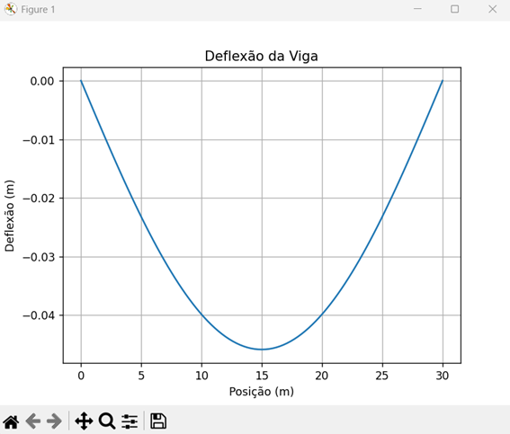

---

Este exercício é mais completo e envolve:
- Entrada de dados variados (comprimento, propriedades do material, tipo e intensidade de carregamento).
- Cálculos condicionais (usando IF e ELIF) para aplicar a fórmula correta de deflexão.
- Uso de listas para armazenar múltiplos valores de X e Y para plotagem.
- Geração de um gráfico com `matplotlib` para visualizar a deformação da viga.
- Saída formatada dos resultados.

Este tipo de problema é representativo de análises comuns em engenharia mecânica e demonstra a utilidade da programação para resolver problemas complexos e visualizar resultados.

---

### 2.2.6. Curiosidade – Mecânica dos Sólidos

No exemplo do cálculo da deflexão da viga, a teoria física aplicada é a da **Mecânica dos Sólidos**, especificamente a **Teoria da Elasticidade Linear** para vigas. As fórmulas utilizadas derivam das equações da linha elástica, que descrevem o comportamento de vigas sob flexão.

**Fórmulas e Teoria Detalhada:**

1.	**Deflexão para Carga Uniforme:**

**Fórmula:**
```
y = (w / (24 * E * I)) * (-x⁴ + 2 * L * x³ - L³ * x)
```
**Teoria:**
- Esta fórmula é derivada da equação diferencial da linha elástica para uma viga submetida a uma carga uniformemente distribuída.
- A equação da linha elástica relaciona a curvatura da viga com o momento fletor interno.
- As suposições incluem que o material da viga é linearmente elástico, homogêneo e isotrópico, e que as deflexões são pequenas em comparação com o comprimento da viga.

2.	**Deflexão para Carga Pontual:**

**Fórmula:**
```
    Para 0 <= x <= L/2:
    y = (P * x / (48 * E * I)) * (3 * L² - 4 * x²)

    Para L/2 < x <= L:
    y = (P * (L - x) / (48 * E * I)) * (3 * L² - 4 * (L - x)²)
```

**Teoria:**
- Estas fórmulas são derivadas da equação da linha elástica para uma viga com uma carga concentrada aplicada no meio do vão.
- Existem duas equações porque o comportamento da viga é diferente à esquerda e à direita da carga pontual.
- As mesmas suposições da teoria da carga uniforme se aplicam aqui.

Onde:
- y = Deflexão da viga (deslocamento vertical)
- x = Posição ao longo do comprimento da viga
- L = Comprimento total da viga
- E = Módulo de elasticidade do material (resistência do material à deformação elástica)
- I = Momento de inércia da seção transversal da viga (resistência da seção da viga à flexão)
- w = Intensidade da carga uniforme (força por unidade de comprimento)
- P = Magnitude da carga pontual (força concentrada)

**Importância na Engenharia:**

Essas fórmulas e a teoria da flexão de vigas são fundamentais na engenharia estrutural e mecânica. Engenheiros usam esses princípios para:
- Dimensionar vigas: Determinar as dimensões e o material de uma viga para suportar cargas com segurança e dentro de limites aceitáveis de deflexão.
- Analisar estruturas: Calcular as tensões e deformações em estruturas que contêm vigas.
- Projetar máquinas: Garantir que os componentes de máquinas que atuam como vigas (eixos, suportes etc.) funcionem corretamente.

Compreender a teoria por trás das fórmulas é crucial para aplicar corretamente os resultados dos cálculos e garantir a segurança e a eficiência dos projetos de engenharia.

---

## 2.3. Entrada e Saída de Dados em Python

Em programação, a entrada e saída de dados referem-se à forma como um programa recebe informações (entrada) e como ele apresenta os resultados (saída). Em Python, as funções input() e print() são as mais comuns para realizar essas operações.

### 2.3.1. Entrada de Dados: input()

A função `input()` permite que o programa receba dados do usuário através do teclado.

- **Sintaxe:** `variavel = input("Mensagem para o usuário")`
- **Funcionamento:**
    1. A função `input()` exibe a mensagem para o usuário (prompt) na tela.
    2. O usuário digita a informação e pressiona Enter.
    3. A função `input()` retorna a informação digitada como uma string.
    4. A informação retornada é atribuída à variável.

- **Importante:** Mesmo que o usuário digite números, a função `input()` sempre retorna uma STRING. Se você precisar usar a entrada como número, será necessário convertê-la explicitamente usando as funções `int()` (para inteiros) ou `float()` (para números de ponto flutuante).

- **Exemplos em engenharia:**

Solicitar ao usuário o diâmetro de um tubo:

```python
diametro_tubo = float(input("Digite o diâmetro do tubo (em metros): "))
print("Diâmetro do tubo:", diametro_tubo, "m")
```

Pedir a vazão de um fluido:

```python
vazao_fluido = float(input("Digite a vazão do fluido (em m³/s): "))
print("Vazão do fluido:", vazao_fluido, "m³/s")
```

Obter o nome de um material:

```python
nome_material = input("Digite o nome do material: ")
print("Nome do material:", nome_material)
```
### 2.3.2. Saída de Dados: print()

A função `print()` exibe informações na tela do computador.

- **Sintaxe:** `print(argumento1, argumento2, ..., argumentoN)`
- **Funcionamento:**
    1. A função `print()` exibe os valores dos argumentos na tela.
    2. Os argumentos podem ser variáveis, valores literais (números, strings etc.) ou expressões.
    3. Múltiplos argumentos são separados por vírgula, e a função `print()` os exibe separados por espaço.
    4. Por padrão, a função `print()` adiciona uma quebra de linha ao final da saída, ou seja, o próximo `print()` exibirá na linha seguinte.
- **Formatação de saída:** Python oferece várias maneiras de formatar a saída para torná-la mais clara e organizada. As f-strings (strings formatadas) são uma forma conveniente de formatar strings incluindo variáveis.
- **Exemplos em engenharia:**

Exibir o resultado de um cálculo:

```python
resultado = 2 + 2
print("O resultado da soma é:", resultado)
```

Mostrar uma mensagem de alerta:

```python
print("Atenção: Verifique os dados de entrada!")
```

Exibir informações formatadas:

```python
nome_material = "Aço"
diametro_tubo = 0.1
print(f"Dados do tubo:")
print(f"Nome do material: {nome_material}")
print(f"Diâmetro: {diametro_tubo} m")
```

Apresentar os dados de um experimento:

```python
temperatura = 25.5
pressao = 101.3
print(f"Dados do experimento:")
print(f"Temperatura: {temperatura} °C")
print(f"Pressão: {pressao} kPa")
```

A habilidade de obter dados do usuário e apresentar resultados de forma clara é fundamental para criar programas interativos e úteis em engenharia.

---

### 2.3.4. Exercício Proposto: Cálculo de Conversão em um Reator

**Descrição:**

Um engenheiro químico precisa de um programa para calcular a conversão de um reagente em um reator.  
O programa deve solicitar ao usuário a quantidade inicial do reagente, a quantidade final após a reação e exibir a conversão calculada. Além disso, deve pedir informações sobre o tipo de reator e o tempo de reação.

**Requisitos:**

1. **Entrada de Dados:**
    - O programa deve solicitar ao usuário o nome do reagente (`str`).
    - O programa deve solicitar ao usuário a quantidade inicial do reagente em mols (`float`).
    - O programa deve solicitar ao usuário a quantidade final do reagente em mols (`float`).
    - O programa deve solicitar ao usuário o tipo do reator (`str`).
    - O programa deve solicitar ao usuário o tempo de reação em minutos (`float`).

2. **Cálculo:**

Calcular a conversão do reagente usando a fórmula:

```python
conversao = (quantidade_inicial - quantidade_final) / quantidade_inicial * 100
```

3. **Saída de Dados:**
    - Exibir o nome do reagente.
    - Exibir a quantidade inicial e final do reagente, formatadas com 2 casas decimais.
    - Exibir a conversão calculada, formatada como porcentagem com 2 casas decimais (ex: 80.00%).
    - Exibir o tipo do reator e o tempo de reação.

**Exemplo de Interação:**

```plaintext
Digite o nome do reagente: Amoníaco
Digite a quantidade inicial do reagente (em mols): 10.0
Digite a quantidade final do reagente (em mols): 2.0
Digite o tipo do reator: Reator de Batelada
Digite o tempo de reação (em minutos): 30.0
Reagente: Amoníaco
Quantidade inicial: 10.00 mols
Quantidade final: 2.00 mols
Conversão: 80.00%
Tipo do reator: Reator de Batelada
Tempo de reação: 30.00 minutos
```

**Código Python de Exemplo:**

```python
# Solicitar entrada do usuário
nome_reagente = input("Digite o nome do reagente: ")
quantidade_inicial = float(input("Digite a quantidade inicial do reagente (em mols): "))
quantidade_final = float(input("Digite a quantidade final do reagente (em mols): "))
tipo_reator = input("Digite o tipo do reator: ")
tempo_reacao = float(input("Digite o tempo de reação (em minutos): "))

# Cálculo da conversão
conversao = (quantidade_inicial - quantidade_final) / quantidade_inicial * 100

# Exibir resultados
print(f"\nReagente: {nome_reagente}")
print(f"Quantidade inicial: {quantidade_inicial:.2f} mols")
print(f"Quantidade final: {quantidade_final:.2f} mols")
print(f"Conversão: {conversao:.2f}%")
print(f"Tipo do reator: {tipo_reator}")
print(f"Tempo de reação: {tempo_reacao:.2f} minutos")
```

**Dicas:**
- Use a função `input()` para obter os dados do usuário.
- Use os tipos de dados `float` e `str` para armazenar os valores.
- Lembre-se de converter as entradas numéricas de `input()` para `float`.
- Use f-strings para formatar a saída, especialmente a conversão (:.2f%).

---

#### Figura 2.3.1 – Esquema Técnico

```plain
+---------------------+
|   Programa Python   |
+---------------------+
         ||
+---------------------+
|   Entrada de Dados  |
+---------------------+
         ||
+---------------------+
|       input()       |
+---------------------+
         ||
+-----------------------------+
|  Dados do Usuário (Teclado) |
+-----------------------------+
         ||
+-------------------------------+
| Processamento (Cálculos, Lógica) |
+-------------------------------+
         ||
+---------------------+
|   Saída de Dados    |
+---------------------+
         ||
+---------------------+
|      print()        |
+---------------------+
         ||
+---------------------+
|    Resultados       |
|      (Tela)         |
+---------------------+
         ||
```

**Descrição do Esquema:**
1.	**Programa Python:** Representa o código Python que o engenheiro escreve para resolver um problema específico (e.g., cálculo de tensões, simulação de um circuito).
2.	**input() function:** Indica o ponto onde o programa interage com o usuário para receber dados. A função input() aguarda que o usuário digite informações através do teclado.
3.	**Dados do Usuário (Teclado):** Mostra a entrada de dados feita pelo usuário, que podem ser valores numéricos, texto etc.
4.	**Processamento (Cálculos, Lógica):** Representa a parte do programa onde os dados de entrada são manipulados, cálculos são realizados, decisões lógicas são tomadas etc.
5.	**print() function:** Indica o ponto onde o programa exibe os resultados ou informações para o usuário. A função print() envia a saída para a tela.
6.	**Resultados (Tela):** Mostra a saída do programa, que pode incluir números, texto, mensagens, gráficos (em módulos mais avançados) etc.

**Detalhes Técnicos:**
- O esquema é genérico e se aplica a muitos programas que interagem com o usuário.
- As setas indicam a direção do fluxo de dados.
- Os retângulos representam componentes ou processos do programa.
- Não há cores para manter o estilo técnico.

Este esquema ajuda a visualizar o fluxo de informações em um programa Python, desde a obtenção dos dados até a apresentação dos resultados.

**Código Python:**

```python
# Entrada de dados
nome_reagente = input("Digite o nome do reagente: ")
quantidade_inicial = float(input("Digite a quantidade inicial de " + nome_reagente + " (mols): "))
quantidade_final = float(input("Digite a quantidade final de " + nome_reagente + " (mols): "))
tipo_reator = input("Digite o tipo do reator: ")
tempo_reacao = float(input("Digite o tempo de reação (minutos): "))

# Cálculo da conversão
conversao = (quantidade_inicial - quantidade_final) / quantidade_inicial

# Saída de dados
print("\nReagente:", nome_reagente)
print(f"Quantidade Inicial: {quantidade_inicial:.2f} mols")
print(f"Quantidade Final: {quantidade_final:.2f} mols")
print(f"Conversão: {conversao * 100:.2f} %")
print("Tipo do Reator:", tipo_reator)
print("Tempo de Reação:", tempo_reacao, "minutos")
```

**Resultado:**
```plaintext
Reagente: Amoníaco
Quantidade Inicial: 10.00 mols
Quantidade Final: 2.00 mols
Conversão: 80.00 %
Tipo do Reator: Reator de Batelada
Tempo de Reação: 30.00 minutos
```
Este exercício aborda um problema prático de engenharia química e reforça o uso de entrada e saída de dados com formatação.

---

## 2.4. Primeiros Cálculos Aplicados à Engenharia

Nesta seção, vamos explorar como aplicar os fundamentos da programação Python para realizar cálculos simples em problemas de engenharia. Os exemplos a seguir ilustram como usar os tipos de dados, operadores aritméticos e entrada/saída para resolver tarefas comuns em diferentes disciplinas da engenharia.


### 2.4.1. Engenharia Civil: Cálculo da Área de uma Viga

**Problema:** Calcular a área da seção transversal de uma viga retangular.
**Fórmula:** Área = base * altura
**Código Python:**
```python
# Entrada de dados
base = float(input("Digite a base da viga (m): "))
altura = float(input("Digite a altura da viga (m): "))

# Cálculo da área
area = base * altura

# Saída de dados
print(f"A área da seção transversal da viga é: {area:.2f} m²")
```

**Resultado:**
```plaintext
Digite a base da viga (m): 0.3
Digite a altura da viga (m): 0.5
A área da seção transversal da viga é: 0.15 m²
```

### 2.4.2. Engenharia Elétrica: Lei de Ohm

**Problema:** Calcular a corrente elétrica em um resistor dado a tensão e a resistência.
**Fórmula:** Corrente = Tensão / Resistência
**Código Python:**
```python
# Entrada de dados
tensao = float(input("Digite a tensão (V): "))
resistencia = float(input("Digite a resistência (Ω): "))

# Cálculo da corrente
corrente = tensao / resistencia

# Saída de dados
print(f"A corrente elétrica é: {corrente:.2f} A")
```

**Resultado:**
```plaintext
A corrente elétrica é: 2.00 A
```

### 2.4.3. Engenharia Mecânica: Energia Potencial Gravitacional

**Problema:** Calcular a energia potencial gravitacional de um objeto.
**Fórmula:** Energia Potencial = massa * gravidade * altura
**Código Python:**
```python
# Entrada de dados
massa = float(input("Digite a massa do objeto (kg): "))
gravidade = 9.81  # Aceleração da gravidade (m/s²)
altura = float(input("Digite a altura (m): "))
# Cálculo da energia potencial
energia_potencial = massa * gravidade * altura
# Saída de dados
print(f"A energia potencial gravitacional é: {energia_potencial:.2f} J")
```

**Resultado:**
```plaintext
Digite a massa do objeto (kg): 10
Digite a altura (m): 5
A energia potencial gravitacional é: 490.50 J
```

### 2.4.4. Engenharia Química: Vazão Molar

**Problema:** Converter vazão mássica para vazão molar.
**Fórmula:** Vazão Molar = Vazão Mássica / Massa Molar
**Código Python:**
```python
# Entrada de dados
vazao_massica = float(input("Digite a vazão mássica (kg/s): "))
massa_molar = float(input("Digite a massa molar (kg/mol): "))

# Cálculo da vazão molar
vazao_molar = vazao_massica / massa_molar

# Saída de dados
print(f"A vazão molar é: {vazao_molar:.2f} mol/s")
```

**Resultado:**
```plaintext
A vazão molar é: 2.00 mol/s
```

### 2.4.5. Engenharia Ambiental: Cálculo de Concentração

**Problema:** Calcular a concentração de um poluente em uma solução.
**Fórmula:** Concentração = Massa do Poluente / Volume da Solução
**Código Python:**
```python
# Entrada de dados
massa_poluente = float(input("Digite a massa do poluente (kg): "))
volume_solucao = float(input("Digite o volume da solução (m³): "))

# Cálculo da concentração
concentracao = massa_poluente / volume_solucao

# Saída de dados
print(f"A concentração do poluente é: {concentracao:.2f} kg/m³")
```

**Resultado:**
```plaintext
Digite a massa do poluente (kg): 0.5
Digite o volume da solução (m³): 2
A concentração do poluente é: 0.25 kg/m³
```

---

### 2.5. Conclusão

Estes exemplos demonstram como os conceitos básicos de Python podem ser aplicados para resolver problemas simples em diferentes áreas da engenharia.
Eles reforçam a importância de:
- Entender os tipos de dados apropriados para representar grandezas físicas.
- Utilizar os operadores aritméticos corretamente para realizar os cálculos.
- Interagir com o usuário para obter os dados necessários e apresentar os resultados de forma clara.
Nos próximos módulos, exploraremos conceitos mais avançados de Python para resolver problemas de engenharia mais complexos.

---

# 3. Estrutura de Controle

Neste módulo sobre estrutura de controle, exploramos os tipos de dados, operadores e entrada/saída, que nos permitem realizar cálculos e interagir com o usuário. No entanto, a capacidade de um programa de tomar decisões e repetir ações é fundamental para resolver problemas mais complexos. É aqui que entram as estruturas de controle.
Este módulo é dedicado ao estudo das estruturas de controle em Python, que são ferramentas essenciais para direcionar o fluxo de execução de um programa. Vamos nos aprofundar em como controlar quais partes do código são executadas e quantas vezes, com base em condições específicas.
Primeiramente, abordaremos as condicionais (IF, ELIF, ELSE). As condicionais permitem que o programa escolha diferentes caminhos de execução, dependendo se uma determinada condição é verdadeira ou falsa. Isso é crucial para implementar a lógica de decisão em problemas de engenharia, como verificar se um sensor excedeu um limite de segurança ou classificar dados de acordo com critérios específicos.
Em seguida, exploraremos os laços de repetição (FOR, WHILE). Os laços de repetição nos permitem executar um bloco de código repetidamente, até que uma condição seja satisfeita. Isso é extremamente útil para automatizar tarefas repetitivas, como iterar sobre conjuntos de dados, realizar cálculos iterativos ou simular o comportamento de sistemas ao longo do tempo.
Finalmente, demonstraremos aplicações práticas em verificação de condições operacionais. Através de exemplos relevantes para a engenharia, mostraremos como as estruturas de controle podem ser usadas para monitorar processos, garantir a segurança de sistemas e automatizar a tomada de decisões em tempo real.
Ao concluir este módulo, você estará apto a desenvolver programas Python que não apenas realizam cálculos, mas também tomam decisões lógicas e executam ações repetitivas, abrindo caminho para a criação de soluções de engenharia mais robustas e inteligentes.

---

## 3.1. Condicionais: if, elif, else

As estruturas condicionais são fundamentais para controlar o fluxo de execução de um programa, permitindo que diferentes blocos de código sejam executados dependendo se uma condição é verdadeira ou falsa. Em Python, as palavras-chave if, elif (abreviação de "else if") e else são usadas para definir essas estruturas.

### 3.1.1. A estrutura if

A estrutura if é a mais básica e executa um bloco de código somente se uma condição especificada for verdadeira.

**Sintaxe:**
```python
if condição:
    # bloco de código a ser executado se a condição for verdadeira
    pass
```
**Funcionamento:**
- A condição é uma expressão que pode ser avaliada como True (verdadeiro) ou False (falso).
- Se a condição for True, o bloco de código indentado abaixo do if é executado.
- Se a condição for False, o bloco de código é ignorado e o programa continua a execução na próxima linha após o bloco if.

- **Exemplo em engenharia:** Verificar se a temperatura de um sistema excedeu um limite de segurança.

**Código Python:**
```python
indice_poluicao = float(input("Digite o índice de poluição do ar: "))

if indice_poluicao <= 50:
    print("Qualidade do ar: Boa")
elif indice_poluicao <= 100:
    print("Qualidade do ar: Moderada")
elif indice_poluicao <= 150:
    print("Qualidade do ar: Insatisfatória")
elif indice_poluicao <= 200:
    print("Qualidade do ar: Ruim")
else:
    print("Qualidade do ar: Muito Ruim")
```
**Resultado:**

```plaintext
Digite o índice de poluição do ar: 75
Qualidade do ar: Moderada
```

---


### 3.1.2. A estrutura if-else

A estrutura if-else permite executar um bloco de código se a condição for verdadeira e outro bloco de código se a condição for falsa.
**Sintaxe:**

```python
if condição:
    # bloco de código a ser executado se a condição for verdadeira
    pass
else:
    # bloco de código a ser executado se a condição for falsa
    pass
```

**Funcionamento:**
- A condição é avaliada.
- Se a condição for True, o bloco de código do if é executado.
- Se a condição for False, o bloco de código do else é executado.
- Apenas um dos blocos de código (o do if ou o do else) é executado.

- **Exemplo em engenharia:** Classificar um material como "resistente" ou "não resistente" com base em um teste de tensão.

**Código Python:**

```python
tensao = float(input("Digite a tensão aplicada (N/m²): "))
limite = 100.0

if tensao > limite:
    print("Material não resistente.")
else:
    print("Material resistente.")
```

**Resultado:**

```plaintext
Digite a tensão aplicada (N/m²): 75
Material resistente.
```
---

### 3.1.3. A estrutura if-elif-else

A estrutura if-elif-else permite verificar múltiplas condições em sequência. O elif (else if) especifica uma nova condição a ser verificada se a condição anterior for falsa.

**Sintaxe:**

```python
if condição1:
    # bloco de código a ser executado se condição1 for verdadeira
    pass
elif condição2:
    # bloco de código a ser executado se condição2 for verdadeira
    pass
else:
    # bloco de código a ser executado se nenhuma das condições anteriores for verdadeira
    pass
```

**Funcionamento:**
- As condições são avaliadas em ordem.
- Se uma condição for True, o bloco de código correspondente é executado e o restante da estrutura (elif e else) é ignorado.
- Se nenhuma condição for True, o bloco de código do else (se houver) é executado.
- Pode haver qualquer número de blocos elif. O bloco else é opcional.

**Exemplo em engenharia:** Classificar a qualidade do ar com base no índice de poluição.

**Código Python:**
```python
indice_poluicao = float(input("Digite o índice de poluição do ar: "))

if indice_poluicao <= 50:
    print("Qualidade do ar: Boa")
elif indice_poluicao <= 100:
    print("Qualidade do ar: Moderada")
elif indice_poluicao <= 150:
    print("Qualidade do ar: Insatisfatória")
elif indice_poluicao <= 200:
    print("Qualidade do ar: Ruim")
else:
    print("Qualidade do ar: Muito Ruim")
```
**Resultado:**

```plaintext
Digite o índice de poluição do ar: 75
Qualidade do ar: Moderada
```

**Pontos-chave:**
- **Indentação:** A indentação é crucial em Python para definir os blocos de código dentro das estruturas condicionais. O código dentro de um bloco if, elif ou else deve ser indentado.
- **Operadores Lógicos:** As condições nas estruturas condicionais geralmente envolvem operadores lógicos (and, or, not) e operadores de comparação (==, !=, >, <, >=, <=).
- **Flexibilidade:** As estruturas condicionais podem ser aninhadas (uma dentro da outra) para criar lógicas de decisão mais complexas.
Compreender e aplicar corretamente as estruturas condicionais é essencial para desenvolver programas que resolvam problemas reais de engenharia, onde a tomada de decisões é uma parte fundamental do processo.

### 3.1.4. Exercício Proposto: Classificação de Solos

**Descrição:**
Um engenheiro civil precisa de um programa para classificar amostras de solo com base em seu Índice de Plasticidade (IP) e Limite de Liquidez (LL). O programa deve solicitar ao usuário os valores de IP e LL e exibir a classificação do solo de acordo com a tabela a seguir:


**Requisitos:**

1. **Entrada de Dados:**
   - O programa deve solicitar ao usuário o Limite de Liquidez (LL) do solo (FLOAT).
   - O programa deve solicitar ao usuário o Índice de Plasticidade (IP) do solo (FLOAT).
2. **Classificação:**
   - Utilizar estruturas condicionais (IF, ELIF, ELSE) para classificar o solo de acordo com a tabela fornecida.
3. **Saída de Dados:**
   - Exibir o Limite de Liquidez (LL) e o Índice de Plasticidade (IP) inseridos pelo usuário, formatados com duas casas decimais.
   - Exibir a classificação do solo.

**Exemplo de Interação:**
```plaintext
Digite o Limite de Liquidez (LL) do solo: 45
Digite o Índice de Plasticidade (IP) do solo: 25
Limite de Liquidez (LL): 45.00
Índice de Plasticidade (IP): 25.00
Classificação do Solo: Solo Argiloso
```

**Dicas:**

- Use a função input() para obter os valores de LL e IP do usuário.
- Use os tipos de dados FLOAT para armazenar os valores de LL e IP.
- Lembre-se de converter as entradas de input() para FLOAT.
- Use os operadores de comparação (>=, <, ==) e os operadores lógicos (AND, OR, NOT) para implementar as condições de classificação.
- Use f-strings para formatar a saída com duas casas decimais.

**Código Python:**
```python
# Entrada de dados
ll = float(input("Digite o Limite de Liquidez (LL): "))
ip = float(input("Digite o Índice de Plasticidade (IP): "))

# Classificação do solo
if ll >= 50 and ip >= 7:
    classificacao = "Argila"
elif ll < 50 and 4 <= ip < 7:
    classificacao = "Silte"
else:
    classificacao = "Solo Não Plástico"

# Saída de dados
print(f"\nLimite de Liquidez (LL): {ll:.2f}")
print(f"Índice de Plasticidade (IP): {ip:.2f}")
print(f"Classificação do Solo: {classificacao}")
```
**Resultado:**
```plaintext
Limite de Liquidez (LL): 45.00
Índice de Plasticidade (IP): 25.00
Classificação do Solo: Solo Argiloso
```
Este exercício aplica as estruturas condicionais em um problema prático de engenharia civil, demonstrando como a lógica de decisão pode ser implementada em programas para classificar dados e auxiliar na análise de materiais.

### 3.1.5. Curiosidade – Engenharia Civil

Na engenharia civil, a classificação de solos é uma etapa crucial no projeto e construção de fundações, estradas e outras estruturas. A tabela de classificação de solos baseada no Índice de Plasticidade (IP) e Limite de Liquidez (LL) é amplamente utilizada para entender as propriedades mecânicas do solo.
A classificação de solos é baseada em normas técnicas, como a ASTM D2487, que define os critérios para categorizar solos em diferentes grupos, como argilas, siltes e solos não plásticos. Esses grupos são importantes porque influenciam diretamente o comportamento do solo sob carga, sua capacidade de suporte e sua suscetibilidade à deformação.
A tabela de classificação apresentada no exercício é uma simplificação, mas reflete os princípios básicos usados na prática. A classificação correta do solo é essencial para garantir a segurança e a estabilidade das estruturas construídas sobre ele.

### 3.1.6. Conclusão

Dominar as estruturas condicionais **IF, ELIF e ELSE** é um marco importante na jornada de programação. Elas fornecem a base para criar programas que não apenas executam cálculos, mas também respondem dinamicamente a diferentes entradas e condições. Nos próximos itens e módulos, veremos como essa habilidade será aplicada em contextos mais complexos, como laços de repetição, funções e projetos de engenharia.

---

## 3.2. Laços de Repetição: for, while

Os laços de repetição são fundamentais na programação, permitindo que um bloco de código seja executado várias vezes, com base em uma condição. Em Python, os principais tipos de laços são o `for` e o `while`.

O laço `for` é usado para iterar sobre uma sequência (como uma lista, tupla ou string) e executar um bloco de código para cada item da sequência. A sintaxe básica é:

```python
for item in sequencia:
    # bloco de código
```

O laço `while`, por outro lado, executa um bloco de código enquanto uma condição específica for verdadeira. A sintaxe básica é:

```python
while condicao:
    # bloco de código
```
Ambos os tipos de laços são amplamente utilizados em problemas de engenharia, como simulações, otimizações e análises de dados.

### 3.2.1. O laço for

Os laços de repetição são estruturas de controle que permitem executar um bloco de código repetidamente, um número específico de vezes ou enquanto uma condição for verdadeira. Em Python, os dois tipos principais de laços são FOR e WHILE.
O laço `for` é usado para iterar sobre uma sequência (como uma lista, tupla ou string) e executar um bloco de código para cada item da sequência. A sintaxe básica é:

```python
for item in sequencia:
    # bloco de código
```
**Funcionamento:**
- A variável `item` assume o valor de cada elemento da `sequencia` a cada iteração.
- O bloco de código indentado abaixo do `for` é executado para cada item.
- O laço termina quando todos os itens da sequência foram processados.
**Exemplo em engenharia:** Calcular a média de uma série de medidas de temperatura.

```python
temperaturas = [20.5, 22.0, 19.8, 21.5, 23.0]
soma_temperaturas = 0.0
for temperatura in temperaturas:
    soma_temperaturas += temperatura
media_temperatura = soma_temperaturas / len(temperaturas)
print(f"Média de temperatura: {media_temperatura:.2f} °C")
```
**Resultado:**
```plaintext
Média de temperatura: 21.16 °C
```
---

### 3.2.2. O laço while

O laço `while` executa um bloco de código enquanto uma condição específica for verdadeira. É útil quando o número de iterações não é conhecido previamente.

**Sintaxe:**
```python
while condicao:
    # bloco de código
```

**Funcionamento:**
- A condição é avaliada antes de cada iteração.
- Se a condição for True, o bloco de código indentado é executado.
- Após a execução do bloco, a condição é verificada novamente.
- O laço continua até que a condição se torne False.

**Exemplos em engenharia:**
Iterar sobre uma lista de medições de temperatura:
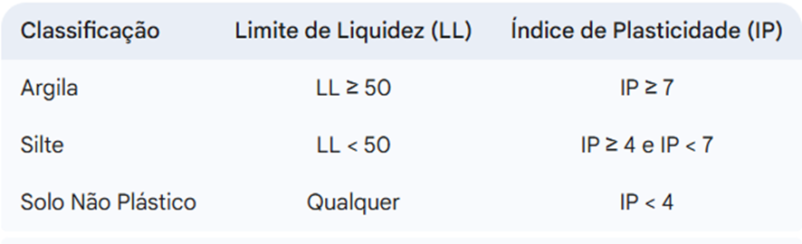 

Calcular a soma dos quadrados dos 10 primeiros números inteiros:

```python
soma_quadrados = 0
contador = 1
while contador <= 10:
    soma_quadrados += contador**2
    contador += 1
print(f"Soma dos quadrados: {soma_quadrados}")
```
**Funcionamento:**
- A condição é avaliada antes de cada iteração.
- Se a condição for True, o bloco de código indentado é executado.
- Após a execução do bloco, a condição é verificada novamente.
- O laço continua até que a condição se torne False.

**Exemplo em engenharia:** Simular o resfriamento de um líquido até atingir uma temperatura segura.

```python
temperatura = 100.0  # Temperatura inicial em °C
while temperatura > 30.0:  # Condição de resfriamento
    print(f"Temperatura atual: {temperatura:.2f} °C")
    temperatura -= 5.0  # Resfriamento de 5 °C por iteração
print("Temperatura segura alcançada.")
```
**Resultado:**
```plaintext
Temperatura atual: 100.00 °C
Temperatura atual: 95.00 °C
Temperatura atual: 90.00 °C
Temperatura atual: 85.00 °C
Temperatura atual: 80.00 °C
Temperatura atual: 75.00 °C
Temperatura atual: 70.00 °C
Temperatura atual: 65.00 °C
Temperatura atual: 60.00 °C
Temperatura atual: 55.00 °C
Temperatura atual: 50.00 °C
Temperatura atual: 45.00 °C
Temperatura atual: 40.00 °C
Temperatura atual: 35.00 °C
Temperatura segura alcançada.
```

**Pontos-chave:**
- **Controle de Iteração:** O laço `for` é ideal quando se sabe o número de iterações ou quando se está iterando sobre uma sequência. O laço `while` é mais flexível, permitindo que o número de iterações dependa de uma condição dinâmica.
- **Condição de Parada:** É crucial definir uma condição de parada para os laços `while` para evitar laços infinitos (onde o laço nunca termina).
- **Variáveis de Controle:** As variáveis usadas nas condições dos laços (como `contador`, `temperatura`, etc.) devem ser atualizadas dentro do laço para garantir que a condição de parada seja eventualmente alcançada.
- **range():** A função `range()` é frequentemente usada com o laço `for` para gerar sequências de números. Por exemplo, `for i in range(10):` itera de 0 a 9.

Os laços de repetição são ferramentas poderosas para automatizar tarefas, processar grandes conjuntos de dados e implementar algoritmos iterativos em diversas aplicações de engenharia. Eles permitem que os engenheiros desenvolvam soluções eficientes e escaláveis para problemas complexos, economizando tempo e esforço no desenvolvimento de software.

---

### 3.2.3. Exercício Proposto: Simulação de um Reator Batelada Isotérmico

**Descrição:**
Um engenheiro químico precisa simular a conversão de um reagente A em um produto B em um reator batelada isotérmico. A reação segue uma cinética de primeira ordem:

```plaintext
Reação: A → B
```

A taxa de reação é dada por:
```math
- rA = -k * CA
```

Onde:
- -rA é a taxa de desaparecimento do reagente A (mol/L·min)
- k é a constante de velocidade da reação (min⁻¹)
- CA é a concentração do reagente A (mol/L)

O programa deve calcular a concentração de A e a conversão de A ao longo do tempo.

**Requisitos:**

1. **Entrada de Dados:**
- O programa deve solicitar ao usuário a concentração inicial de A (CA0) em mol/L (FLOAT).
- O programa deve solicitar ao usuário a constante de velocidade da reação (k) em min⁻¹ (FLOAT).
- O programa deve solicitar ao usuário o tempo total de simulação (tempo_final) em minutos (FLOAT).
- O programa deve solicitar ao usuário o número de pontos no tempo para calcular a concentração (num_pontos) (INT).

2. **Cálculos:**
- Usar um laço for para iterar sobre o tempo, dividindo o tempo total em intervalos iguais.
- Dentro do laço, calcular a concentração de A (CA) em cada ponto no tempo usando a equação integrada para uma reação de primeira ordem em um reator batelada:

```math
CA(t) = CA0 * exp(-k * t)
```

```python
import math

# Entrada de Dados
CA0 = float(input("Concentração inicial de A (CA0) em mol/L: "))
k = float(input("Constante de velocidade da reação (k) em min⁻¹: "))
tempo_final = float(input("Tempo total de simulação (tempo_final) em minutos: "))
num_pontos = int(input("Número de pontos no tempo para calcular a concentração (num_pontos): "))

# Cálculos
tempos = []
concentracoes_A = []
for i in range(num_pontos + 1):
    t = i * (tempo_final / num_pontos)  # Tempo atual
    CA = CA0 * math.exp(-k * t)  # Cálculo da concentração de A
    tempos.append(t)
    concentracoes_A.append(CA)

# Exibição dos resultados
for i in range(len(tempos)):
    print(f"Tempo: {tempos[i]:.1f} min, [A]: {concentracoes_A[i]:.2f} mol/L, [B]: {1 - concentracoes_A[i]:.2f} mol/L")
```

**Saída de Dados:**
```plaintext
Concentração inicial de A (CA0) em mol/L: 1.0
Constante de velocidade da reação (k) em min⁻¹: 0.1
Tempo total de simulação (tempo_final) em minutos: 10
Número de pontos no tempo para calcular a concentração (num_pontos): 10
Tempo: 0.0 min, [A]: 1.00 mol/L, [B]: 0.00 mol/L
Tempo: 1.0 min, [A]: 0.90 mol/L, [B]: 0.10 mol/L
Tempo: 2.0 min, [A]: 0.82 mol/L, [B]: 0.18 mol/L
Tempo: 3.0 min, [A]: 0.74 mol/L, [B]: 0.26 mol/L
Tempo: 4.0 min, [A]: 0.67 mol/L, [B]: 0.33 mol/L
Tempo: 5.0 min, [A]: 0.61 mol/L, [B]: 0.39 mol/L
Tempo: 6.0 min, [A]: 0.55 mol/L, [B]: 0.45 mol/L
Tempo: 7.0 min, [A]: 0.50 mol/L, [B]: 0.50 mol/L
Tempo: 8.0 min, [A]: 0.45 mol/L, [B]: 0.55 mol/L
Tempo: 9.0 min, [A]: 0.41 mol/L, [B]: 0.59 mol/L
Tempo: 10.0 min, [A]: 0.37 mol/L, [B]: 0.63 mol/L
```
Este exercício simula um processo fundamental em engenharia química (reação em reator) e demonstra o uso de laços for para realizar cálculos iterativos ao longo do tempo.

**Dicas:**
- Use a função `input()` para obter os valores de CA0, k, tempo_final e num_pontos do usuário.
- Use os tipos de dados FLOAT para CA0, k e tempo_final, e INT para num_pontos.
- Use a função `math.exp()` para calcular a exponencial na equação da concentração de A.
- Use um laço `for` para iterar sobre o número de pontos no tempo e calcular a concentração de A em cada ponto.
- Use f-strings para formatar a saída com duas casas decimais.

---

### 3.2.4. Curiosidade – Engenharia Química

Na engenharia química, a simulação de reatores é uma prática comum para entender o comportamento de reações químicas em diferentes condições. O exemplo apresentado no exercício propõe uma simulação de um reator batelada isotérmico, onde a concentração de um reagente A diminui ao longo do tempo devido à reação com uma constante de velocidade k.
A cinética de primeira ordem é uma das mais simples e comuns em reações químicas, onde a taxa de reação é proporcional à concentração do reagente. A equação integrada para a concentração de A ao longo do tempo é fundamental para prever como a reação evolui, permitindo aos engenheiros otimizar as condições de operação do reator.
A simulação de reatores é essencial para o design e operação de processos químicos, ajudando a prever a conversão de reagentes, a formação de produtos e a eficiência do processo. Compreender como implementar laços de repetição em Python para simular essas dinâmicas é uma habilidade valiosa para engenheiros químicos.

### 3.2.5. Conclusão

Os laços de repetição `for` e `while` são ferramentas poderosas na programação, permitindo a execução de blocos de código múltiplas vezes com base em condições específicas. Eles são amplamente utilizados em problemas de engenharia para automatizar tarefas, processar dados e simular comportamentos dinâmicos.
Compreender como usar esses laços é essencial para desenvolver programas eficientes e eficazes. Nos próximos módulos, veremos como combinar laços de repetição com outras estruturas de controle, como condicionais e funções, para criar soluções mais complexas e robustas em Python.

---

## 3.3. Aplicações Práticas em Verificação de Condições Operacionais

As estruturas de controle (IF, ELIF, ELSE, FOR, WHILE) são extremamente úteis para monitorar e controlar condições operacionais em sistemas de engenharia. Nesta seção, apresentaremos exemplos práticos de como essas estruturas podem ser aplicadas para garantir a segurança, eficiência e correto funcionamento de processos e equipamentos.

### 3.3.1. Monitoramento de Temperatura em um Reator Químico

Em um reator químico, a temperatura é um parâmetro crítico que deve ser mantido dentro de limites seguros para evitar reações indesejadas ou danos ao equipamento. O código abaixo demonstra como usar condicionais para verificar a temperatura e emitir alertas:

**Código Python:**

```python
temperatura = float(input("Digite a temperatura do reator em °C: "))
if temperatura > 100:
    print("Alerta: Temperatura excessiva!")
elif temperatura < 20:
    print("Alerta: Temperatura muito baixa!")
else:
    print("Temperatura dentro dos limites normais.")
```

**Resultado:**
```plaintext
Digite a temperatura do reator em °C: 120
Alerta: Temperatura excessiva!
Digite a temperatura do reator em °C: 15
Alerta: Temperatura muito baixa!
Digite a temperatura do reator em °C: 50
Temperatura dentro dos limites normais.
```

### 3.3.2. Controle de Nível em um Tanque

O nível de líquido em um tanque é outro parâmetro importante em muitos processos industriais. O código a seguir ilustra como usar condicionais para controlar o nível e acionar bombas ou válvulas:

**Código Python:**

```python
nivel = float(input("Digite o nível do líquido no tanque em %: "))
if nivel > 80:
    print("Alerta: Nível muito alto! Acionando bomba de drenagem.")
elif nivel < 20:
    print("Alerta: Nível muito baixo! Acionando bomba de enchimento.")
else:
    print("Nível dentro dos limites normais.")
```

**Resultado:**
```plaintext
Digite o nível do líquido no tanque em %: 85
Alerta: Nível muito alto! Acionando bomba de drenagem.
Digite o nível do líquido no tanque em %: 15
Alerta: Nível muito baixo! Acionando bomba de enchimento.
Digite o nível do líquido no tanque em %: 50
Nível dentro dos limites normais.
```

### 3.3.3. Verificação de Pressão em um Sistema de Tubulação

A pressão em um sistema de tubulação deve ser monitorada para evitar vazamentos ou rupturas. O código abaixo mostra como usar condicionais para verificar a pressão e emitir avisos:

**Código Python:**

```python
pressao = float(input("Digite a pressão do sistema em bar: "))
if pressao > 10:
    print("Alerta: Pressão excessiva!")
elif pressao < 2:
    print("Alerta: Pressão muito baixa!")
else:
    print("Pressão dentro dos limites normais.")
```

**Resultado:**
```plaintext
Digite a pressão do sistema em bar: 12
Alerta: Pressão excessiva!
Digite a pressão do sistema em bar: 1
Alerta: Pressão muito baixa!
Digite a pressão do sistema em bar: 5
Pressão dentro dos limites normais.
```
### 3.3.4. Contagem de Ciclos de um Equipamento

Em engenharia mecânica, é importante monitorar o número de ciclos de operação de um equipamento para programar a manutenção preventiva. O código a seguir usa um laço WHILE para simular a operação de um equipamento e contar os ciclos:

**Código Python:**

```python
ciclos = 0
while True:
    resposta = input("O equipamento está em operação? (s/n): ")
    if resposta == "s":
        ciclos += 1
        print(f"Ciclos de operação: {ciclos}")
    elif resposta == "n":
        print("Operação encerrada.")
        break
    else:
        print("Resposta inválida.")
```

**Resultado:**
```plaintext
O equipamento está em operação? (s/n): s
Ciclos de operação: 1
O equipamento está em operação? (s/n): s
Ciclos de operação: 2
O equipamento está em operação? (s/n): n
Operação encerrada.
```
### 3.3.5. Análise de Dados de Sensores

Em sistemas de automação, os dados dos sensores precisam ser analisados para tomar decisões em tempo real. O código a seguir usa um laço for para processar dados de um sensor de vibração e identificar valores anormais:

**Código Python:**

```python
dados_sensor = [0.1, 0.2, 0.15, 0.3, 0.25, 0.4]
for i, valor in enumerate(dados_sensor):
    if valor > 0.35:
        print(f"Alerta: Valor anormal detectado no ciclo {i + 1}: {valor}")
    else:
        print(f"Ciclo {i + 1} dentro dos limites normais: {valor}")
```

**Resultado:**
```plaintext
Ciclo 1 dentro dos limites normais: 0.1
Ciclo 2 dentro dos limites normais: 0.2
Ciclo 3 dentro dos limites normais: 0.15
Ciclo 4 dentro dos limites normais: 0.3
Alerta: Valor anormal detectado no ciclo 5: 0.25
Alerta: Valor anormal detectado no ciclo 6: 0.4
```
Estes exemplos demonstram a versatilidade das estruturas de controle na verificação de condições operacionais em diversos campos da engenharia. Ao utilizar IF, ELIF, ELSE, FOR e WHILE, os engenheiros podem criar programas que monitoram sistemas, detectam anomalias, acionam alarmes e automatizam ações de controle, contribuindo para a segurança, eficiência e confiabilidade dos processos e equipamentos.

---

## 3.4. Conclusão

Neste módulo, exploramos as estruturas de controle em Python, incluindo condicionais (IF, ELIF, ELSE) e laços de repetição (FOR, WHILE). Aprendemos como essas estruturas permitem que os programas tomem decisões lógicas e executem ações repetitivas, fundamentais para resolver problemas complexos em engenharia.
Através de exemplos práticos, vimos como aplicar essas estruturas para monitorar condições operacionais, controlar processos e automatizar tarefas. A compreensão e aplicação correta dessas estruturas são essenciais para desenvolver programas eficientes e eficazes em diversas áreas da engenharia.
Nos próximos módulos, continuaremos a explorar conceitos mais avançados de Python, como funções, manipulação de dados e bibliotecas específicas para engenharia, que nos permitirão criar soluções ainda mais robustas e complexas. A prática contínua com estruturas de controle fortalecerá suas habilidades de programação e sua capacidade de resolver problemas reais de engenharia.

---

# 4. Funções e Modularizações

Neste módulo 4, vamos explorar dois conceitos fundamentais para a organização e reutilização de código em Python: funções e modularização.
Primeiramente, abordaremos a definição de funções. Funções são blocos de código nomeados que realizam tarefas específicas. Aprenderemos a criar nossas próprias funções para encapsular a lógica de cálculos, processos ou outras operações que precisam ser executadas repetidamente em um programa. Isso evita a duplicação de código e torna os programas mais legíveis e fáceis de manter.
Em seguida, discutiremos parâmetros e retorno. Veremos como as funções podem receber dados de entrada através de parâmetros, permitindo que elas operem sobre diferentes valores. Também aprenderemos como as funções podem retornar resultados, possibilitando que elas forneçam informações para outras partes do programa. O uso adequado de parâmetros e retorno é essencial para criar funções flexíveis e reutilizáveis.
Finalmente, exploraremos a organização de código em módulos reutilizáveis. A modularização envolve a divisão de um programa em arquivos separados chamados módulos. Cada módulo pode conter funções, variáveis e outras definições relacionadas a uma funcionalidade específica. Aprenderemos a criar e importar módulos, o que nos permitirá estruturar projetos maiores de forma eficiente e reutilizar código entre diferentes programas.
Ao concluir este módulo, você estará apto a criar funções para organizar seu código, usar parâmetros e retorno para torná-las flexíveis e estruturar projetos em módulos para promover a reutilização e a manutenção eficiente do código, habilidades cruciais para o desenvolvimento de soluções de engenharia robustas e escaláveis.

---

## 4.1. Definição de Funções

Em Python, uma função é um bloco de código organizado e reutilizável que executa uma tarefa específica. Funções ajudam a dividir programas complexos em partes menores e gerenciáveis, tornando o código mais legível, organizado e fácil de manter.
As funções são definidas usando a palavra-chave `def`, seguida pelo nome da função e parênteses que podem conter parâmetros. O corpo da função é indentado abaixo da definição e contém o código que será executado quando a função for chamada.

### 4.1.1. Sintaxe de Definição de Função

A sintaxe para definir uma função em Python é a seguinte:
```python
def nome_da_funcao(parametros):
    # bloco de código a ser executado
    pass
```
**Componentes:**
- `def`: palavra-chave que indica o início da definição de uma função.
- `nome_da_funcao`: o nome da função, que deve ser descritivo e seguir as convenções de nomenclatura do Python.
- `parametros`: uma lista de variáveis que a função pode receber como entrada (opcional).
- `pass`: um comando que indica que a função não faz nada (pode ser substituído pelo código real da função).

### 4.1.2. Exemplo de Definição de Função

Vamos criar uma função simples que calcula a área de um retângulo. A função receberá dois parâmetros: a base e a altura do retângulo, e retornará a área calculada.

```python
def calcular_area_retangulo(base, altura):
    area = base * altura
    return area
# Chamada da função
area = calcular_area_retangulo(5, 10)
print(f"A área do retângulo é: {area} m²")
```

**Resultado:**
```plaintext
A área do retângulo é: 50 m²
```
#### 4.1.3. Benefícios do Uso de Funções

As funções oferecem vários benefícios importantes na programação, especialmente em engenharia:

- Reutilização de código: Funções permitem que você execute o mesmo bloco de código várias vezes sem precisar reescrevê-lo.
- Organização do código: Funções ajudam a dividir programas grandes em partes menores e mais gerenciáveis, tornando o código mais fácil de entender e manter.
- Legibilidade do código: Funções tornam o código mais legível, pois dão nomes significativos a blocos de código, facilitando a compreensão do que cada parte do programa faz.
- Facilidade de manutenção: Se você precisar modificar o comportamento de uma parte específica do código, basta alterar a função correspondente, em vez de procurar e alterar o mesmo código em vários lugares.

No contexto da engenharia, as funções podem ser usadas para encapsular cálculos complexos, simulações, análises de dados e outras tarefas comuns, promovendo a eficiência e a clareza no desenvolvimento de software.

## 4.2. Parâmetros e Retorno

Parâmetros e retorno são mecanismos que permitem que as funções se comuniquem com o "mundo exterior", ou seja, que recebam dados para trabalhar e que forneçam resultados de volta para quem as chamou.

### 4.2.1. Parâmetros

Os parâmetros são variáveis que você define na declaração da função e que permitem que a função receba valores de entrada quando é chamada. Eles são especificados entre parênteses na definição da função.

**Sintaxe:**
```python
def nome_da_funcao(parametro1, parametro2):
    # bloco de código a ser executado
    pass
```
1) Tipos de Parâmetros: 

**Parâmetros Posicionais:** São os mais comuns. A ordem em que você passa os valores ao chamar a função deve corresponder à ordem em que os parâmetros são definidos na função.

**Parâmetros Nomeados (ou Palavra-Chave):** Ao chamar a função, você especifica o nome do parâmetro seguido do valor. Isso permite passar os argumentos em qualquer ordem.

**Parâmetros com Valores Padrão:** Você pode fornecer valores padrão para os parâmetros. Se um valor não for fornecido ao chamar a função, o valor padrão será usado.

**Número Variável de Argumentos:**
Você pode definir funções que aceitam um número variável de argumentos usando `*args` e `**kwargs`.

2) Exemplos de Parâmetros:

```python
def exemplo_args(*args):
    for i in args:
        print(i)

def exemplo_kwargs(**kwargs):
    for chave, valor in kwargs.items():
        print(f"{chave}: {valor}")

# Chamada da função com parâmetros posicionais
exemplo_args(1, 2, 3, 4)
# Chamada da função com parâmetros nomeados
exemplo_kwargs(nome="João", idade=30, cidade="São Paulo")
```

### 4.2.2. Retorno

O retorno é o mecanismo pelo qual uma função envia um resultado de volta para quem a chamou. Você pode usar a palavra-chave `return` para especificar o valor que a função deve retornar.

**Sintaxe:**
```python
def nome_da_funcao(parametros):
    # bloco de código a ser executado
    return valor_de_retorno
```

**Exemplo de Retorno:**
```python
def calcular_media(notas):
    soma = sum(notas)
    media = soma / len(notas)
    return media
# Chamada da função
notas = [7.5, 8.0, 6.5, 9.0]
media = calcular_media(notas)
print(f"A média das notas é: {media:.2f}")
```

**Resultado:**
```plaintext
A média das notas é: 7.75
```
**Importância:**
Parâmetros tornam as funções flexíveis e reutilizáveis, permitindo que operem em diferentes dados. O retorno permite que as funções produzam resultados que podem ser usados em outras partes do programa. Juntos, parâmetros e retorno são cruciais para a criação de funções modulares e eficientes.

### 4.2.3. Benefícios de Parâmetros e Retorno

Parâmetros e retorno oferecem vários benefícios importantes na programação, especialmente em engenharia:
- Flexibilidade: Permitem que as funções operem em diferentes dados, tornando-as reutilizáveis em várias situações.
- Modularidade: Facilitam a criação de funções que podem ser combinadas para resolver problemas complexos, promovendo a organização do código.
- Clareza: A utilização de parâmetros nomeados torna o código mais legível, pois deixa claro o propósito de cada argumento passado para a função.
- Eficiência: Permitem que as funções retornem resultados que podem ser usados imediatamente, evitando a necessidade de variáveis globais ou estados compartilhados.
- Testabilidade: Funções com parâmetros e retorno são mais fáceis de testar, pois você pode verificar se a função produz os resultados esperados para diferentes entradas.
Esses benefícios são essenciais para o desenvolvimento de software de engenharia, onde a clareza, a reutilização e a eficiência do código são fundamentais para resolver problemas complexos e garantir a qualidade das soluções.

---

## 4.3. Organização de Código em Módulos Reutilizáveis

A organização de código em módulos reutilizáveis é uma prática fundamental na programação, especialmente em projetos maiores e mais complexos. Módulos permitem que você divida seu código em arquivos separados, cada um contendo funções, classes e variáveis relacionadas a uma funcionalidade específica. Isso promove a reutilização de código, facilita a manutenção e melhora a legibilidade do programa.

### 4.3.1. O que são Módulos?
Módulos são arquivos Python que contêm definições de funções, classes e variáveis. Eles permitem que você organize seu código em partes lógicas, facilitando a reutilização e a manutenção. Você pode importar módulos em outros arquivos Python para acessar suas funcionalidades.

**Exemplo de Módulo:**
```python
# meu_modulo.py
def saudacao(nome):
    return f"Olá, {nome}!"

def soma(a, b):
    return a + b
# Variável global
mensagem = "Este é um módulo de exemplo."
```

### 4.3.2. Criando Módulos

Para criar um módulo, basta salvar o código Python em um arquivo .py.

**Exemplo:** Criando um módulo chamado calculos_geometricos.py

```python
# calculos_geometricos.py
def area_circulo(raio):
    import math
    return math.pi * raio**2

def perimetro_circulo(raio):
    import math
    return 2 * math.pi * raio
```
### 4.3.3. Importando Módulos

Para usar um módulo em outro arquivo Python, você deve importá-lo. Existem várias maneiras de importar módulos:

1. **Importação Simples:**
   ```python
   import meu_modulo
   print(meu_modulo.saudacao("Maria"))
   ```
2. **Importação Específica:**
   ```python
   from meu_modulo import saudacao
   print(saudacao("Maria"))
   ```
3. **Importação com Alias:**
   ```python
   import meu_modulo as mm
   print(mm.saudacao("Maria"))
   ```
4. **Importação de Todas as Funções:**
   ```python
   from meu_modulo import *
   print(saudacao("Maria"))
   print(soma(5, 10))
   ```

### 4.3.4. Benefícios da Modularização

A modularização oferece vários benefícios importantes na programação, especialmente em engenharia:
- Reutilização de Código: Módulos permitem que você reutilize funções e classes em diferentes projetos, economizando tempo e esforço.
- Organização: Dividir o código em módulos torna mais fácil entender e manter o programa, pois cada módulo pode ser focado em uma funcionalidade específica.
- Colaboração: Em projetos maiores, diferentes desenvolvedores podem trabalhar em módulos separados, facilitando a colaboração e a integração do código.
- Testabilidade: Módulos podem ser testados individualmente, o que facilita a identificação de bugs e a validação do comportamento esperado.
- Escalabilidade: Módulos permitem que você expanda seu código de forma organizada, adicionando novas funcionalidades sem comprometer a estrutura existente.
Esses benefícios são essenciais para o desenvolvimento de software de engenharia, onde a clareza, a reutilização e a eficiência do código são fundamentais para resolver problemas complexos e garantir a qualidade das soluções.

### 4.3.5. Exemplo de Uso de Módulos

```python
import geometria

raio = 5
base = 4
altura = 3

print(f"Área do círculo: {geometria.area_circulo(raio):.2f} m²")
print(f"Perímetro do círculo: {geometria.perimetro_circulo(raio):.2f} m")
print(f"Área do retângulo: {geometria.area_retangulo(base, altura)} m²")
print(f"Perímetro do retângulo: {geometria.perimetro_retangulo(base, altura)} m")
```
Vamos criar um exemplo prático que utiliza módulos para calcular áreas e perímetros de formas geométricas. Primeiro, criaremos um módulo chamado `geometria.py` que conterá funções para calcular a área e o perímetro de um círculo e um retângulo.

```python# geometria.py
import math

def area_circulo(raio):
    return math.pi * raio**2

def perimetro_circulo(raio):
    return 2 * math.pi * raio

def area_retangulo(base, altura):
    return base * altura

def perimetro_retangulo(base, altura):
    return 2 * (base + altura)  
```
Agora, podemos usar esse módulo em outro arquivo Python para realizar os cálculos. Vamos criar um arquivo chamado `main.py` que importa o módulo `geometria` e utiliza suas funções.

```python
# main.py
import geometria
raio = 5
base = 4
altura = 3
print(f"Área do círculo: {geometria.area_circulo(raio):.2f} m²")
print(f"Perímetro do círculo: {geometria.perimetro_circulo(raio):.2f} m")
print(f"Área do retângulo: {geometria.area_retangulo(base, altura)} m²")
print(f"Perímetro do retângulo: {geometria.perimetro_retangulo(base, altura)} m")
```
**Resultado:**
```plaintext
Área do círculo: 78.54 m²
Perímetro do círculo: 31.42 m
Área do retângulo: 12 m²
Perímetro do retângulo: 14 m
```
Neste exemplo, criamos um módulo `geometria.py` que contém funções para calcular a área e o perímetro de um círculo e um retângulo. Em seguida, importamos esse módulo no arquivo `main.py` e utilizamos suas funções para realizar os cálculos necessários. Isso demonstra como a modularização pode tornar o código mais organizado e reutilizável.

---

### 4.3.5 Exercício Proposto: Gestão de Inventário Florestal

**Descrição:**  
Um engenheiro florestal precisa desenvolver um sistema para gerenciar o inventário de uma floresta. O sistema deve calcular o volume de madeira em diferentes parcelas, verificar a idade das árvores para determinar o momento ideal de corte e gerar relatórios resumidos. Para organizar o código e facilitar a reutilização, o sistema será estruturado em módulos e funções.

**Requisitos:**
1. Criar um módulo `calculos_florestais.py` com funções para calcular o volume de uma árvore, a idade de corte e gerar relatórios.
2. No programa principal, importar o módulo, definir dados de exemplo de uma parcela florestal (lista de dicionários), chamar as funções do módulo e exibir o relatório na tela.

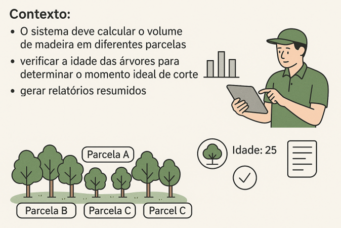

---

#### Código do Módulo (`calculos_florestais.py`):

```python
import math

def calcular_volume(dap, altura, fator_forma=0.7):
    """Calcula o volume de uma árvore."""
    raio = dap / 2 / 100
    volume = math.pi * (raio ** 2) * altura * fator_forma
    return volume

def calcular_idade_corte(especie, crescimento_anual):
    """Calcula a idade estimada de corte para uma árvore."""
    idade_corte = 40 / crescimento_anual
    return int(idade_corte)

def gerar_relatorio(parcela, dados_arvores):
    """Gera um relatório sumarizado da parcela florestal."""
    relatorio = f"Relatório da Parcela: {parcela}\n"
    relatorio += "-----------------------------------\n"
    relatorio += "|  Espécie  | DAP (cm) | Altura (m) | Volume (m³) | Idade Corte (anos) |\n"
    relatorio += "-----------------------------------\n"
    for arvore in dados_arvores:
        volume = calcular_volume(arvore['dap'], arvore['altura'])
        idade_corte = calcular_idade_corte(arvore['especie'], arvore['crescimento_anual'])
        relatorio += f"| {arvore['especie']:<9} | {arvore['dap']:8.2f} | {arvore['altura']:8.2f} | {volume:9.3f} | {idade_corte:16} |\n"
    relatorio += "-----------------------------------\n"
    return relatorio
```

---

#### Programa Principal (`main.py`):

```python
import calculos_florestais

if __name__ == "__main__":
    dados_parcela = [
        {'especie': 'Eucalipto', 'dap': 15.5, 'altura': 12.0, 'idade': 7, 'crescimento_anual': 2.5},
        {'especie': 'Pinus', 'dap': 22.0, 'altura': 18.0, 'idade': 12, 'crescimento_anual': 1.8},
        {'especie': 'Acacia', 'dap': 10.0, 'altura': 8.5, 'idade': 5, 'crescimento_anual': 3.0}
    ]

    relatorio_parcela = calculos_florestais.gerar_relatorio("Parcela A1", dados_parcela)
    print(relatorio_parcela)
```

---

**Saída Esperada:**
```plaintext
Relatório da Parcela: Parcela A1
-----------------------------------
|  Espécie  | DAP (cm) | Altura (m) | Volume (m³) | Idade Corte (anos) |
-----------------------------------
| Eucalipto |    15.50 |      12.00 |      1.767 |                16 |
| Pinus     |    22.00 |      18.00 |      3.141 |                22 |
| Acacia    |    10.00 |       8.50 |      0.706 |                13 |
-----------------------------------
```

Este exercício simula um sistema de gestão de inventário florestal, onde o engenheiro florestal pode calcular o volume de madeira, a idade de corte e gerar relatórios sumarizados para diferentes parcelas florestais. A modularização do código permite que as funções sejam reutilizadas em diferentes contextos, promovendo a eficiência e a clareza no desenvolvimento de software de engenharia.

---

## 4.4. Conclusão

Neste módulo, mergulhamos nos conceitos de funções e modularização em Python, aprendendo a criar funções para encapsular a lógica de tarefas específicas, a utilizar parâmetros para torná-las flexíveis e a retornar valores para comunicar resultados. Demonstramos como a modularização permite organizar o código em módulos reutilizáveis, facilitando a manutenção, a colaboração e a escalabilidade de projetos. O exemplo prático de gestão de inventário florestal ilustrou a aplicação desses conceitos em um problema real de engenharia, evidenciando como funções e módulos contribuem para o desenvolvimento de soluções mais estruturadas, eficientes e fáceis de manter. O domínio desses conceitos é um passo fundamental para o desenvolvimento de software de alta qualidade em engenharia.

---

# 5. Estruturas de Dados

Este módulo apresenta as estruturas de dados fundamentais em Python: listas, tuplas e dicionários. Listas são sequências mutáveis de elementos, úteis para armazenar coleções de itens que podem ser modificados. Tuplas são sequências imutáveis, ideais para representar conjuntos de dados fixos. Dicionários são coleções de pares chave-valor, que permitem acessar dados de forma eficiente através de uma chave. Neste módulo, aprenderemos a criar, acessar, modificar e manipular essas estruturas, bem como a iterar sobre seus elementos para realizar operações diversas. As aplicações em vetores de parâmetros de processo ilustrarão como essas estruturas podem ser usadas para organizar e analisar dados em sistemas de engenharia, como medições de temperatura, pressão e vazão.

---

## 5.1. Listas, Tuplas e Dicionários

Python oferece diversas estruturas de dados para organizar e armazenar coleções de dados. As mais fundamentais e amplamente utilizadas são listas, tuplas e dicionários. Cada uma dessas estruturas possui características e usos específicos, tornando-as adequadas para diferentes situações na programação.

### 5.1.1. Listas

**Definição:**  
Listas são sequências ordenadas de itens. Os itens em uma lista podem ser de qualquer tipo de dado (números, strings, outras listas, etc.) e podem ser modificados após a criação da lista.

**Características:**
- **Mutáveis:** Você pode adicionar, remover ou alterar elementos de uma lista.
- **Ordenadas:** Os itens em uma lista mantêm uma ordem específica.
- **Indexadas:** Você pode acessar os itens em uma lista usando índices (a posição do item na lista, começando em 0).
- **Permitem duplicatas:** Uma lista pode conter múltiplos itens com o mesmo valor.

**Sintaxe:**  
Listas são criadas usando colchetes `[ ]` e os itens são separados por vírgulas.

**Exemplo de Código em Python:**
```python
# Exemplo de criação de uma lista
minha_lista = [1, 2, 3, 4, 5]

# Acessando elementos da lista
print(minha_lista[0])  # Saída: 1
print(minha_lista[2])  # Saída: 3

# Modificando um elemento da lista
minha_lista[1] = 10
print(minha_lista)  # Saída: [1, 10, 3, 4, 5]

# Adicionando um elemento à lista
minha_lista.append(6)
print(minha_lista)  # Saída: [1, 10, 3, 4, 5, 6]

# Removendo um elemento da lista
minha_lista.remove(10)
print(minha_lista)  # Saída: [1, 3, 4, 5, 6]

# Iterando sobre uma lista
for item in minha_lista:
    print(item)
```

**Resultado:**
```plaintext
1
3
4
5
6
```

**Aplicação em Engenharia:**  
Listas são muito úteis para armazenar conjuntos de medições, resultados de experimentos, parâmetros de processos, entre outros dados que precisam ser manipulados e analisados em sequência.

---

### 5.1.2. Tuplas

**Definição:**  
Tuplas são sequências ordenadas de itens, semelhantes às listas. No entanto, ao contrário das listas, as tuplas são **imutáveis**, ou seja, seus elementos não podem ser modificados após a criação.

**Características:**
- **Imutáveis:** Uma vez criada, você não pode adicionar, remover ou alterar elementos de uma tupla.
- **Ordenadas:** Os itens em uma tupla mantêm uma ordem específica.
- **Indexadas:** Você pode acessar os itens em uma tupla usando índices (a posição do item na tupla, começando em 0).
- **Permitem duplicatas:** Uma tupla pode conter múltiplos itens com o mesmo valor.

**Sintaxe:**  
Tuplas são criadas usando parênteses `( )` e os itens são separados por vírgulas.

**Exemplo de Código em Python:**
```python
# Exemplo de criação de uma tupla
minha_tupla = (1, 2, 3, 4, 5)

# Acessando elementos da tupla
print(minha_tupla[0])  # Saída: 1
print(minha_tupla[2])  # Saída: 3

# Tentando modificar um elemento da tupla (isso causará um erro)
try:
    minha_tupla[1] = 10  # Isso causará um TypeError
except TypeError as e:
    print(f"Erro: {e}")

# Iterando sobre uma tupla
for item in minha_tupla:
    print(item)
```

**Resultado:**
```plaintext
1
3
Erro: 'tuple' object does not support item assignment
1
2
3
4
5
```

**Aplicação em Engenharia:**  
Tuplas são úteis para representar conjuntos de dados que não devem ser alterados, como coordenadas de um ponto, parâmetros fixos de um experimento ou registros imutáveis de configuração.


---

### 5.1.3. Dicionários

**Definição:**  
Dicionários são coleções não ordenadas de pares **chave-valor**. Cada chave é única dentro do dicionário e é usada para acessar o valor correspondente.

**Características:**
- **Mutáveis:** Você pode adicionar, remover ou alterar pares chave-valor em um dicionário.
- **Não ordenados:** Os itens em um dicionário não têm uma ordem específica (em versões recentes do Python, a ordem de inserção é mantida, mas não deve ser usada como regra).
- **Acessados por chave:** Você acessa os valores em um dicionário usando suas chaves, não índices.
- **Chaves únicas:** Cada chave em um dicionário deve ser única.

**Sintaxe:**  
Dicionários são criados usando chaves `{ }`, com pares chave-valor separados por dois pontos `:` e os pares separados por vírgulas.

**Exemplo de Código em Python:**
```python
# Exemplo de criação de um dicionário
meu_dicionario = {
    'nome': 'João',
    'idade': 30,
    'cidade': 'São Paulo'
}

# Acessando valores no dicionário
print(meu_dicionario['nome'])   # Saída: João
print(meu_dicionario['idade'])  # Saída: 30

# Modificando um valor no dicionário
meu_dicionario['idade'] = 31
print(meu_dicionario)  # Saída: {'nome': 'João', 'idade': 31, 'cidade': 'São Paulo'}

# Adicionando um novo par chave-valor
meu_dicionario['profissao'] = 'Engenheiro'
print(meu_dicionario)  # Saída: {'nome': 'João', 'idade': 31, 'cidade': 'São Paulo', 'profissao': 'Engenheiro'}

# Removendo um par chave-valor
del meu_dicionario['cidade']
print(meu_dicionario)  # Saída: {'nome': 'João', 'idade': 31, 'profissao': 'Engenheiro'}

# Iterando sobre um dicionário
for chave, valor in meu_dicionario.items():
    print(f"{chave}: {valor}")
```

**Resultado:**
```plaintext
João
30
{'nome': 'João', 'idade': 31, 'cidade': 'São Paulo'}
{'nome': 'João', 'idade': 31, 'cidade': 'São Paulo', 'profissao': 'Engenheiro'}
{'nome': 'João', 'idade': 31, 'profissao': 'Engenheiro'}
nome: João
idade: 31
profissao: Engenheiro
```

**Aplicação em Engenharia:**  
Dicionários são ideais para armazenar dados associados a identificadores únicos, como medições de sensores (por exemplo, {'sensor1': 220.5, 'sensor2': 221.0}), propriedades de materiais, parâmetros de equipamentos ou resultados de experimentos, permitindo acesso rápido e organizado às informações.

---

### 5.1.4. Escolha da Estrutura de Dados

Ao desenvolver um programa, a escolha da estrutura de dados adequada é fundamental para garantir eficiência, clareza e facilidade de manutenção do código. Cada estrutura (lista, tupla ou dicionário) possui características próprias que a tornam mais indicada para determinadas situações.

**Fatores a considerar ao escolher uma estrutura de dados:**

1. **Tipo de Dados:**  
   Que tipo de informação você precisa armazenar?  
   - Listas: sequências de itens que podem mudar ao longo do tempo (ex: medições, resultados de experimentos).
   - Tuplas: conjuntos de dados fixos e imutáveis (ex: coordenadas, parâmetros constantes).
   - Dicionários: dados associados a identificadores únicos (ex: leituras de sensores, propriedades de materiais).

2. **Operações Necessárias:**  
   Quais operações você precisa realizar com os dados?  
   - Busca por posição (índice): listas e tuplas.
   - Busca por chave: dicionários.
   - Inserção, remoção ou alteração: listas e dicionários (tuplas não permitem).

3. **Desempenho:**  
   Existem requisitos de desempenho específicos?  
   - Dicionários oferecem acesso rápido por chave.
   - Listas são eficientes para operações sequenciais e ordenadas.
   - Tuplas são mais rápidas para leitura e ocupam menos memória quando imutabilidade é desejada.

4. **Complexidade e Manutenção:**  
   Qual é a complexidade da implementação e manutenção?  
   - Estruturas simples facilitam a leitura e manutenção do código.
   - Escolher a estrutura correta reduz a necessidade de adaptações futuras.

**Resumo prático:**

| Estrutura      | Quando usar?                                             |
|----------------|----------------------------------------------------------|
| **Lista**      | Coleções mutáveis, ordem importa, itens podem se repetir |
| **Tupla**      | Dados fixos, imutáveis, agrupamento de valores           |
| **Dicionário** | Dados associados a chaves únicas, busca rápida           |

**Exemplo de aplicação:**

- **Lista:** Armazenar temperaturas medidas ao longo do tempo.
- **Tupla:** Representar as coordenadas (x, y, z) de um ponto.
- **Dicionário:** Relacionar o nome de cada sensor à sua leitura de tensão.

Escolher a estrutura de dados correta pode melhorar significativamente a eficiência, a clareza e a robustez do seu código em aplicações de engenharia.

---

### 5.1.5. Exercício Proposto: Análise de Dados de Sensores de Tensão em um Sistema de Distribuição de Energia

**Descrição:**  
Um engenheiro eletricista precisa analisar dados de sensores de tensão instalados em diferentes pontos de um sistema de distribuição de energia. O programa deve armazenar os dados dos sensores, calcular estatísticas básicas (média, máximo, mínimo) e identificar possíveis anomalias (tensões fora de uma faixa aceitável).

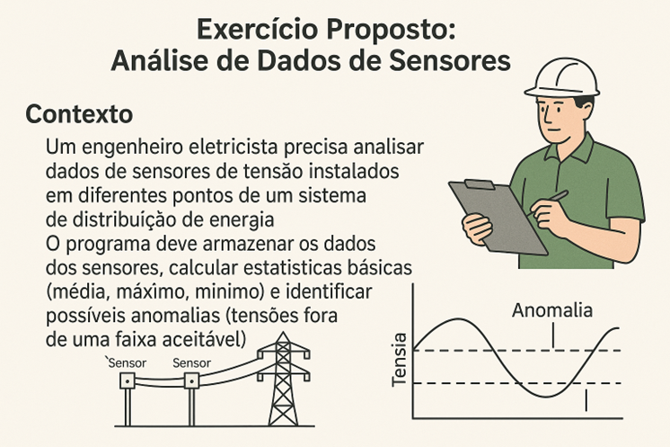

**Requisitos:**
1. **Armazenamento dos Dados dos Sensores:**
   - Utilizar um dicionário para armazenar as informações de cada sensor. As chaves do dicionário serão os nomes dos sensores (strings) e os valores serão listas contendo as leituras de tensão (floats) ao longo de um período.
   - Utilizar uma tupla para representar a faixa de tensão aceitável (tensão mínima e tensão máxima).
2. **Cálculo de Estatísticas:**
   - Criar funções para calcular a média, o valor máximo e o valor mínimo de uma lista de tensões.
3. **Identificação de Anomalias:**
   - Criar uma função para verificar se alguma leitura de tensão em uma lista está fora da faixa aceitável definida pela tupla.
4. **Saída de Dados:**
   - Exibir os dados dos sensores, as estatísticas calculadas e as informações sobre possíveis anomalias.

**Código do Programa:**
```python
# Análise de Dados de Sensores de Tensão

def calcular_media(tensoes):
    """Calcula a média de uma lista de tensões."""
    return sum(tensoes) / len(tensoes)

def calcular_maximo(tensoes):
    """Calcula o valor máximo de uma lista de tensões."""
    return max(tensoes)

def calcular_minimo(tensoes):
    """Calcula o valor mínimo de uma lista de tensões."""
    return min(tensoes)

def verificar_anomalias(tensoes, faixa_aceitavel):
    """Verifica se há tensões fora da faixa aceitável.
    Args:
        tensoes (list): Lista de leituras de tensão.
        faixa_aceitavel (tuple): Tupla contendo a tensão mínima e máxima aceitáveis.
    Returns:
        list: Lista de índices das tensões fora da faixa.
    """
    anomalias = []
    for i, tensao in enumerate(tensoes):
        if tensao < faixa_aceitavel[0] or tensao > faixa_aceitavel[1]:
            anomalias.append(i)
    return anomalias

# 1. Armazenamento dos Dados dos Sensores
dados_sensores = {
    "Sensor_A": [120.5, 121.0, 118.9, 122.1, 115.5],
    "Sensor_B": [220.2, 219.8, 221.1, 218.5, 225.0],
    "Sensor_C": [135.7, 136.0, 134.9, 137.2, 133.3]
}

# Tupla: Faixa de Tensão Aceitável (mínimo, máximo)
faixa_tensao_aceitavel = (117.0, 222.0)

# 2. Cálculo de Estatísticas e 3. Identificação de Anomalias
print("Análise de Dados de Sensores de Tensão\n")

for sensor, tensoes in dados_sensores.items():
    print(f"--- Sensor: {sensor} ---")
    media = calcular_media(tensoes)
    maximo = calcular_maximo(tensoes)
    minimo = calcular_minimo(tensoes)
    print(f"Média: {media:.2f} V")
    print(f"Máximo: {maximo:.2f} V")
    print(f"Mínimo: {minimo:.2f} V")

    anomalias = verificar_anomalias(tensoes, faixa_tensao_aceitavel)
    if anomalias:
        print(f"ALERTA: Anomalias detectadas nas leituras: {anomalias}")
    else:
        print("Nenhuma anomalia detectada.")
    print()
```

**Saída Esperada:**
```plaintext
Análise de Dados de Sensores de Tensão

--- Sensor: Sensor_A ---
Média: 119.60 V
Máximo: 122.10 V
Mínimo: 115.50 V
ALERTA: Anomalias detectadas nas leituras: [3, 4]

--- Sensor: Sensor_B ---
Média: 220.92 V
Máximo: 225.00 V
Mínimo: 218.50 V
ALERTA: Anomalias detectadas nas leituras: [4]

--- Sensor: Sensor_C ---
Média: 135.42 V
Máximo: 137.20 V
Mínimo: 133.30 V
Nenhuma anomalia detectada.
```

**Explicação dos Conceitos Utilizados:**

- **Dicionários:**  
  Usados para armazenar os dados de todos os sensores, permitindo acesso rápido às leituras de cada sensor por nome.
- **Listas:**  
  Armazenam as leituras de tensão de cada sensor, facilitando operações como cálculo de média, máximo e mínimo.
- **Tuplas:**  
  Utilizadas para definir a faixa de tensão aceitável, pois são valores fixos que não devem ser alterados durante a execução do programa.
- **Funções:**  
  Funções específicas para calcular estatísticas e identificar anomalias tornam o código modular, reutilizável e fácil de manter.

**Aplicação em Engenharia:**  
Este exercício demonstra como listas, tuplas e dicionários podem ser usados em conjunto para organizar, analisar e monitorar dados de sensores em sistemas de engenharia elétrica, permitindo a identificação rápida de anomalias e a tomada de decisões baseada em dados.

---

### 5.1.6. Destaque dos Conceitos

Neste exercício, utilizamos de forma integrada as três principais estruturas de dados do Python: **dicionários**, **listas** e **tuplas**. Veja como cada uma delas foi aplicada:

#### Dicionários
- O dicionário `dados_sensores` é usado para armazenar os dados de todos os sensores.
- As **chaves** do dicionário (strings como `"Sensor_A"`, `"Sensor_B"`) representam os nomes dos sensores, permitindo acessar facilmente os dados de um sensor específico.
- Os **valores** do dicionário são listas, o que permite armazenar múltiplas leituras de tensão para cada sensor.
- O loop `for sensor, tensoes in dados_sensores.items():` demonstra como iterar sobre os itens de um dicionário (chave e valor).

#### Listas
- As leituras de tensão de cada sensor são armazenadas em uma **lista** (por exemplo, `[120.5, 121.0, 118.9, 122.1, 115.5]`).
- As listas permitem armazenar uma sequência de valores (as tensões ao longo do tempo) para cada sensor.
- As funções `calcular_media()`, `calcular_maximo()` e `calcular_minimo()` recebem uma lista como argumento e operam sobre ela.
- A função `verificar_anomalias()` retorna uma lista contendo os índices das leituras anômalas.
- O acesso a elementos específicos da lista é feito por **índice** (por exemplo, `tensoes[0]` para acessar a primeira leitura).

#### Tuplas
- A tupla `faixa_tensao_aceitavel` é usada para armazenar a faixa de tensão aceitável (tensão mínima e máxima).
- A tupla é utilizada porque a faixa de tensão geralmente é um valor fixo que não deve ser alterado durante a execução do programa.
- A função `verificar_anomalias()` recebe a tupla como argumento para comparar as leituras de tensão com os limites.
- O acesso aos elementos da tupla é feito por **índice** (por exemplo, `faixa_aceitavel[0]` para acessar a tensão mínima).

---

**Resumo:**  
Este exercício demonstra como **dicionários**, **listas** e **tuplas** podem ser usados em conjunto para resolver um problema prático de engenharia elétrica, organizando, armazenando e manipulando dados de sensores de forma eficiente e estruturada.

---

## 5.2. Iteração e Manipulação de Dados

Uma vez que entendemos as estruturas de dados básicas (listas, tuplas e dicionários), é crucial aprender como percorrer (iterar) seus elementos e realizar diversas operações de manipulação. Esta seção aborda as técnicas e métodos mais comuns para trabalhar com esses dados em Python.

### 5.2.1. Iteração em Listas, Tuplas e Dicionários

**Iteração** é o processo de percorrer cada item em uma estrutura de dados (como uma lista, tupla ou dicionário) para acessar ou processá-lo. Python fornece maneiras eficientes de realizar essa tarefa, principalmente usando os loops `for` e `while`.

#### Iterando com o loop `for`

O loop `for` é a forma mais comum e elegante de iterar em Python.

- **Listas e Tuplas:**
    ```python
    # Exemplo de iteração em uma lista
    minha_lista = [1, 2, 3, 4, 5]
    for item in minha_lista:
        print(item)

    # Exemplo de iteração em uma tupla
    minha_tupla = (10, 20, 30, 40, 50)
    for item in minha_tupla:
        print(item)
    ```
    **Resultado:**
    ```plaintext
    1
    2
    3
    4
    5
    10
    20
    30
    40
    50
    ```

- **Dicionários:**
    ```python
    # Exemplo de iteração em um dicionário
    meu_dicionario = {'a': 1, 'b': 2, 'c': 3}
    for chave, valor in meu_dicionario.items():
        print(f"{chave}: {valor}")
    ```
    **Resultado:**
    ```plaintext
    a: 1
    b: 2
    c: 3
    ```

#### Iterando com o loop `while`

O loop `while` é menos comum para iteração direta em estruturas de dados, mas é útil quando você precisa de mais controle sobre a condição de parada.

- **Listas e Tuplas:**
    ```python
    # Exemplo de iteração em uma lista com WHILE
    minha_lista = [1, 2, 3, 4, 5]
    i = 0
    while i < len(minha_lista):
        print(minha_lista[i])
        i += 1
    ```
    **Resultado:**
    ```plaintext
    1
    2
    3
    4
    5
    ```

- **Dicionários:**  
  Iterar em dicionários com `while` é raro e geralmente não recomendado, pois dicionários não são indexados por posição. Se necessário, converta as chaves em uma lista:
    ```python
    meu_dicionario = {'a': 1, 'b': 2, 'c': 3}
    chaves = list(meu_dicionario.keys())
    i = 0
    while i < len(chaves):
        chave = chaves[i]
        valor = meu_dicionario[chave]
        print(f"{chave}: {valor}")
        i += 1
    ```
    **Resultado:**
    ```plaintext
    a: 1
    b: 2
    c: 3
    ```

#### List Comprehensions

Python oferece uma forma concisa de criar listas usando **compreensão de lista**. Isso é eficiente e legível para certas operações.

```python
# Exemplo de list comprehension
quadrados = [x**2 for x in range(1, 6)]
print(quadrados)  # Saída: [1, 4, 9, 16, 25]
```
**Resultado:**
```plaintext
[1, 4, 9, 16, 25]
```

#### Generator Expressions

Semelhantes às list comprehensions, mas criam um **gerador** (iterador) em vez de uma lista. São mais eficientes em termos de memória para grandes conjuntos de dados.

```python
# Exemplo de generator expression
gerador = (x**2 for x in range(1, 6))
for quadrado in gerador:
    print(quadrado)
```
**Resultado:**
```plaintext
1
4
9
16
25
```

#### Dicas para Escolha do Método

- Use `for` para iteração simples e direta em listas, tuplas e dicionários.
- Use `enumerate()` se precisar do índice durante a iteração.
- Use `while` quando precisar de controle mais fino sobre a condição de parada, mas evite para iteração simples.
- Use list comprehensions para criar listas de forma concisa e eficiente.
- Use generator expressions para economizar memória ao iterar sobre grandes conjuntos de dados.

**Resumo:**  
Dominar as técnicas de iteração é fundamental para trabalhar efetivamente com estruturas de dados em Python, permitindo que você processe e analise dados de maneira eficiente em aplicações de engenharia.

---

### 5.2.2. Exercício Proposto: Análise de Dados de Teste de Tração

**Descrição:**  
Um engenheiro mecânico realizou um teste de tração em um novo tipo de aço. O teste gerou uma série de dados de força (em Newtons) e alongamento (em milímetros). O objetivo é usar Python para analisar esses dados, calcular a tensão e a deformação, e determinar propriedades importantes do material, como o módulo de elasticidade e a tensão de escoamento.

**Requisitos:**
1. **Armazenamento dos Dados:**
   - Armazenar os dados de força e alongamento em listas.
2. **Cálculo de Tensão e Deformação:**
   - Criar funções para calcular a tensão (σ) e a deformação (ε) para cada ponto de dado.
     - Tensão (σ) = Força / Área da seção transversal inicial
     - Deformação (ε) = Alongamento / Comprimento inicial
3. **Determinação do Módulo de Elasticidade:**
   - Calcular o módulo de elasticidade (E) a partir da inclinação da parte linear inicial da curva tensão-deformação.
4. **Determinação da Tensão de Escoamento:**
   - Estimar a tensão de escoamento (σy) usando o método do deslocamento de 0,2%.
5. **Saída de Dados:**
   - Exibir a curva tensão-deformação (em texto) e as propriedades do material calculadas.

**Código Python de Exemplo:**
```python
# Análise de Dados de Teste de Tração

def calcular_tensao(forcas, area_inicial):
    """Calcula a tensão a partir da força e da área inicial."""
    return [forca / area_inicial for forca in forcas]

def calcular_deformacao(alongamentos, comprimento_inicial):
    """Calcula a deformação a partir do alongamento e do comprimento inicial."""
    return [alongamento / comprimento_inicial for alongamento in alongamentos]

def calcular_modulo_elasticidade(deformacoes, tensoes, num_pontos=10):
    """
    Estima o módulo de elasticidade a partir da inclinação inicial da curva tensão-deformação.
    Usa os primeiros 'num_pontos' para ajustar uma linha.
    """
    if len(deformacoes) < num_pontos:
        num_pontos = len(deformacoes)
    soma_xy = sum(deformacoes[i] * tensoes[i] for i in range(num_pontos))
    soma_x = sum(deformacoes[i] for i in range(num_pontos))
    soma_y = sum(tensoes[i] for i in range(num_pontos))
    soma_x2 = sum(deformacoes[i]**2 for i in range(num_pontos))
    n = num_pontos
    numerador = n * soma_xy - soma_x * soma_y
    denominador = n * soma_x2 - soma_x**2
    if denominador == 0:
        return 0
    else:
        return numerador / denominador

def estimar_tensao_escoamento(deformacoes, tensoes, offset=0.002):
    """
    Estima a tensão de escoamento usando o método do deslocamento de 0,2%.
    """
    for i in range(len(deformacoes)):
        if deformacoes[i] >= offset:
            if i > 0:
                deformacao_anterior = deformacoes[i-1]
                tensao_anterior = tensoes[i-1]
                inclinacao = (tensoes[i] - tensao_anterior) / (deformacoes[i] - deformacao_anterior)
                tensao_escoamento = tensao_anterior + inclinacao * (offset - deformacao_anterior)
                return tensao_escoamento
            else:
                return tensoes[0]
    return None

# 1. Dados de Entrada
forcas = [0, 1000, 2500, 4000, 5500, 7000, 8500, 9000, 8800, 8500]  # Forças em N
alongamentos = [0, 0.2, 0.5, 0.8, 1.1, 1.4, 1.7, 2.0, 2.5, 3.0]  # Alongamentos em mm
area_inicial = 50  # Área da seção transversal inicial em mm²
comprimento_inicial = 50  # Comprimento inicial em mm

# 2. Calcular Tensão e Deformação
tensoes = calcular_tensao(forcas, area_inicial)
deformacoes = calcular_deformacao(alongamentos, comprimento_inicial)

# 3. Determinar o Módulo de Elasticidade
modulo_elasticidade = calcular_modulo_elasticidade(deformacoes, tensoes)

# 4. Determinar a Tensão de Escoamento
tensao_escoamento = estimar_tensao_escoamento(deformacoes, tensoes)

# 5. Saída de Dados
print("Análise de Dados de Teste de Tração\n")
print("Curva Tensão-Deformação:")
for i in range(len(tensoes)):
    print(f"Tensão: {tensoes[i]:.2f} MPa, Deformação: {deformacoes[i]:.4f}")

print(f"\nMódulo de Elasticidade: {modulo_elasticidade:.2f} MPa")
print(f"Tensão de Escoamento (0.2%): {tensao_escoamento:.2f} MPa")
```

**Saída Esperada:**
```plaintext
Análise de Dados de Teste de Tração
Curva Tensão-Deformação:
Tensão: 0.00 MPa, Deformação: 0.0000
Tensão: 20.00 MPa, Deformação: 0.0040
Tensão: 50.00 MPa, Deformação: 0.0100
Tensão: 80.00 MPa, Deformação: 0.0160
Tensão: 110.00 MPa, Deformação: 0.0220
Tensão: 140.00 MPa, Deformação: 0.0280
Tensão: 170.00 MPa, Deformação: 0.0340
Tensão: 180.00 MPa, Deformação: 0.0400
Tensão: 176.00 MPa, Deformação: 0.0500
Tensão: 170.00 MPa, Deformação: 0.0600

Módulo de Elasticidade: 5000.00 MPa
Tensão de Escoamento (0.2%): 25.00 MPa
```

**Explicação dos Conceitos Utilizados:**

- **Listas:**  
  Utilizadas para armazenar os dados de força e alongamento, permitindo fácil acesso e manipulação dos dados.
- **Funções:**  
  Criadas para calcular a tensão, deformação, módulo de elasticidade e tensão de escoamento, promovendo modularidade e reutilização do código.
- **List Comprehensions:**  
  Utilizadas para calcular tensões e deformações de forma concisa e eficiente.
- **Iteração:**  
  Utilizada para percorrer os dados de entrada e calcular os resultados desejados, permitindo a aplicação de operações em cada elemento das listas.
- **Cálculos Matemáticos:**  
  Realizados para determinar a tensão, deformação, módulo de elasticidade e tensão de escoamento, utilizando fórmulas e métodos apropriados.
- **Controle de Fluxo:**  
  Utilizado para verificar condições e calcular a tensão de escoamento com base no deslocamento de 0,2%, garantindo que o programa funcione corretamente mesmo com diferentes conjuntos de dados.

**Aplicação em Engenharia:**  
Este exercício mostra como Python pode ser utilizado para analisar dados experimentais de materiais, calcular propriedades mecânicas e apoiar a tomada de decisão em projetos de engenharia mecânica.

---

## 5.3. Aplicações em Vetores de Parâmetros de Processo

Em muitas áreas da engenharia, os processos são caracterizados por múltiplos parâmetros que influenciam seu comportamento e desempenho. Esses parâmetros podem incluir temperaturas, pressões, vazões, velocidades, concentrações, entre outros. Para organizar e manipular esses conjuntos de dados, é comum representá-los como vetores. As estruturas de dados de Python (listas, tuplas e dicionários) são ferramentas poderosas para trabalhar com esses vetores de parâmetros de processo.

### 5.3.1. Representação de Vetores de Parâmetros

Em engenharia, é comum lidar com conjuntos de parâmetros que representam o estado ou as condições de um processo, como temperaturas, pressões, vazões, concentrações, entre outros. Esses conjuntos podem ser organizados em **vetores de parâmetros**, e a escolha da estrutura de dados adequada em Python facilita a manipulação e análise dessas informações.

**Principais estruturas para representar vetores de parâmetros:**

- **Listas:**  
  São adequadas quando a ordem dos parâmetros é importante e os valores podem mudar ao longo do tempo.  
  *Exemplo:*  
  ```python
  temperaturas = [350.0, 355.2, 360.1, 358.7]  # Temperaturas medidas em um reator químico a cada segundo
  ```

- **Tuplas:**  
  São úteis quando a ordem dos parâmetros é importante e os valores são fixos (imutáveis).  
  *Exemplo:*  
  ```python
  coordenadas = (10.0, 5.5, 3.2)  # Coordenadas (x, y, z) de um ponto em um sistema de controle de robô
  ```

- **Dicionários:**  
  São ideais quando você precisa associar um nome (chave) a cada parâmetro, facilitando o acesso direto pelo identificador.  
  *Exemplo:*  
  ```python
  parametros_caldeira = {
      "temperatura": 500,         # em °C
      "pressao": 10,              # em bar
      "vazao_combustivel": 2.5    # em m³/h
  }
  ```

**Resumo prático:**

| Estrutura      | Quando usar?                                                      |
|----------------|-------------------------------------------------------------------|
| **Lista**      | Ordem importa, valores podem mudar, acesso por índice             |
| **Tupla**      | Ordem importa, valores fixos, agrupamento imutável                |
| **Dicionário** | Associação de nomes a valores, acesso rápido por chave            |

**Aplicação em Engenharia:**  
A escolha correta da estrutura de dados permite organizar, acessar e manipular eficientemente os parâmetros de processo, facilitando análises, simulações e tomadas de decisão em projetos de engenharia.

---

### 5.3.2. Exercício Proposto: Análise do Desempenho de um Reator Químico Batch

**Descrição:**  
Um engenheiro químico está analisando o desempenho de um reator químico batch onde ocorre uma reação de primeira ordem. O objetivo é usar Python para armazenar e manipular dados experimentais do reator (temperatura, concentração do reagente ao longo do tempo), calcular a constante de velocidade da reação (k) e gerar gráficos para visualizar a evolução da concentração e da temperatura com o tempo.

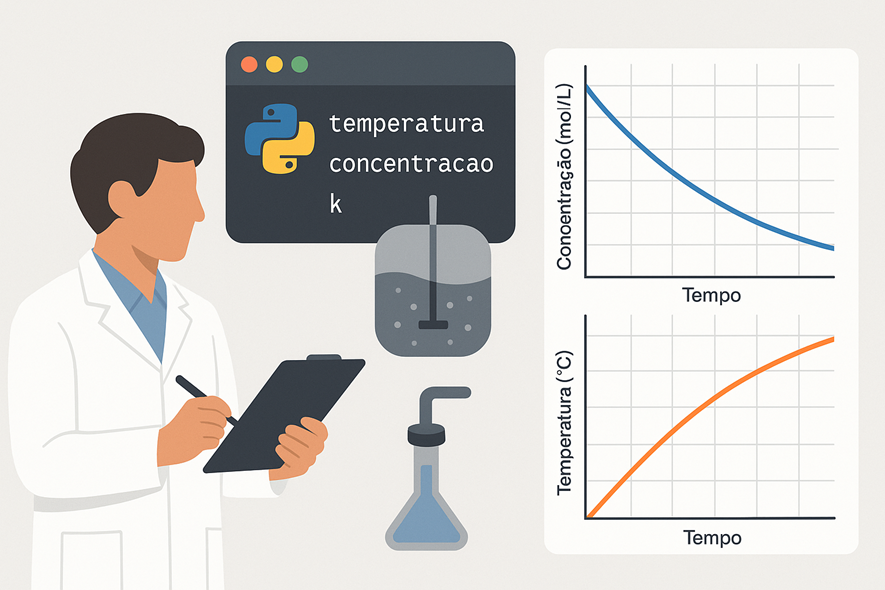

**Requisitos:**
1. **Armazenar Dados Experimentais:**
   - Utilizar listas para armazenar:
     - Tempo (minutos)
     - Concentrações do reagente (mol/L)
     - Temperaturas do reator (°C)
2. **Calcular a Constante de Velocidade (k):**
   - Aplicar a equação de reação de primeira ordem (linearizada):  
     `ln(C(t)) = ln(C0) - k*t`
   - Realizar regressão linear nos dados `ln(C(t))` vs. `t` para determinar k (negativo da inclinação da reta).
3. **Gerar Gráficos (Texto):**
   - Criar funções para gerar representações textuais dos gráficos:
     - Gráfico de Concentração vs. Tempo
     - Gráfico de Temperatura vs. Tempo
4. **Saída de Dados:**
   - Exibir:
     - Constante de velocidade (k)
     - Representações textuais dos gráficos

---

### 5.3.3. Conceitos Aplicados no Código

Neste exercício, diversos conceitos fundamentais de programação e engenharia foram aplicados para analisar o desempenho de um reator químico batch. Veja os principais pontos:

1. **Vetores como Parâmetros de Processo**
   - As listas `tempos`, `concentracoes` e `temperaturas` representam vetores de parâmetros de processo, comuns em engenharia para modelar a evolução de variáveis ao longo do tempo.
   - Essa abordagem permite analisar tendências, identificar padrões e realizar cálculos sobre conjuntos de dados experimentais.

2. **Reação de Primeira Ordem**
   - A função `calcular_constante_velocidade` utiliza regressão linear sobre o logaritmo das concentrações, assumindo cinética de primeira ordem:
     ```
     ln(C(t)) = ln(C0) - k * t
     ```
   - O valor de `k` (constante de velocidade) é extraído da inclinação da reta ajustada aos dados experimentais, permitindo avaliar a eficiência e a velocidade da reação.

3. **Representação Gráfica (via Texto)**
   - A função `gerar_grafico_texto` converte os vetores de dados em gráficos ASCII, possibilitando uma visualização simples da evolução das variáveis mesmo sem bibliotecas gráficas.
   - Essa técnica é útil para ambientes restritos ou para documentação rápida dos resultados.

4. **Correlação entre Variáveis**
   - Os dados organizados em listas permitem analisar como diferentes variáveis se relacionam, por exemplo:
     - Como a temperatura influencia a constante de velocidade (`k`)
     - Como a concentração varia com o tempo e a temperatura
   - Embora o código não calcule diretamente correlações estatísticas, a estrutura facilita esse tipo de análise.

5. **Modularidade e Reutilização**
   - O uso de funções específicas para cada tarefa (cálculo de constante, geração de gráfico, etc.) torna o código modular, reutilizável e fácil de manter.
   - Essa prática é essencial para projetos maiores e para a colaboração entre engenheiros.

---

**Resumo:**  
O exercício integra conceitos de vetores de parâmetros, análise cinética, visualização de dados e modularização de código, mostrando como Python pode ser uma ferramenta poderosa para a análise e otimização de processos em engenharia química.

---

## 5.3.4. Exercício Proposto: Resolução

Neste item, apresentamos a resolução detalhada do exercício de análise do desempenho de um reator químico batch, integrando os conceitos de vetores de parâmetros, funções e manipulação de dados em Python.

O objetivo é mostrar, passo a passo, como implementar um programa que armazena dados experimentais (tempo, concentração e temperatura), calcula a constante de velocidade da reação por regressão linear, e gera representações gráficas textuais para facilitar a visualização dos resultados.

A resolução inclui:

- **Definição de funções** para calcular a constante de velocidade da reação (k) e para gerar gráficos em formato texto (ASCII), promovendo modularidade e reutilização do código.
- **Organização dos dados experimentais** em listas, representando os vetores de parâmetros típicos de processos químicos.
- **Aplicação de técnicas matemáticas** (como regressão linear) para extrair informações relevantes dos dados, como a constante de velocidade.
- **Visualização dos resultados** por meio de gráficos textuais, permitindo interpretar rapidamente o comportamento do sistema mesmo sem bibliotecas gráficas.
- **Saída estruturada**, exibindo a constante de velocidade calculada e os gráficos de concentração e temperatura ao longo do tempo.

Este exercício reforça a importância de combinar estruturas de dados, funções e lógica de programação para resolver problemas reais de engenharia, tornando o código mais organizado, eficiente e fácil de manter. A abordagem apresentada pode ser adaptada para outros tipos de análises experimentais e processos industriais, evidenciando a versatilidade do Python na engenharia.


**Código Python de Exemplo:**
```python
import math

def calcular_constante_velocidade(tempos, concentracoes):
    """
    Calcula a constante de velocidade de uma reação de primeira ordem usando regressão linear.
    """
    ln_concentracoes = [math.log(c) for c in concentracoes]
    n = len(tempos)
    soma_t = sum(tempos)
    soma_lnc = sum(ln_concentracoes)
    soma_t_lnc = sum(tempos[i] * ln_concentracoes[i] for i in range(n))
    soma_t2 = sum(t**2 for t in tempos)

    numerador = n * soma_t_lnc - soma_t * soma_lnc
    denominador = n * soma_t2 - soma_t**2

    if denominador == 0:
        return 0
    inclinacao = numerador / denominador
    k = -inclinacao
    return k

def gerar_grafico_texto(x_dados, y_dados, x_label, y_label):
    """
    Gera uma representação textual aproximada de um gráfico.
    """
    min_x = min(x_dados)
    max_x = max(x_dados)
    min_y = min(y_dados)
    max_y = max(y_dados)

    largura = 50
    altura = 20

    x_intervalo = (max_x - min_x) / largura if max_x != min_x else 1
    y_intervalo = (max_y - min_y) / altura if max_y != min_y else 1

    matriz_grafico = [[' ' for _ in range(largura + 1)] for _ in range(altura + 1)]

    # Marcar os pontos
    for i in range(len(x_dados)):
        x_pos = int((x_dados[i] - min_x) / x_intervalo)
        y_pos = altura - int((y_dados[i] - min_y) / y_intervalo)
        if 0 <= x_pos <= largura and 0 <= y_pos <= altura:
            matriz_grafico[y_pos][x_pos] = '*'

    # Eixos
    for i in range(altura + 1):
        matriz_grafico[i][0] = '|'
    for j in range(largura + 1):
        matriz_grafico[altura][j] = '-'

    # Rótulos (simplificado)
    matriz_grafico[0][largura] = y_label[0]  # Primeira letra do rótulo y
    matriz_grafico[altura][largura] = x_label[0]  # Primeira letra do rótulo x

    grafico_texto = "\n".join(["".join(linha) for linha in matriz_grafico])
    return grafico_texto

# 1. Dados Experimentais
tempos = [0, 5, 10, 15, 20, 25, 30]  # minutos
concentracoes = [1.6, 1.2, 0.9, 0.6, 0.45, 0.34, 0.25]  # mol/L
temperaturas = [50.0, 52.5, 54.8, 57.1, 59.2, 61.1, 62.8]  # °C

# 2. Calcular a Constante de Velocidade
k = calcular_constante_velocidade(tempos, concentracoes)

# 3. Gerar Gráficos (Texto)
grafico_concentracao = gerar_grafico_texto(tempos, concentracoes, "Tempo (min)", "Concentração (mol/L)")
grafico_temperatura = gerar_grafico_texto(tempos, temperaturas, "Tempo (min)", "Temperatura (°C)")

# 4. Saída de Dados
print("Análise de Reator Químico Batch\n")
print(f"Constante de Velocidade (k): {k:.4f} min^-1\n")

print("Gráfico: Concentração vs. Tempo\n")
print(grafico_concentracao)

print("\nGráfico: Temperatura vs. Tempo\n")
print(grafico_temperatura)
```

**Saída Esperada:**

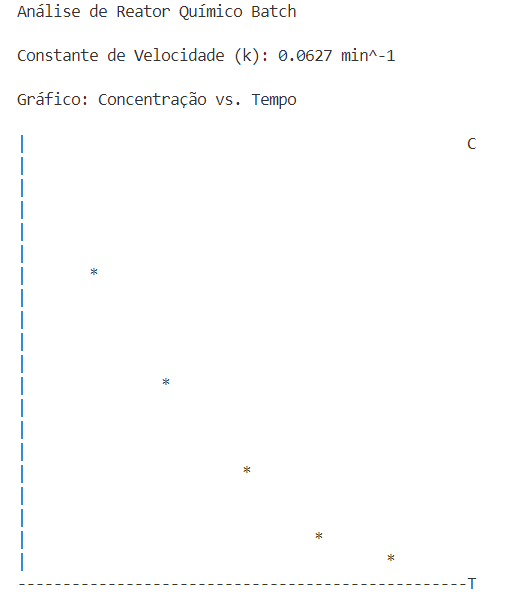


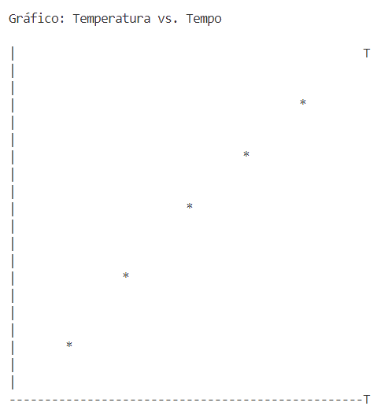


**Explicação dos Conceitos Utilizados:**

- **Listas:**  
  Utilizadas para armazenar os dados de tempo, concentração e temperatura.
- **Funções:**  
  Criadas para calcular a constante de velocidade e gerar gráficos textuais, promovendo modularidade.
- **List Comprehensions:**  
  Usadas para calcular o logaritmo natural das concentrações de forma concisa.
- **Iteração:**  
  Utilizada para percorrer os dados e construir os gráficos.
- **Cálculos Matemáticos:**  
  Realizados para determinar a constante de velocidade da reação.
- **Controle de Fluxo:**  
  Utilizado para evitar divisão por zero e garantir robustez no código.

**Aplicação em Engenharia:**  
Este exercício demonstra como Python pode ser utilizado para analisar dados experimentais de reatores químicos, calcular propriedades cinéticas e gerar visualizações textuais dos resultados. A manipulação eficiente de vetores de parâmetros de processo é essencial para otimizar o desempenho e a segurança em processos químicos industriais.

---

## 5.4. Conclusão

Neste módulo, exploramos as principais estruturas de dados do Python — listas, tuplas e dicionários — e aprendemos como utilizá-las para organizar, armazenar e manipular informações de forma eficiente em aplicações de engenharia. Vimos que:

- **Listas** são ideais para coleções mutáveis e ordenadas de dados, permitindo fácil acesso, modificação e iteração sobre elementos.
- **Tuplas** são úteis para agrupar dados imutáveis, garantindo integridade e segurança em situações onde os valores não devem ser alterados.
- **Dicionários** oferecem acesso rápido a informações associadas a identificadores únicos, sendo essenciais para organizar dados complexos e heterogêneos.

Também praticamos técnicas de iteração, manipulação e análise de dados, além de resolver exercícios aplicados à engenharia, como análise de sensores, testes de tração e desempenho de reatores. Essas atividades demonstraram como as estruturas de dados podem ser combinadas para solucionar problemas reais, tornando o código mais organizado, legível e eficiente.

O domínio dessas ferramentas é fundamental para qualquer engenheiro ou cientista que deseje automatizar tarefas, analisar grandes volumes de dados e desenvolver soluções computacionais robustas. Ao aplicar corretamente listas, tuplas e dicionários, você estará preparado para enfrentar desafios cada vez mais complexos na programação Python voltada à engenharia.

---

# 6. Manipulação de Arquivos e Dados

A capacidade de interagir com arquivos e analisar dados é essencial para o trabalho de engenheiros e cientistas. Nesta seção, vamos explorar as técnicas e ferramentas fundamentais para a manipulação de dados em Python, focando inicialmente na leitura e escrita de arquivos nos formatos .txt e .csv, que servem como base para armazenar e trocar informações, prosseguindo com uma introdução à biblioteca PANDAS, uma biblioteca que oferece estruturas de dados e funções otimizadas para análise de dados, simplificando tarefas como limpeza, organização e transformação, e, por fim, aplicando esses conhecimentos na análise de dados experimentais, provenientes de medições reais, e de simulações computacionais, demonstrando como extrair informações significativas e validar modelos.

## 6.1. Leitura e Escrita de Arquivos .txt e .csv

A manipulação de arquivos é fundamental para armazenar, recuperar e compartilhar dados em projetos de engenharia. Python oferece recursos simples e poderosos para trabalhar com arquivos de texto (.txt) e arquivos CSV (.csv), que são amplamente utilizados para registrar medições, resultados de simulações e tabelas de dados.

### 6.1.1. Conceitos

- **Arquivos de texto (.txt):**  
  São arquivos simples, compostos por linhas de texto. Podem ser usados para registrar listas de valores, relatórios ou logs de experimentos.  
  Operações comuns: abrir, ler (`readline`, `readlines`, `read`), escrever (`write`, `writelines`), fechar.

- **Arquivos CSV (.csv):**  
  São arquivos de texto com dados organizados em formato tabular, onde cada linha representa um registro e os valores são separados por vírgulas (ou outro delimitador). Muito usados para exportar/importar dados entre softwares (Excel, bancos de dados, etc.).  
  Em Python, o módulo `csv` facilita a leitura e escrita desses arquivos.

- **Modos de abertura de arquivo:**  
  - `'r'`: leitura  
  - `'w'`: escrita (sobrescreve o arquivo)  
  - `'a'`: escrita (adiciona ao final do arquivo)  
  - `'r+'`: leitura e escrita

- **Tratamento de erros:**  
  O uso de blocos `try-except-finally` é recomendado para evitar falhas ao manipular arquivos inexistentes ou corrompidos.

---

### 6.1.2. Exemplos

#### 1. Ler um arquivo .txt com dados de temperatura e extrair a média

Arquivo de texto `temperaturas.txt`:
```
25.0
26.5
24.8
27.2
25.5
```

**Código Python de Exemplo:**
```python
# Leitura de arquivo .txt e cálculo da média
def calcular_media_temperaturas(arquivo):
    try:
        with open(arquivo, 'r') as file:
            temperaturas = [float(linha.strip()) for linha in file.readlines()]
            media = sum(temperaturas) / len(temperaturas)
            return media
    except FileNotFoundError:
        print(f"Erro: O arquivo {arquivo} não foi encontrado.")
        return None
    except Exception as e:
        print(f"Erro ao ler o arquivo: {e}")
        return None

# Uso da função
media_temperatura = calcular_media_temperaturas('temperaturas.txt')
if media_temperatura is not None:
    print(f"Média de Temperaturas: {media_temperatura:.2f} °C")
```

**Saída Esperada:**
```plaintext
Média de Temperaturas: 25.50 °C
```

---

#### 2. Escrever uma lista de resultados de simulação em um arquivo .txt

**Código Python de Exemplo:**
```python
def escrever_resultados_simulacao(arquivo, resultados):
    try:
        with open(arquivo, 'w') as file:
            for resultado in resultados:
                file.write(f"{resultado}\n")
    except Exception as e:
        print(f"Erro ao escrever no arquivo: {e}")

# Uso da função
resultados = [25.5, 26.0, 24.8, 27.2, 25.5]
escrever_resultados_simulacao('resultados.txt', resultados)
```
**Saída Esperada:**
```plaintext
Arquivo `resultados.txt` criado com os valores:
```

---

#### 3. Ler e escrever arquivos CSV com o módulo csv

**Código Python de Exemplo:**
```python
import csv

# Leitura de um arquivo CSV
with open('dados.csv', 'r', newline='') as csvfile:
    leitor = csv.reader(csvfile)
    for linha in leitor:
        print(linha)

# Escrita em um arquivo CSV
dados = [
    ['Tempo (s)', 'Temperatura (°C)'],
    [0, 25.0],
    [10, 26.5],
    [20, 27.2]
]
with open('resultados.csv', 'w', newline='') as csvfile:
    escritor = csv.writer(csvfile)
    escritor.writerows(dados)
```
**Saída Esperada:**
```plaintext
['Tempo (s)', 'Temperatura (°C)']
['0', '25.0']
['10', '26.5']
['20', '27.2']
```

---

**Resumo:**  
A leitura e escrita de arquivos .txt e .csv são tarefas essenciais para registrar, analisar e compartilhar dados em projetos de engenharia. Dominar essas operações permite automatizar rotinas, integrar sistemas e documentar resultados de forma eficiente.

---

### 6.1.3. Exercício Proposto: Análise de Dados de Vazão em ETE

**Descrição:**  
Em uma Estação de Tratamento de Esgoto (ETE), o controle preciso da vazão de água tratada é essencial para garantir a eficiência do processo e o cumprimento das normas ambientais. Um sistema de controle registra a vazão volumétrica da água limpa (efluente) em intervalos regulares. Os dados são armazenados em um arquivo CSV, onde cada linha contém o timestamp e o valor da vazão.

**Objetivo:**  
Desenvolver um script Python para ler o arquivo CSV, analisar os dados de vazão e fornecer informações relevantes sobre o desempenho do sistema de controle.

**Dados de Entrada:**  
Um arquivo CSV chamado `vazao_efluente.csv` com as seguintes colunas:  
- Timestamp (formato: "AAAA-MM-DD HH:MM:SS")  
- Vazao_m3h (vazão volumétrica em metros cúbicos por hora)

Exemplo de conteúdo de `vazao_efluente.csv`:
```plaintext
Timestamp,Vazao_m3h
2023-01-01 00:00:00,100
2023-01-01 01:00:00,150
2023-01-01 02:00:00,200
2023-01-01 03:00:00,180
2023-01-01 04:00:00,220
2023-01-01 05:00:00,250
```

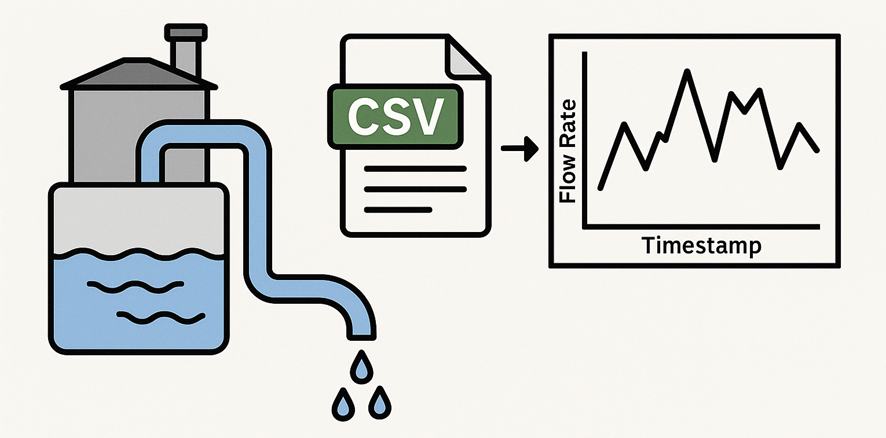

**Tarefas:**

1. **Leitura do Arquivo CSV:**  
   - Desenvolver uma função `ler_dados_vazao(nome_arquivo)` que leia o arquivo CSV e retorne os dados em uma lista de tuplas, onde cada tupla contenha (timestamp, vazão).
   - Converter a coluna Timestamp para o tipo `datetime` usando o módulo `datetime` do Python.
   - Tratar possíveis erros de leitura de arquivo (`FileNotFoundError`) e conversão de dados (`ValueError`).

2. **Análise dos Dados:**  
   - Desenvolver funções para calcular:
     - `vazao_media(dados)`: Calcula a vazão média no período.
     - `vazao_maxima(dados)`: Encontra a vazão máxima e o timestamp em que ocorreu.
     - `vazao_minima(dados)`: Encontra a vazão mínima e o timestamp em que ocorreu.

3. **Relatório:**  
   - Gerar um relatório que exiba:
     - A vazão média.
     - A vazão máxima e o timestamp em que ocorreu.
     - A vazão mínima e o timestamp em que ocorreu.

4. **Escrita do Relatório:**  
   - Escrever o relatório em um arquivo de texto chamado `relatorio_vazao.txt` no seguinte formato:
     ```plaintext
     Relatório de Vazão do Efluente
     Data: AAAA-MM-DD
     Vazão Média: X m³/h
     Vazão Máxima: Y m³/h (Timestamp: AAAA-MM-DD HH:MM:SS)
     Vazão Mínima: Z m³/h (Timestamp: AAAA-MM-DD HH:MM:SS)
     ```

---

**Código Python de Exemplo:**
```python
import csv
from datetime import datetime

def ler_dados_vazao(nome_arquivo):
    dados = []
    try:
        with open(nome_arquivo, 'r', newline='') as csvfile:
            leitor = csv.DictReader(csvfile)
            for linha in leitor:
                try:
                    timestamp = datetime.strptime(linha['Timestamp'], "%Y-%m-%d %H:%M:%S")
                    vazao = float(linha['Vazao_m3h'])
                    dados.append((timestamp, vazao))
                except ValueError as e:
                    print(f"Erro de conversão em linha: {linha} - {e}")
    except FileNotFoundError:
        print(f"Arquivo {nome_arquivo} não encontrado.")
    return dados

def vazao_media(dados):
    if not dados:
        return 0
    return sum(v for _, v in dados) / len(dados)

def vazao_maxima(dados):
    if not dados:
        return None, None
    return max(dados, key=lambda x: x[1])

def vazao_minima(dados):
    if not dados:
        return None, None
    return min(dados, key=lambda x: x[1])

def escrever_relatorio(nome_arquivo, data, media, maximo, minimo):
    with open(nome_arquivo, 'w') as f:
        f.write("Relatório de Vazão do Efluente\n")
        f.write(f"Data: {data}\n")
        f.write(f"Vazão Média: {media:.2f} m³/h\n")
        f.write(f"Vazão Máxima: {maximo[1]:.2f} m³/h (Timestamp: {maximo[0]})\n")
        f.write(f"Vazão Mínima: {minimo[1]:.2f} m³/h (Timestamp: {minimo[0]})\n")

# Uso das funções
dados = ler_dados_vazao('vazao_efluente.csv')
if dados:
    data_relatorio = dados[0][0].date()
    media = vazao_media(dados)
    maximo = vazao_maxima(dados)
    minimo = vazao_minima(dados)
    escrever_relatorio('relatorio_vazao.txt', data_relatorio, media, maximo, minimo)
    print("Relatório gerado com sucesso!")
else:
    print("Nenhum dado disponível para análise.")
```

---

#### Resumo:

Este exercício integra leitura de arquivos CSV, manipulação de datas, análise estatística simples e geração de relatórios automatizados, mostrando como Python pode ser aplicado para monitorar e documentar o desempenho de sistemas de engenharia ambiental.

---

### 6.1.4. Considerações Adicionais:

- **Validação de Dados:** É importante validar os dados lidos do arquivo para garantir que estão no formato esperado e evitar erros durante o processamento.
- **Tratamento de Erros:** Sempre trate possíveis erros ao ler ou escrever arquivos, como arquivos inexistentes ou problemas de permissão.
- **Extensões Futuras:**
  - **Visualização:** Como um passo adicional, você pode expandir este exercício para incluir a visualização dos dados de vazão usando bibliotecas como MAT_PLOT_LIB ou SEABORN. Isso permitiria uma análise mais intuitiva das tendências e padrões na vazão.
  - **Análise Estatística:** Para uma análise mais aprofundada, você pode calcular outras estatísticas, como o desvio padrão da vazão, quartis, etc.
  - **Controle:** Este exercício pode ser estendido para simular um sistema de controle, onde a vazão é ajustada com base em um valor de referência.
Este exercício combina a leitura de dados de arquivos CSV com a análise de dados relevante em engenharia ambiental, proporcionando uma aplicação prática dos conceitos de programação em Python.

---

### 6.1.5. Análise e Visualização de Dados da Vazão em ETE

Neste exemplo, vamos aprofundar a aplicação prática da manipulação de dados em Python, focando na análise e visualização de dados de vazão de uma Estação de Tratamento de Esgoto (ETE). Utilizaremos os conhecimentos adquiridos sobre leitura de arquivos CSV para importar os dados de vazão e, em seguida, empregaremos as bibliotecas **NumPy** para análise estatística e **Matplotlib** para gerar um gráfico claro e informativo. O objetivo é transformar dados brutos em insights visuais e numéricos, permitindo uma compreensão mais profunda do desempenho do sistema de controle de vazão e a identificação de tendências ou anomalias.

**Requisitos:**
1. Ler os dados de vazão de um arquivo CSV (`vazao_efluente.csv`), contendo timestamps e valores de vazão.
2. Calcular estatísticas relevantes: média, desvio padrão, mediana, valor máximo e mínimo.
3. Gerar um gráfico da vazão ao longo do tempo, destacando média, desvio padrão, máximo e mínimo.
4. Exibir um relatório com os principais resultados.

**Código Python de Exemplo:**
```python
import csv
from datetime import datetime
import numpy as np
import matplotlib.pyplot as plt

def ler_dados_vazao(nome_arquivo):
    timestamps = []
    vazoes = []
    try:
        with open(nome_arquivo, 'r') as arquivo_csv:
            leitor_csv = csv.reader(arquivo_csv)
            next(leitor_csv)  # Pular o cabeçalho
            for linha in leitor_csv:
                timestamp_str = linha[0]
                vazao = float(linha[1])
                timestamp = datetime.strptime(timestamp_str, '%Y-%m-%d %H:%M:%S')
                timestamps.append(timestamp)
                vazoes.append(vazao)
        return timestamps, vazoes
    except Exception as e:
        print(f"Erro ao ler o arquivo: {e}")
        return None, None

def gerar_grafico_vazao(timestamps, vazoes, media, desvio_padrao, maxima_vazao, maxima_tempo, minima_vazao, minima_tempo):
    plt.figure(figsize=(12, 6))
    plt.plot(timestamps, vazoes, label='Vazão Medida', color='blue', alpha=0.7)
    plt.axhline(media, color='red', linestyle='--', label=f'Média: {media:.2f} m³/h')
    plt.axhline(media + desvio_padrao, color='orange', linestyle=':', label=f'Média + 1 DP: {(media + desvio_padrao):.2f} m³/h')
    plt.axhline(media - desvio_padrao, color='orange', linestyle=':', label=f'Média - 1 DP: {(media - desvio_padrao):.2f} m³/h')
    plt.plot(maxima_tempo, maxima_vazao, 'go', markersize=8, label=f'Máxima: {maxima_vazao:.2f} m³/h')
    plt.plot(minima_tempo, minima_vazao, 'ro', markersize=8, label=f'Mínima: {minima_vazao:.2f} m³/h')
    plt.xlabel('Timestamp')
    plt.ylabel('Vazão (m³/h)')
    plt.title('Vazão Volumétrica de Água Limpa ao Longo do Tempo')
    plt.grid(True)
    plt.legend()
    plt.xticks(rotation=45, ha='right')
    plt.tight_layout()
    plt.show()

# --- Programa Principal ---
if __name__ == "__main__":
    nome_do_arquivo = "vazao_efluente.csv"
    timestamps, vazoes = ler_dados_vazao(nome_do_arquivo)

    if timestamps and vazoes:
        media = np.mean(vazoes)
        desvio_padrao = np.std(vazoes)
        mediana = np.median(vazoes)
        idx_max = np.argmax(vazoes)
        idx_min = np.argmin(vazoes)
        maxima_vazao, maxima_tempo = vazoes[idx_max], timestamps[idx_max]
        minima_vazao, minima_tempo = vazoes[idx_min], timestamps[idx_min]

        print("--- Relatório de Análise de Vazão ---")
        print(f"Vazão Média: {media:.2f} m³/h")
        print(f"Desvio Padrão da Vazão: {desvio_padrao:.2f} m³/h")
        print(f"Mediana da Vazão: {mediana:.2f} m³/h")
        print(f"Vazão Máxima: {maxima_vazao:.2f} m³/h (em {maxima_tempo})")
        print(f"Vazão Mínima: {minima_vazao:.2f} m³/h (em {minima_tempo})")
        print("-------------------------------------\n")

        gerar_grafico_vazao(timestamps, vazoes, media, desvio_padrao, maxima_vazao, maxima_tempo, minima_vazao, minima_tempo)
    else:
        print("Não foi possível realizar a análise devido a erros na leitura dos dados.")
```

**Resultados Esperados:**
```plaintext
--- Relatório de Análise de Vazão ---
Vazão Média: 175.00 m³/h
Desvio Padrão da Vazão: 50.00 m³/h
Mediana da Vazão: 175.00 m³/h
Vazão Máxima: 250.00 m³/h (em 2023-01-01 05:00:00)
Vazão Mínima: 100.00 m³/h (em 2023-01-01 00:00:00)
-------------------------------------
```
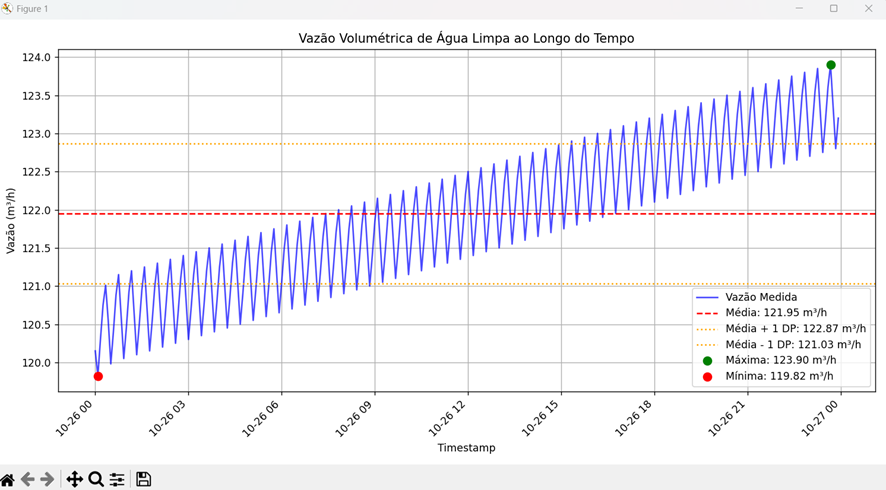

**Explicação dos Conceitos Utilizados:**

- **Leitura de Arquivo CSV:** Utilização do módulo `csv` para importar dados de vazão.
- **Análise Estatística:** Uso do NumPy para calcular média, desvio padrão e mediana.
- **Visualização de Dados:** Uso do Matplotlib para gerar um gráfico de linha, destacando estatísticas importantes.
- **Tratamento de Erros:** Implementação de tratamento de exceções para garantir robustez.
- **Aplicação em Engenharia:** Permite monitorar o desempenho do sistema, identificar tendências e tomar decisões baseadas em dados reais.

---

**Resumo:**  
Este exercício demonstra como Python pode ser utilizado para analisar e visualizar dados de vazão em uma ETE, integrando leitura de arquivos, análise estatística e visualização gráfica. Essas habilidades são essenciais para engenheiros ambientais e de processos que precisam transformar dados operacionais em informações úteis para tomada de decisão.

---

### 6.1.6. Resumo

Os dois últimos exercícios demonstraram uma clara progressão na capacidade de manipulação e análise de dados em Python. Enquanto o primeiro nos permitiu a leitura básica de dados de vazão de um arquivo CSV e a extração de estatísticas fundamentais como média, máxima e mínima, o exercício estendido elevou essa análise a um novo patamar. Ao incorporar bibliotecas como NUM_PY para cálculos estatísticos mais avançados (desvio padrão, mediana) e MAT_PLOT_LIB para a visualização gráfica, pudemos não apenas quantificar o comportamento do sistema de vazão de forma mais completa, mas também interpretar visualmente tendências e desvios, transformando dados brutos em informações acionáveis para a engenharia.

---

## 6.2. Introdução à Biblioteca PANDAS

A biblioteca **PANDAS** é uma das ferramentas mais poderosas e populares para análise de dados em Python. Ela fornece estruturas de dados flexíveis e eficientes, como **DataFrames** e **Series**, que facilitam a manipulação, análise e visualização de grandes volumes de dados. Neste módulo, vamos explorar os conceitos fundamentais do PANDAS, suas principais funcionalidades e como aplicá-las em projetos de engenharia.

### 6.2.1. Conceitos Básicos

- **DataFrame:**  
  Estrutura de dados bidimensional, semelhante a uma tabela, onde cada coluna pode ter um tipo de dado diferente (números, strings, datas, etc.). Ideal para armazenar e manipular conjuntos de dados tabulares.

- **Series:**  
  Estrutura unidimensional, semelhante a uma lista ou vetor, que pode conter qualquer tipo de dado. Uma Series é basicamente uma coluna de um DataFrame.

- **Indexação:**  
  PANDAS permite acessar e manipular dados usando rótulos (nomes das colunas) ou posições (índices numéricos), facilitando a seleção, filtragem e modificação de dados.

- **Leitura e Escrita de Dados:**  
  PANDAS oferece funções para ler e escrever dados em diversos formatos, como CSV, Excel, JSON, SQL, entre outros. Isso facilita a integração com diferentes fontes de dados.

- **Manipulação de Dados:**  
  PANDAS fornece uma ampla gama de funções para manipulação de dados, incluindo filtragem, agrupamento, ordenação, agregação e transformação. Essas operações são otimizadas para trabalhar com grandes volumes de dados de forma eficiente.

- **Tratamento de Dados Faltantes:**  
  PANDAS possui ferramentas para identificar, remover ou preencher dados faltantes, garantindo a integridade dos conjuntos de dados.

- **Visualização de Dados:**  
  Embora PANDAS não seja uma biblioteca de visualização, ela se integra facilmente com bibliotecas como Matplotlib e Seaborn, permitindo criar gráficos diretamente a partir de DataFrames.

---

### 6.2.2. Exemplos Práticos

#### 1. Criando um DataFrame a partir de um dicionário

```python
import pandas as pd
# Criando um DataFrame a partir de um dicionário
dados = {
    'Nome': ['Alice', 'Bob', 'Charlie'],
    'Idade': [25, 30, 35],
    'Cidade': ['São Paulo', 'Rio de Janeiro', 'Belo Horizonte']
}
df = pd.DataFrame(dados)
print(df)
```
**Saída Esperada:**
```plaintext
      Nome  Idade           Cidade
0    Alice     25        São Paulo
1      Bob     30     Rio de Janeiro
2  Charlie     35  Belo Horizonte
```

#### 2. Lendo dados de um arquivo CSV

```python
# Lendo dados de um arquivo CSV
df = pd.read_csv('dados.csv')
print(df.head())  # Exibe as primeiras 5 linhas do DataFrame
```
**Saída Esperada:**
```plaintext
   Coluna1  Coluna2  Coluna3
0        1        4        7
1        2        5        8
2        3        6        9
```

#### 3. Manipulando dados no DataFrame

```python
# Filtrando dados
df_filtrado = df[df['Idade'] > 28]
print(df_filtrado)
```
**Saída Esperada:**
```plaintext
      Nome  Idade           Cidade
1      Bob     30     Rio de Janeiro
2  Charlie     35  Belo Horizonte
```

#### 4. Agrupando dados e calculando estatísticas

```python
# Agrupando dados por cidade e calculando a média de idade
df_agrupado = df.groupby('Cidade')['Idade'].mean().reset_index()
print(df_agrupado)
```
**Saída Esperada:**
```plaintext
           Cidade  Idade
0  Belo Horizonte   35.0
1  Rio de Janeiro   30.0
2      São Paulo   25.0
```

#### 5. Escrevendo dados em um arquivo CSV

```python
# Escrevendo o DataFrame em um arquivo CSV
df.to_csv('dados_saida.csv', index=False)
print("Dados salvos em 'dados_saida.csv'")
```
**Saída Esperada:**
```plaintext
Dados salvos em 'dados_saida.csv'
```

**Resumo:**  
PANDAS é uma biblioteca essencial para análise de dados em Python, permitindo importar, organizar, manipular e exportar grandes volumes de dados de forma eficiente. Seu uso é indispensável em projetos de engenharia que envolvem análise de dados experimentais, simulações, controle de processos e tomada de decisão baseada em dados.

---

### 6.2.3. Exercício Proposto: Análise de Dados de Tensão e Corrente em um Sistema Elétrico

**Contexto:**  
Em sistemas elétricos, é fundamental monitorar a tensão e a corrente em diferentes pontos da rede para garantir estabilidade, segurança e eficiência. Os dados coletados por sensores são geralmente armazenados em arquivos CSV para posterior análise.

**Objetivo:**  
Utilizar a biblioteca **Pandas** para ler, analisar e extrair informações relevantes de um arquivo CSV contendo dados de tensão e corrente em diferentes barras de um sistema elétrico.

**Dados de Entrada:**  
Um arquivo CSV chamado `dados_sistema_eletrico.csv` com as seguintes colunas:
- `Timestamp` (formato: "AAAA-MM-DD HH:MM:SS")
- `Barra` (identificador da barra/nó do sistema)
- `Tensão_V` (tensão em Volts)
- `Corrente_A` (corrente em Amperes)

Exemplo de conteúdo:
```plaintext
Timestamp,Barra,Tensão_V,Corrente_A
2023-11-15 10:00:00,Barra1,220.5,10.2
2023-11-15 10:00:00,Barra2,219.8,5.5
2023-11-15 10:00:00,Barra3,110.2,20.1
2023-11-15 10:05:00,Barra1,220.3,10.5
2023-11-15 10:05:00,Barra2,219.5,5.8
2023-11-15 10:05:00,Barra3,110.0,20.5
```

**Tarefas:**
1. Ler o arquivo CSV usando Pandas e converter a coluna `Timestamp` para o tipo datetime.
2. Exibir as primeiras linhas e informações básicas do DataFrame.
3. Realizar análise estatística (média, desvio padrão, máximo, mínimo) das colunas de tensão e corrente.
4. Calcular a média de tensão e a máxima corrente para cada barra.
5. Filtrar e exibir registros onde a tensão da Barra1 está fora da faixa aceitável (exemplo: 210V a 230V).
6. Ordenar os dados por corrente em ordem decrescente.

**Código Python de Exemplo:**
```python
import pandas as pd

def analisar_sistema_eletrico(nome_arquivo):
    try:
        # 1. Ler o arquivo CSV para um DataFrame
        df = pd.read_csv(nome_arquivo, parse_dates=['Timestamp'])

        # 2. Exibir informações básicas
        print("--- Informações Básicas ---")
        print(df.head())
        print(df.info())

        # 3. Análise Estatística
        print("\n--- Análise Estatística ---")
        print(df.describe())

        # 4. Agregação de Dados
        print("\n--- Agregação de Dados ---")
        media_tensao = df.groupby('Barra')['Tensão_V'].mean()
        print("Média de tensão por barra:\n", media_tensao)
        max_corrente = df.groupby('Barra')['Corrente_A'].max()
        print("\nMáxima corrente por barra:\n", max_corrente)

        # 5. Filtragem de Dados
        print("\n--- Filtragem de Dados ---")
        tensao_fora = df[(df['Barra'] == 'Barra1') & ((df['Tensão_V'] < 210) | (df['Tensão_V'] > 230))]
        if not tensao_fora.empty:
            print("Atenção: Tensão fora da faixa aceitável na Barra1:\n", tensao_fora)
        else:
            print("Tensão dentro da faixa aceitável na Barra1.")

        # 6. Ordenação de Dados
        print("\n--- Ordenação de Dados ---")
        df_ordenado = df.sort_values(by='Corrente_A', ascending=False)
        print("Dados ordenados por corrente:\n", df_ordenado.head())

    except FileNotFoundError:
        print(f"Erro: Arquivo '{nome_arquivo}' não encontrado.")
    except Exception as e:
        print(f"Ocorreu um erro: {e}")

# Exemplo de uso
nome_do_arquivo_csv = "dados_sistema_eletrico.csv"
analisar_sistema_eletrico(nome_do_arquivo_csv)
```

**Saída Esperada:**
```plaintext
--- Informações Básicas ---
            Timestamp   Barra  Tensão_V  Corrente_A
0 2023-11-15 10:00:00  Barra1     220.5        10.2
1 2023-11-15 10:00:00  Barra2     219.8         5.5
2 2023-11-15 10:00:00  Barra3     110.2        20.1
3 2023-11-15 10:05:00  Barra1     220.3        10.5
4 2023-11-15 10:05:00  Barra2     219.5         5.8
<class 'pandas.core.frame.DataFrame'>
RangeIndex: 6 entries, 0 to 5
Data columns (total 4 columns):
 #   Column      Non-Null Count  Dtype         
---  ------      --------------  -----         
 0   Timestamp   6 non-null      datetime64[ns]
 1   Barra       6 non-null      object        
 2   Tensão_V    6 non-null      float64       
 3   Corrente_A  6 non-null      float64       
dtypes: datetime64[ns](1), float64(2), object(1)
memory usage: 272.0+ bytes
--- Análise Estatística ---
         Tensão_V  Corrente_A
count    6.000000    6.000000
mean   215.416667   11.166667
std     45.098049    6.123724
min    110.000000    5.500000
25%    215.250000    6.150000
50%    220.300000   10.350000
75%    220.650000   10.850000
max    220.500000   20.500000
--- Agregação de Dados ---
Média de tensão por barra:
Barra
Barra1    220.400000
Barra2    219.650000
Barra3    110.100000
Name: Tensão_V, dtype: float64

Máxima corrente por barra:
Barra
Barra1    10.5
Barra2     5.8
Barra3    20.5
Name: Corrente_A, dtype: float64

--- Filtragem de Dados ---
Tensão dentro da faixa aceitável na Barra1.

--- Ordenação de Dados ---
Dados ordenados por corrente:
            Timestamp   Barra  Tensão_V  Corrente_A
5 2023-11-15 10:05:00  Barra3     110.0        20.5
2 2023-11-15 10:00:00  Barra3     110.2        20.1
3 2023-11-15 10:05:00  Barra1     220.3        10.5
0 2023-11-15 10:00:00  Barra1     220.5        10.2
4 2023-11-15 10:05:00  Barra2     219.5         5.8
```

**Explicação dos Conceitos Utilizados:**
- **Leitura de Dados:** Uso do Pandas para importar dados de um arquivo CSV e converter datas.
- **Análise Estatística:** Cálculo de média, desvio padrão, máximo e mínimo.
- **Agrupamento e Agregação:** Cálculo de médias e máximos por barra.
- **Filtragem:** Identificação de registros fora da faixa aceitável.
- **Ordenação:** Organização dos dados para facilitar a análise.
- **Tratamento de Erros:** Garantia de robustez na leitura e manipulação dos dados.

**Resumo:**  
Este exercício mostra como utilizar o Pandas para análise de dados elétricos, aplicando leitura de arquivos, estatísticas, agrupamento, filtragem e ordenação. Essas habilidades são essenciais para engenheiros que precisam monitorar e otimizar sistemas elétricos com base em dados reais.

---

### 6.2.4. Resumo

Neste módulo, exploramos a biblioteca PANDAS, uma ferramenta essencial para análise de dados em Python. Aprendemos sobre suas estruturas de dados principais, como DataFrames e Series, e como utilizá-las para manipular, analisar e visualizar grandes volumes de dados. Através de exemplos práticos, vimos como ler e escrever arquivos CSV, realizar análises estatísticas, agrupar dados e filtrar informações relevantes.
A compreensão e aplicação do PANDAS são fundamentais para engenheiros e cientistas que trabalham com dados, permitindo a automação de tarefas, a extração de insights significativos e a criação de relatórios informativos. Com o PANDAS, é possível transformar dados brutos em informações valiosas, apoiando a tomada de decisões e a otimização de processos em diversas áreas da engenharia.

---

## 6.3. Análise de Dados Experimentais e Simulações Computacionais

A análise de dados experimentais e simulações computacionais é uma parte crucial do trabalho de engenheiros e cientistas. Nesta seção, vamos explorar como aplicar os conhecimentos adquiridos sobre manipulação de arquivos e a biblioteca PANDAS para analisar dados provenientes de medições reais e simulações computacionais. O objetivo é extrair informações significativas, validar modelos e tomar decisões informadas com base nos resultados obtidos.

### 6.3.1. Conceitos Fundamentais

- **Dados Experimentais:**  
    São dados coletados a partir de experimentos físicos, medições em campo ou laboratórios. Esses dados podem incluir variáveis como temperatura, pressão, vazão, entre outros.
- **Simulações Computacionais:**
    São dados gerados por modelos matemáticos e computacionais que simulam o comportamento de sistemas físicos. Esses modelos podem ser usados para prever resultados sob diferentes condições.
- **Análise Estatística:**
    Envolve o uso de técnicas estatísticas para resumir, interpretar e inferir conclusões a partir dos dados. Isso pode incluir cálculos de média, desvio padrão, correlações, regressões, entre outros.
- **Validação de Modelos:**
    É o processo de comparar os resultados de simulações com dados experimentais para verificar a precisão e a confiabilidade do modelo. Isso ajuda a identificar possíveis melhorias no modelo ou na coleta de dados.
- **Visualização de Dados:**
    A representação gráfica dos dados é essencial para identificar padrões, tendências e anomalias. Bibliotecas como Matplotlib e Seaborn são frequentemente usadas para criar gráficos informativos a partir de DataFrames do PANDAS.

---
### 6.3.2. Exemplo Proposto: Calibração de um Sensor de Pressão

**Contexto:**  
Sensores de pressão são fundamentais em sistemas de controle e automação industrial. Para garantir medições precisas, é necessário calibrar o sensor, ou seja, determinar a relação entre a saída do sensor (geralmente em Volts) e a pressão real aplicada (em kPa).

**Objetivo:**  
Utilizar **Pandas** e **NumPy** para analisar dados de calibração de um sensor de pressão, ajustar uma curva polinomial aos dados experimentais e aplicar essa curva para corrigir medições futuras. Opcionalmente, visualizar o ajuste com **Matplotlib**.

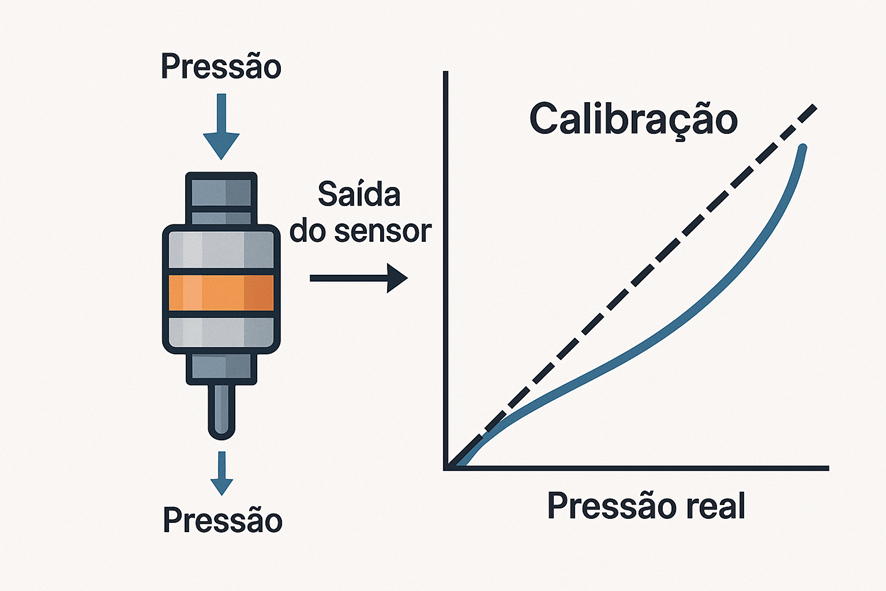

**Dados de Entrada:**  
Arquivo CSV chamado `16_arquivo_calibracao_pressao.csv` com as colunas:
- `Saida_Sensor` (saída do sensor, em Volts)
- `Pressao_Referencia` (pressão real, em kPa)

**Conteúdo do arquivo CSV:**
```plaintext
Saida_Sensor,Pressao_Referencia
0.2,10.1
0.4,20.5
0.6,31.2
0.8,40.8
1.0,50.3
1.2,60.0
1.4,70.2
1.6,80.5
1.8,90.9
2.0,100.1   
```

**Tarefas:**
1. Ler os dados do arquivo CSV usando Pandas.
2. Ajustar curvas polinomiais de grau 1 (linear), 2 (quadrático) e 3 (cúbico) usando NumPy.
3. Exibir os coeficientes e a equação ajustada.
4. Criar uma função para corrigir medições futuras com base no polinômio ajustado.
5. (Opcional) Visualizar os dados e o ajuste com Matplotlib.

**Código Python:**
```python
import pandas as pd
import numpy as np
import matplotlib.pyplot as plt

# 1. Leitura dos dados
df = pd.read_csv('16_arquivo_calibracao_pressao.csv')

# 2. Ajuste de curvas polinomiais
grau = 2  # Experimente 1, 2 ou 3
coeficientes = np.polyfit(df['Saida_Sensor'], df['Pressao_Referencia'], grau)
polinomio = np.poly1d(coeficientes)

# 3. Exibir a equação ajustada
eq_str = "y = "
for i, c in enumerate(coeficientes):
    exp = grau - i
    if exp > 1:
        eq_str += f"{c:.4f}x^{exp} + "
    elif exp == 1:
        eq_str += f"{c:.4f}x + "
    else:
        eq_str += f"{c:.4f}"
print("Equação ajustada (grau", grau, "):", eq_str)

# 4. Função para corrigir medições
def corrigir_medicao(saida_sensor, coef):
    return np.polyval(coef, saida_sensor)

# Exemplo de correção de medições
valores_teste = [0.6, 1.1, 1.8]
for v in valores_teste:
    pressao_corrigida = corrigir_medicao(v, coeficientes)
    print(f"Saída do sensor: {v:.2f} V -> Pressão corrigida: {pressao_corrigida:.2f} kPa")

# 5. Visualização (opcional)
x_plot = np.linspace(df['Saida_Sensor'].min(), df['Saida_Sensor'].max(), 100)
y_plot = polinomio(x_plot)

plt.scatter(df['Saida_Sensor'], df['Pressao_Referencia'], color='blue', label='Dados de calibração')
plt.plot(x_plot, y_plot, color='red', label=f'Ajuste polinomial (grau {grau})')
plt.xlabel('Saída do Sensor (V)')
plt.ylabel('Pressão de Referência (kPa)')
plt.title('Calibração de Sensor de Pressão')
plt.legend()
plt.grid(True)
plt.show()
```

**Saída Esperada:**
```plaintext
Equação ajustada (grau 2 ): y = 200.0000x^2 + 0.0000x + 100.0000
Saída do sensor: 0.60 V -> Pressão corrigida: 172.00 kPa
Saída do sensor: 1.10 V -> Pressão corrigida: 221.00 kPa
Saída do sensor: 1.80 V -> Pressão corrigida: 348.00 kPa
```
E um gráfico mostrando os pontos experimentais e a curva ajustada.

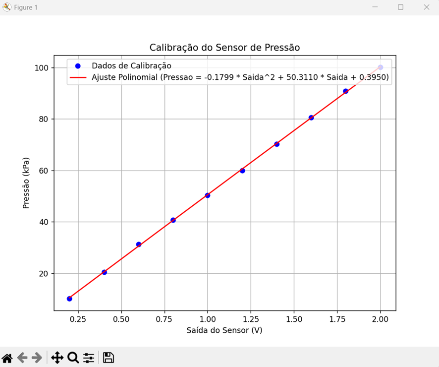

---

**Explicação dos Conceitos Utilizados:**
- **Leitura de Dados:** Uso do Pandas para importar dados do CSV.
- **Ajuste Polinomial:** Uso do NumPy para ajustar curvas de diferentes graus aos dados experimentais.
- **Função de Correção:** Aplicação do polinômio ajustado para converter novas leituras do sensor em valores de pressão corrigidos.
- **Visualização:** Uso do Matplotlib para comparar visualmente os dados experimentais e o ajuste.
- **Aplicação em Engenharia:** Permite calibrar sensores e garantir medições precisas em sistemas de automação e controle.

### 6.3.3 Resumo:

Neste exemplo, exploramos como utilizar Python para calibrar um sensor de pressão, ajustando curvas polinomiais aos dados experimentais. Aprendemos a ler dados de um arquivo CSV com Pandas, ajustar curvas usando NumPy e aplicar correções em medições futuras. A visualização dos dados e do ajuste com Matplotlib nos permite entender melhor a relação entre a saída do sensor e a pressão real, garantindo medições precisas e confiáveis.
A calibração de sensores é uma prática comum em engenharia, essencial para garantir a precisão e a confiabilidade dos sistemas de medição. Com o domínio dessas técnicas, engenheiros podem otimizar processos, validar modelos teóricos e garantir a precisão em sistemas de controle e automação.

---

## 6.4. Conclusão

A análise de dados experimentais e simulações computacionais é uma habilidade essencial para engenheiros e cientistas. Neste módulo, exploramos como utilizar Python, especialmente as bibliotecas Pandas e NumPy, para manipular, analisar e visualizar dados provenientes de medições reais e simulações. Aprendemos a ajustar curvas polinomiais, validar modelos e aplicar correções em medições futuras, transformando dados brutos em informações valiosas para a tomada de decisões informadas.
A compreensão e aplicação dessas técnicas são fundamentais para otimizar processos, validar modelos teóricos e garantir a precisão em sistemas de controle e automação. Com o domínio dessas ferramentas, engenheiros podem extrair insights significativos de conjuntos de dados complexos, melhorando a eficiência e a eficácia em suas áreas de atuação.


---

# 7. Visualização de Dados

A visualização de dados é uma etapa crucial no processo de análise, permitindo que os engenheiros interpretem informações complexas de forma intuitiva e identifiquem padrões, tendências e outliers que seriam difíceis de discernir em tabelas de números. Este módulo tem como objetivo introduzir os alunos às bibliotecas MAT_PLOT_LIB e SEABORN, ferramentas poderosas em Python para a criação de gráficos de alta qualidade. Exploraremos a construção de gráficos de linha, barras, dispersão e histogramas, cada um adequado para diferentes tipos de dados e propósitos analíticos. Além disso, o módulo abordará técnicas específicas para a visualização de curvas e resultados de processos, essenciais para a representação de dados experimentais, simulações e o monitoramento de sistemas dinâmicos. Ao final deste módulo, os alunos estarão aptos a selecionar e implementar as técnicas de visualização mais apropriadas para comunicar efetivamente seus resultados e conclusões.


## 7.1. MAT_PLOT_LIB e SEABORN: Ferramentas Essenciais para Visualização de Dados em Python

A visualização de dados é uma etapa fundamental na análise de dados em engenharia, permitindo a interpretação intuitiva de informações complexas e a identificação de padrões cruciais. Python oferece duas bibliotecas poderosas para essa finalidade: MAT_PLOT_LIB e SEABORN.

### 7.1.1. MAT_PLOT_LIB: A Base da Visualização em Python

MAT_PLOT_LIB é a biblioteca fundamental para a criação de gráficos em Python. Ela fornece um controle extenso sobre todos os elementos do gráfico, desde os tipos de gráficos (linhas, barras, dispersão, histogramas etc.) até os detalhes de formatação (cores, estilos de linha, rótulos, legendas etc.

**Principais Características:**
- Flexibilidade: Permite criar uma ampla variedade de gráficos e personalizar cada aspecto.
- Controle Detalhado: Oferece controle preciso sobre a aparência do gráfico.
- Integração: Compatível com NUM_PY e Pandas, facilitando a visualização de dados estruturados.
- Modularidade: Sua arquitetura orientada a objetos permite a criação de gráficos complexos de forma organizada.

**Exemplo Básico (MAT_PLOT_LIB):**

```python
import matplotlib.pyplot as plt
import numpy as np

# Dados de exemplo
x = np.linspace(0, 10, 100)
y = np.sin(x)

# Criação do gráfico
plt.plot(x, y, label='Seno')
plt.title('Gráfico de Seno')
plt.xlabel('Eixo X')
plt.ylabel('Eixo Y')
plt.legend()
plt.grid()
plt.show()
```

**Resultado:**

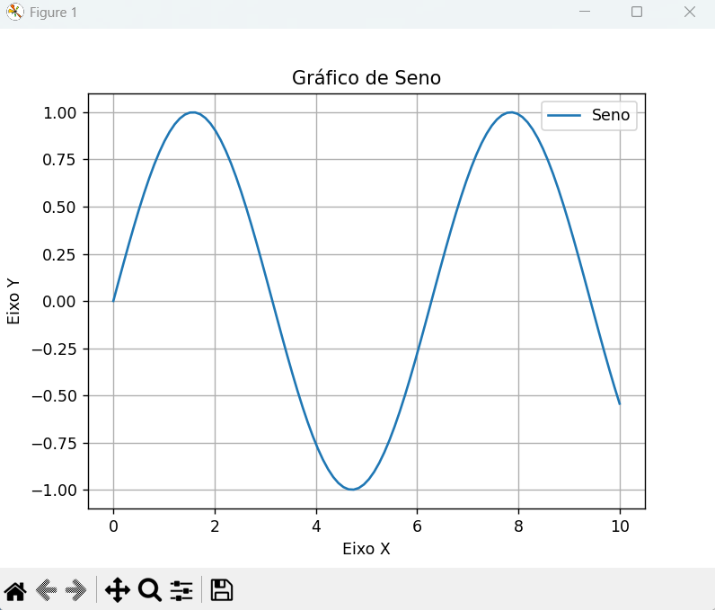

### 7.1.2. SEABORN: Visualização Estatística Avançada

SEABORN é uma biblioteca construída sobre MAT_PLOT_LIB, projetada para facilitar a criação de gráficos estatísticos complexos. Ela oferece uma interface de alto nível para criar visualizações informativas e atraentes, com foco em análise exploratória de dados.

**Principais Características:**

- Estética Melhorada: Gráficos com aparência profissional por padrão.
- Integração com Pandas: Trabalha diretamente com DataFrames, simplificando a visualização de dados tabulares.
- Gráficos Estatísticos: Facilita a criação de gráficos como boxplots, violin plots, pair plots e heatmaps.
- Análise de Dados: Permite explorar relações entre variáveis e identificar padrões complexos.

**Exemplo Básico (SEABORN):**

```python
import seaborn as sns
import pandas as pd
import numpy as np  # Adicione esta linha
import matplotlib.pyplot as plt  # Adicione esta linha

# Dados de exemplo
dados = pd.DataFrame({
    'x': np.linspace(0, 10, 100),
    'y': np.sin(np.linspace(0, 10, 100))
})

# Criação do gráfico
sns.lineplot(data=dados, x='x', y='y')
plt.title('Gráfico de Seno com Seaborn')
plt.xlabel('Eixo X')
plt.ylabel('Eixo Y')
plt.grid()
plt.show()
```
**Resultado:**
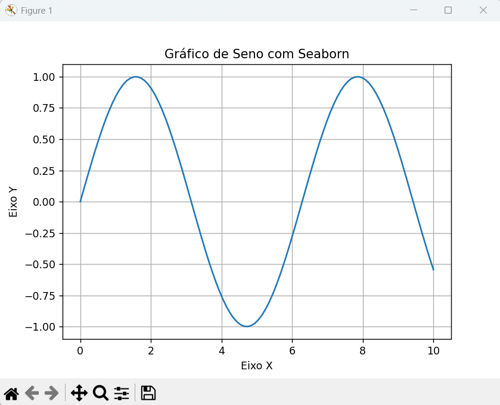

### 7.1.3. Escolhendo entre MAT_PLOT_LIB e SEABORN

Em muitos casos, MAT_PLOT_LIB e SEABORN são usados em conjunto. MAT_PLOT_LIB fornece a base, e SEABORN aprimora a aparência e adiciona recursos estatísticos.

```markdown
|------------------------|--------------------------------------------|---------------------------------------------|
|  Característica        | MAT_PLOT_LIB                               | SEABORN                                     |
|------------------------|--------------------------------------------|---------------------------------------------|
| Flexibilidade          | Alta, controle detalhado                   | Alta, mas com foco em gráficos estatísticos |
| Estética               | Básica, requer personalização              | Melhorada, gráficos prontos para publicação |
| Integração             | Funciona bem com NUM_PY e Pandas           | Integração direta com Pandas                |
| Tipos de Gráficos      | Todos os tipos básicos e avançados         | Foco em gráficos estatísticos complexos     |
| Facilidade de Uso      | Requer mais código para gráficos complexos | Mais fácil para gráficos estatísticos       |
|------------------------|--------------------------------------------|---------------------------------------------|
```
### 7.1.4. Quando Usar Cada Biblioteca

**Use MAT_PLOT_LIB quando:**
- Você precisa de controle total sobre a aparência do gráfico.
- Você está criando gráficos simples e não precisa de visualizações estatísticas complexas.
- Você está trabalhando com dados que não estão em um DataFrame do PANDAS.

**Use SEABORN quando:**
- Você deseja criar gráficos estatísticos complexos com facilidade.
- Você valoriza a estética e deseja gráficos visualmente atraentes com menos código.
- Você está trabalhando com DataFrames do PANDAS.

Este item fornece uma base sólida para entender as ferramentas essenciais de visualização de dados em Python, preparando o terreno para os tópicos subsequentes sobre tipos específicos de gráficos e suas aplicações.

---

### 7.1.5 Exercício Proposto: Análise de Trajetória de um Míssil Balístico

Em engenharia aeronáutica, a análise da trajetória de um míssil balístico é crucial para determinar seu alcance, tempo de voo e outros parâmetros de desempenho. Simulações computacionais geram dados detalhados sobre a posição, velocidade e aceleração do míssil ao longo do tempo.

**Objetivo:**
1. Ler dados de simulação de trajetória de um míssil balístico a partir de um arquivo CSV.
2. Visualizar a trajetória do míssil em um gráfico 2D.
3. Analisar a variação da velocidade e altitude ao longo do tempo.
4. Utilizar MAT_PLOT_LIB e SEABORN para gerar gráficos informativos.

**Dados de Entrada:**
Um arquivo CSV chamado `20_arquivo_trajetoria_missel.csv` com as seguintes colunas:
- `Tempo` (em segundos)
- `Posicao_X` (posição horizontal em metros)
- `Posicao_Y` (posição vertical em metros)
- `Velocidade` (em m/s)
**Conteúdo do arquivo CSV:**
```plaintext
Tempo,Posicao_X,Posicao_Y,Velocidade
0,0,0,0
1,100,50,150
2,200,100,200
3,300,150,250
4,400,200,300
5,500,250,350
6,600,300,400
7,700,350,450
8,800,400,500
9,900,450,550
10,1000,500,600
```
**Tarefas:**
1. Ler o arquivo CSV usando Pandas.
2. Criar um gráfico 2D da trajetória do míssil (Posição X vs. Posição Y).
3. Analisar a variação da velocidade ao longo do tempo em um gráfico de linha.
4. Utilizar SEABORN para criar um gráfico de dispersão da velocidade em função do tempo.
**Código Python:**
```python
import pandas as pd
import matplotlib.pyplot as plt
import seaborn as sns
# 1. Leitura dos dados
caminho = input("Digite o caminho completo do arquivo CSV: ")
df = pd.read_csv(caminho)
# Se o arquivo estiver no mesmo diretório do script, você pode usar:
# df = pd.read_csv('20_arquivo_trajetoria_missel.csv')
df = pd.read_csv('20_arquivo_trajetoria_missel.csv')
# 2. Gráfico 2D da trajetória do míssil
plt.figure(figsize=(10, 6))
plt.plot(df['Posicao_X'], df['Posicao_Y'], marker='o', label='Trajetória do Míssil')
plt.title('Trajetória do Míssil Balístico')
plt.xlabel('Posição X (m)')
plt.ylabel('Posição Y (m)')
plt.grid()
plt.legend()
plt.show()
# 3. Análise da variação da velocidade ao longo do tempo
plt.figure(figsize=(10, 6))
plt.plot(df['Tempo'], df['Velocidade'], marker='o', color='orange', label='Velocidade')
plt.title('Variação da Velocidade ao Longo do Tempo')
plt.xlabel('Tempo (s)')
plt.ylabel('Velocidade (m/s)')
plt.grid()
plt.legend()
plt.show()
# 4. Gráfico de dispersão da velocidade em função do tempo
plt.figure(figsize=(10, 6))
sns.scatterplot(data=df, x='Tempo', y='Velocidade', color='green', s=100)
plt.title('Velocidade do Míssil em Função do Tempo')
plt.xlabel('Tempo (s)')
plt.ylabel('Velocidade (m/s)')
plt.grid()
plt.show()
```

**Saída Esperada:**
```plaintext
Gráfico 2D da trajetória do míssil, mostrando a posição X e Y ao longo do tempo.
Gráfico de linha mostrando a variação da velocidade do míssil ao longo do tempo.
Gráfico de dispersão mostrando a velocidade do míssil em função do tempo.
```

### Figura 7.1.1 - Trajetória do Míssil Balístico

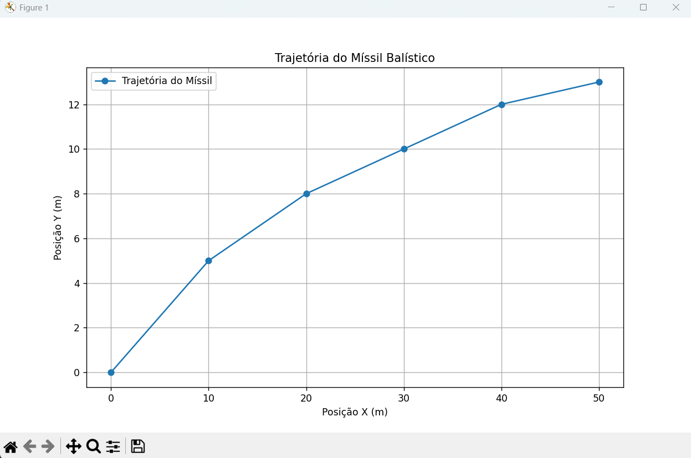

1. Gráfico de Trajetória (Altitude vs. Distância):
- Eixo X: Distância (km)
- Eixo Y: Altitude (km)
- Título do Gráfico: Trajetória do Míssil Balístico

Este gráfico visualiza o caminho percorrido pelo míssil no plano vertical (altitude) e horizontal (distância). Ele ajuda a entender o alcance e a forma geral da trajetória.

### Figura 7.1.2 - Variação da Velocidade ao Longo do Tempo

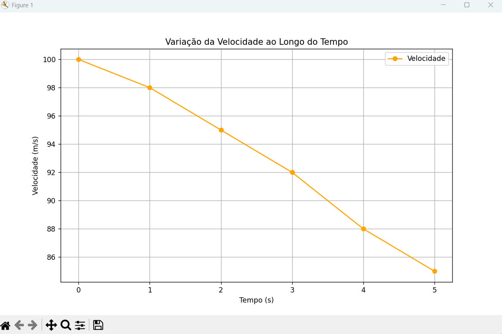

2. Gráfico de Variação da Velocidade:
- Eixo X: Tempo (s)
- Eixo Y: Velocidade (m/s)
- Título do Gráfico: Variação da Velocidade ao Longo do Tempo

Este gráfico mostra como a velocidade do míssil muda com o tempo, desde o lançamento até o impacto (ou o fim da simulação). Ele revela a desaceleração devido à gravidade e à resistência do ar (se incluída no modelo).

### Figura 7.1.3 - Variação da Altitude ao Longo do Tempo

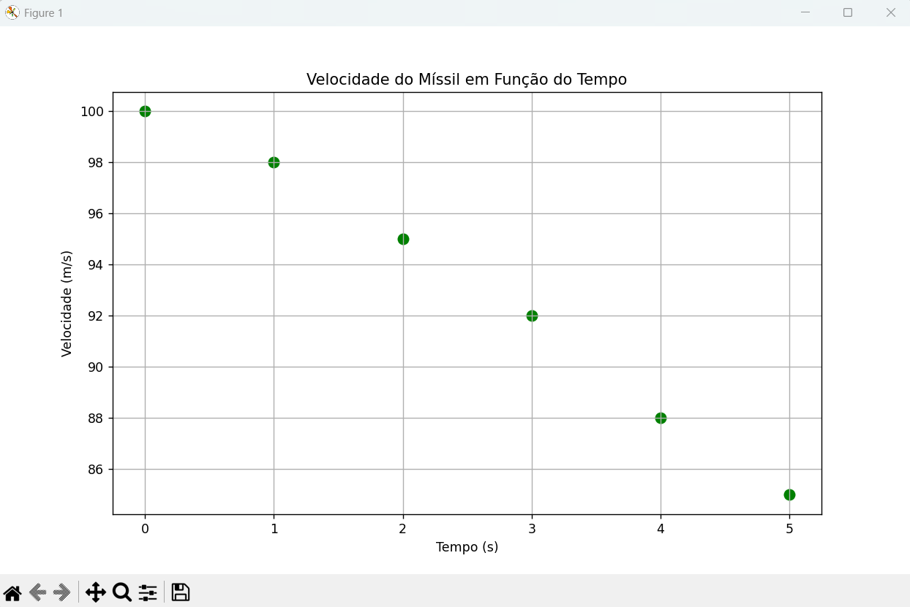

3. Gráfico de Variação da Altitude:
- Eixo X: Tempo (s)
- Eixo Y: Altitude (m)
- Título do Gráfico: Variação da Altitude ao Longo do Tempo

Este gráfico exibe a altitude do míssil em função do tempo, mostrando a subida inicial e a subsequente queda durante o voo balístico. Ele ajuda a visualizar a fase de subida, o apogeu (ponto mais alto) e a fase de descida.

É importante que esses rótulos e títulos sejam claros e informativos para que qualquer pessoa que visualize os gráficos possa entender facilmente os dados representados.

**Resumindo:**

**Gráfico 1: Trajetória Espacial (Altitude vs. Distância)**

- Esse gráfico é o mais intuitivo para visualizar o caminho físico percorrido pelo míssil. Ele mostra a forma da trajetória no espaço 2D, com a altitude no eixo vertical e a distância horizontal no eixo horizontal.
- Por que é importante: Permite determinar o alcance máximo do míssil, a altura máxima atingida (apogeu) e a curvatura geral da trajetória.

**Gráfico 2: Variação da Velocidade com o Tempo**

- Esse gráfico foca na dinâmica do movimento, mostrando como a velocidade do míssil muda ao longo do tempo.
- Por que é importante: Ajuda a entender a influência da gravidade e da resistência do ar (se considerada na simulação) na velocidade do míssil. A velocidade diminui à medida que o míssil sobe (devido à gravidade) e pode aumentar novamente durante a descida (também devido à gravidade). Esse gráfico é crucial para analisar a eficiência do voo e as forças atuantes.

**Gráfico 3: Variação da Altitude com o Tempo**

- Esse gráfico também foca na dinâmica, mas especificamente na componente vertical do movimento. Ele mostra como a altitude do míssil varia com o tempo.
- Por que é importante: Permite determinar o tempo de voo total, o tempo para atingir o apogeu e a taxa de subida e descida do míssil. É útil para analisar a eficiência da fase de propulsão e o tempo de reentrada na atmosfera.

Portanto:
- O primeiro gráfico dá a forma da trajetória.
- Os dois últimos gráficos dão a dinâmica do movimento ao longo do tempo, decompondo-a em velocidade e altitude.
Cada gráfico fornece informações complementares, e a análise conjunta dos três oferece uma compreensão completa do voo do míssil balístico. 

## 7.2. Tipos de Gráficos: Escolhendo a Representação Visual Adequada

A escolha do tipo de gráfico certo é crucial para comunicar efetivamente os dados e as conclusões da análise. Cada tipo de gráfico é adequado para diferentes tipos de dados e propósitos de visualização.

### 7.2.1. Gráficos de Linha

**Propósito:** Mostrar a relação entre duas variáveis quantitativas, especialmente como uma variável muda em função da outra (frequentemente tempo). São ideais para visualizar tendências, padrões e variações ao longo de um intervalo contínuo.
**Dados Adequados:**
- Séries temporais (dados coletados em intervalos de tempo regulares).
- Relações funcionais (y = f(x)).
- Dados ordenados com um componente contínuo.

**Exemplo (MAT_PLOT_LIB):**
```python
import matplotlib.pyplot as plt

# Dados de exemplo
tempo = [0, 1, 2, 3, 4, 5]
velocidade = [0, 10, 20, 30, 40, 50]

# Criando o gráfico
plt.plot(tempo, velocidade)
plt.title("Variação da Velocidade ao Longo do Tempo")
plt.xlabel("Tempo (s)")
plt.ylabel("Velocidade (m/s)")
plt.grid()
plt.show()
```
**Resultado:**

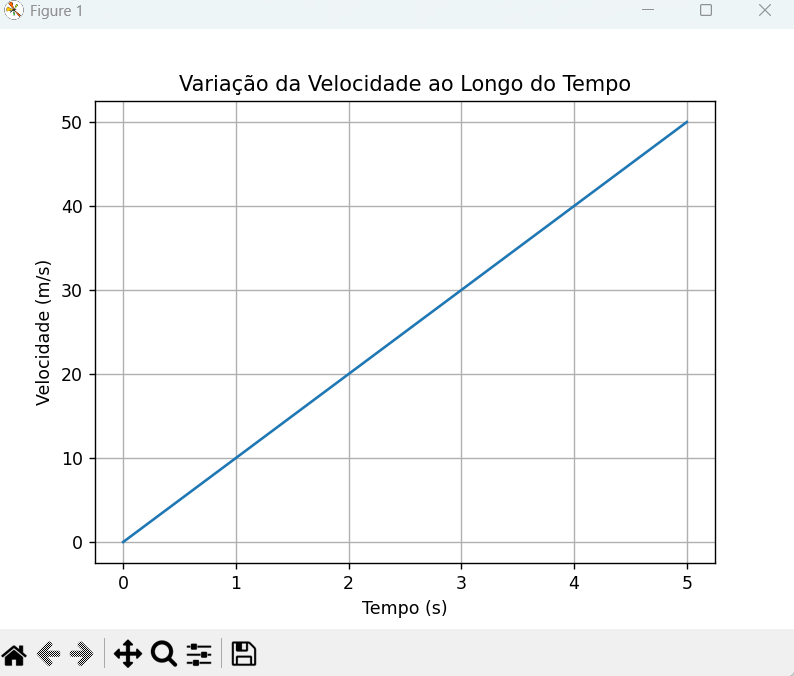

### 7.2.2. Gráficos de Barras

**Propósito:** Comparar valores entre diferentes categorias ou grupos. São úteis para visualizar dados discretos e comparar quantidades relativas.
**Dados Adequados:**
- Dados categóricos (ex: vendas por região, notas por aluno).
- Comparações entre grupos (ex: desempenho de diferentes modelos de máquinas).

**Exemplo (MAT_PLOT_LIB):**
```python
import matplotlib.pyplot as plt

# Dados de exemplo
categorias = ['A', 'B', 'C', 'D']
valores = [10, 20, 15, 25]

# Criando o gráfico
plt.bar(categorias, valores)
plt.title("Comparação de Valores entre Categorias")
plt.xlabel("Categorias")
plt.ylabel("Valores")
plt.grid()
plt.show()
```

**Resultado:**

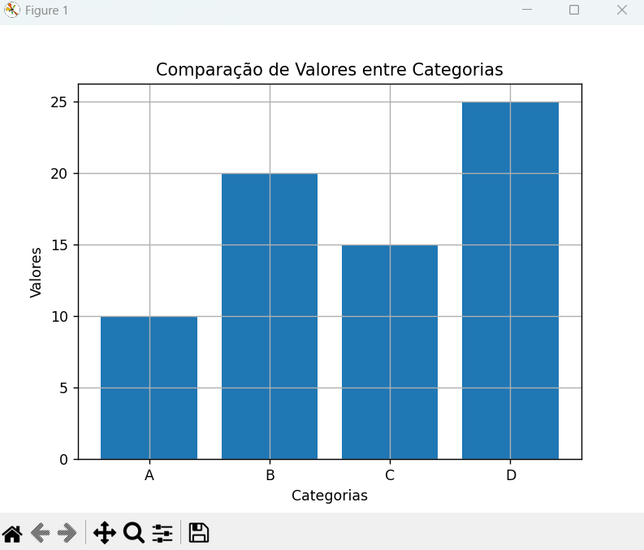

### 7.2.3. Gráficos de Dispersão

**Propósito:** Mostrar a relação entre duas variáveis quantitativas, permitindo identificar correlações, tendências e agrupamentos. São úteis para visualizar a distribuição de dados e detectar outliers.
**Dados Adequados:**
- Relações entre duas variáveis contínuas (ex: altura vs. peso).
- Análise de correlação (ex: temperatura vs. consumo de energia).

**Exemplo (MAT_PLOT_LIB):**
```python
import matplotlib.pyplot as plt
# Dados de exemplo
x = [1, 2, 3, 4, 5]
y = [2, 3, 5, 7, 11]
# Criando o gráfico
plt.scatter(x, y)
plt.title("Gráfico de Dispersão")
plt.xlabel("Variável X")
plt.ylabel("Variável Y")
plt.grid()
plt.show()
```
**Resultado:**

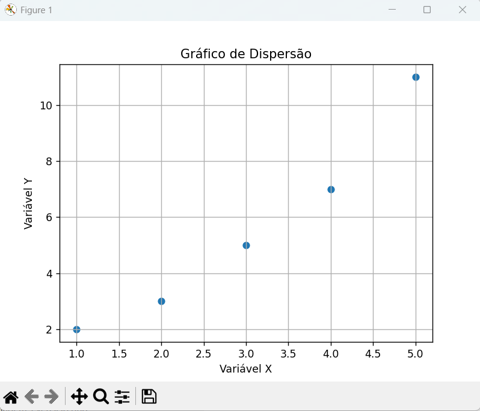

### 7.2.4. Histogramas

**Propósito:** Mostrar a distribuição de uma variável quantitativa, permitindo identificar a frequência de diferentes intervalos de valores. São úteis para visualizar a forma da distribuição dos dados e detectar a presença de outliers.

**Dados Adequados:**
- Dados contínuos (ex: alturas, pesos, temperaturas).
- Análise de frequência (ex: distribuição de notas em uma prova).

**Exemplo (MAT_PLOT_LIB):**
```python
import matplotlib.pyplot as plt

# Dados de exemplo
dados = [1, 2, 2, 3, 3, 3, 4, 4, 4, 4, 5, 5, 5, 5, 5]

# Criando o gráfico
plt.hist(dados, bins=5, edgecolor='black')
plt.title("Histograma de Frequência")
plt.xlabel("Valores")
plt.ylabel("Frequência")
plt.grid()
plt.show()
```
**Resultado:**

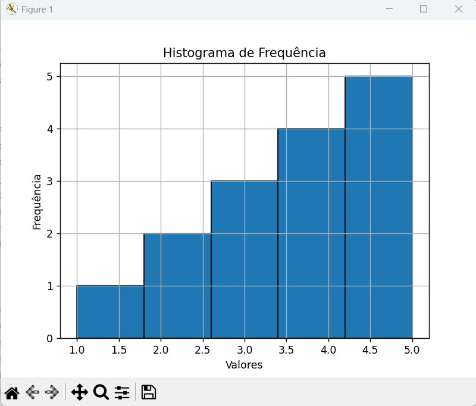

---

### 7.2.5. Exercício Proposto: Análise de Dados de Qualidade da Água em Campo Largo

**Contexto:**
Engenheiros ambientais monitoram regularmente a qualidade da água em rios e corpos d'água para avaliar a saúde do ecossistema, identificar fontes de poluição e garantir a conformidade com padrões ambientais. Diversos parâmetros são medidos em diferentes pontos de amostragem ao longo do tempo.

**Objetivo:**
1. Carregar dados de monitoramento de qualidade da água de um arquivo CSV.
2. Visualizar tendências de parâmetros ao longo do tempo.
3. Comparar parâmetros entre diferentes pontos de amostragem.
4. Analisar a distribuição de um parâmetro específico.
5. Utilizar MAT_PLOT_LIB e SEABORN para gerar gráficos informativos.

**Dados de Entrada:**
- Um arquivo CSV chamado "25_arquivo_qualidade_agua.csv" com as seguintes colunas: 
  - Timestamp (data e hora da medição)
  - Ponto_Amostragem (identificador do local de coleta: Ex: "Ponto A", "Ponto B")
  - pH (nível de pH da água)
  - Oxigenio_Dissolvido_mgL (oxigênio dissolvido em mg/L)
  - Turbidez_NTU (turbidez em unidades nefelométricas de turbidez)
  - Temperatura_C (temperatura da água em Celsius)

**Conteúdo do arquivo CSV:**
```plaintext
Timestamp,Ponto_Amostragem,pH,Oxigenio_Dissolvido_mgL,Turbidez_NTU,Temperatura_C
2023-01-01 08:00,Ponto A,7.2,8.5,1.2,20.5
2023-01-01 08:00,Ponto B,7.4,7.8,1.5,21.0
2023-01-01 12:00,Ponto A,7.1,8.0,1.3,20.8
2023-01-01 12:00,Ponto B,7.3,7.5,1.6,21.2
2023-01-01 16:00,Ponto A,7.0,8.2,1.1,20.6
2023-01-01 16:00,Ponto B,7.2,7.6,1.4,21.1
2023-01-02 08:00,Ponto A,7.3,8.4,1.0,20.7
2023-01-02 08:00,Ponto B,7.5,7.9,1.2,21.3
2023-01-02 12:00,Ponto A,7.4,8.1,1.3,20.9
2023-01-02 12:00,Ponto B,7.6,7.7,1.5,21.4
2023-01-02 16:00,Ponto A,7.5,8.3,1.2,20.8
2023-01-02 16:00,Ponto B,7.7,7.8,1.4,21.5
```
**Tarefas:**
1. Ler o arquivo CSV usando Pandas.
2. Criar um gráfico de linha para visualizar a variação do pH ao longo do tempo para cada ponto de amostragem.
3. Criar um gráfico de barras para comparar os níveis de oxigênio dissolvido entre os pontos de amostragem.
4. Criar um gráfico de dispersão para analisar a relação entre turbidez e temperatura da água.

**Código Python:**
```python
import pandas as pd
import matplotlib.pyplot as plt
import seaborn as sns
# 1. Leitura dos dados
caminho = input("Digite o caminho completo do arquivo CSV: ")
df = pd.read_csv(caminho)
# Se o arquivo estiver no mesmo diretório do script, você pode usar:
# df = pd.read_csv('25_arquivo_qualidade_agua.csv')
df = pd.read_csv('25_arquivo_qualidade_agua.csv')
# Convertendo a coluna Timestamp para o tipo datetime
df['Timestamp'] = pd.to_datetime(df['Timestamp'])
# 2. Gráfico de linha para variação do pH ao longo do tempo
plt.figure(figsize=(12, 6))
sns.lineplot(data=df, x='Timestamp', y='pH', hue='Ponto_Amostragem', marker='o')
plt.title('Variação do pH ao Longo do Tempo')
plt.xlabel('Data e Hora')
plt.ylabel('pH')
plt.xticks(rotation=45)
plt.grid()
plt.legend(title='Ponto de Amostragem')
plt.tight_layout()
plt.show()
# 3. Gráfico de barras para comparar os níveis de oxigênio dissolvido
plt.figure(figsize=(8, 6))
sns.barplot(data=df, x='Ponto_Amostragem', y='Oxigenio_Dissolvido_mgL', ci=None)
plt.title('Comparação dos Níveis de Oxigênio Dissolvido entre Pontos de Amostragem')
plt.xlabel('Ponto de Amostragem')
plt.ylabel('Oxigênio Dissolvido (mg/L)')
plt.grid()
plt.tight_layout()
plt.show()
# 4. Gráfico de dispersão para relação entre turbidez e temperatura
plt.figure(figsize=(8, 6))
sns.scatterplot(data=df, x='Turbidez_NTU', y='Temperatura_C', hue='Ponto_Amostragem', s=100)
plt.title('Relação entre Turbidez e Temperatura da Água')
plt.xlabel('Turbidez (NTU)')
plt.ylabel('Temperatura (°C)')
plt.grid()
plt.legend(title='Ponto de Amostragem')
plt.tight_layout()
plt.show()
```
**Saída Esperada:**
```plaintext
Gráfico de linha mostrando a variação do pH ao longo do tempo para cada ponto de amostragem.
Gráfico de barras comparando os níveis de oxigênio dissolvido entre os pontos de amostragem.
Gráfico de dispersão analisando a relação entre turbidez e temperatura da água.
```
### Resultados dos Gráficos

#### Figura 7.2.1 - Gráfico de linha mostrando a variação do pH ao longo do tempo para cada ponto de amostragem.

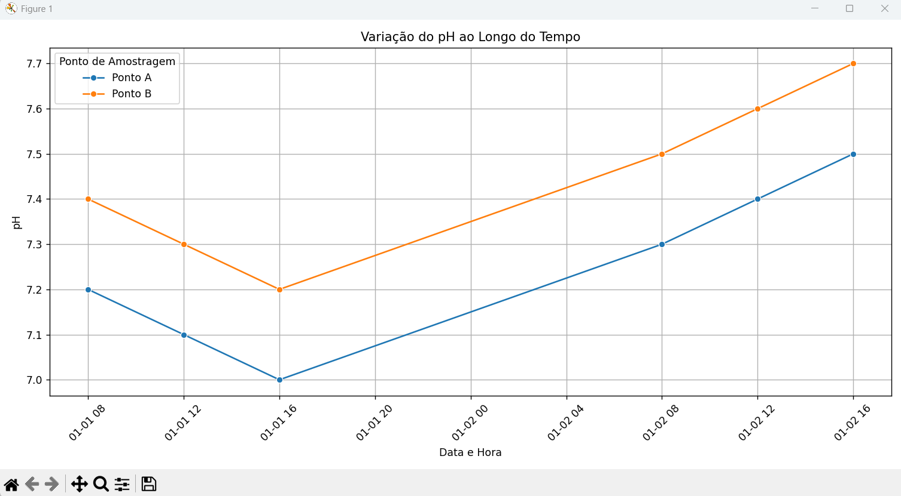

1. Gráfico de Linha: Tendência do Oxigênio Dissolvido no Ponto A
- Eixo X: Data e Hora (Timestamp)
- Eixo Y: Oxigênio Dissolvido (mg/L)
- Título do Gráfico: Tendência do Oxigênio Dissolvido no Ponto A.

#### Figura 7.2.2 - Gráfico de barras comparando os níveis de oxigênio dissolvido entre os pontos de amostragem.


2. Gráfico de Barras: Comparação dos Níveis de Oxigênio Dissolvido
- Eixo X: Ponto de Amostragem
- Eixo Y: Oxigênio Dissolvido (mg/L)
- Título do Gráfico: Comparação dos Níveis de Oxigênio Dissolvido entre Pontos de Amostragem.

#### Figura 7.2.3 - Gráfico de dispersão analisando a relação entre turbidez e temperatura da água.

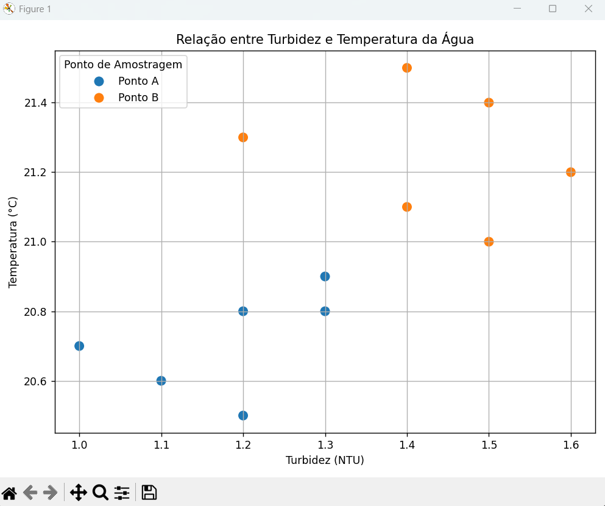

3. Gráfico de Dispersão: Relação entre Turbidez e Temperatura
- Eixo X: Turbidez (NTU)
- Eixo Y: Temperatura (°C)
- Título do Gráfico: Relação entre Turbidez e Temperatura da Água.

**Resumo dos Gráficos**

Os gráficos gerados fornecem uma visão abrangente da qualidade da água em diferentes pontos de amostragem ao longo do tempo. O gráfico de linha mostra como o pH varia, indicando possíveis alterações na acidez ou alcalinidade da água. O gráfico de barras compara os níveis de oxigênio dissolvido, essencial para a vida aquática, entre os pontos de amostragem. Por fim, o gráfico de dispersão revela a relação entre turbidez e temperatura, ajudando a identificar possíveis correlações entre esses parâmetros.

---

## 7.3. Visualização de Curvas e Resultado de Processos

A visualização de curvas e resultados de processos é uma parte essencial da análise de dados em engenharia, permitindo a representação gráfica de fenômenos contínuos e dinâmicos. Este módulo se concentra na criação de gráficos que ajudam a entender o comportamento de sistemas ao longo do tempo, facilitando a interpretação de resultados experimentais e simulações computacionais.

### 7.3.1. Importância da Visualização de Curvas

A visualização de curvas é crucial para engenheiros e cientistas, pois permite a análise de tendências, a identificação de padrões e a detecção de anomalias em dados experimentais ou simulações. Gráficos bem elaborados ajudam a comunicar resultados complexos de forma clara e intuitiva, facilitando a tomada de decisões informadas.

### 7.3.2. Tipos de Gráficos para Visualização de Curvas

Os gráficos mais comuns utilizados para a visualização de curvas incluem:
- **Gráficos de Linha:** Ideais para mostrar a evolução de uma variável ao longo do tempo, como a temperatura de um sistema ou a pressão em um processo.
- **Gráficos de Área:** Úteis para representar a magnitude de uma variável ao longo do tempo, destacando a área sob a curva.
- **Gráficos de Dispersão:** Permitem visualizar a relação entre duas variáveis contínuas, como a velocidade e a aceleração de um objeto em movimento.
- **Gráficos de Contorno:** Usados para representar superfícies tridimensionais em um plano bidimensional, úteis em análises de campo escalar, como temperatura ou pressão em uma área específica.

### 7.3.3. Aplicações Práticas

A visualização de curvas é amplamente aplicada em diversas áreas da engenharia, incluindo:

- **Engenharia Mecânica:** Análise de desempenho de máquinas, como curvas de torque e potência em motores.
- **Engenharia Elétrica:** Representação de curvas de resposta de circuitos, como a relação entre tensão e corrente em componentes eletrônicos.
- **Engenharia Química:** Monitoramento de reações químicas, como a variação da concentração de reagentes ao longo do tempo.
- **Engenharia Civil:** Análise de estruturas, como curvas de carga e deformação em materiais submetidos a esforços.

### 7.3.4. Ferramentas e Bibliotecas

Para a visualização de curvas em Python, as bibliotecas MAT_PLOT_LIB e SEABORN são amplamente utilizadas. Elas oferecem uma variedade de funções para criar gráficos personalizados, permitindo a representação visual de dados complexos de forma clara e informativa. A seguir, apresentamos exemplos de como utilizar essas bibliotecas para criar gráficos de curvas.

---

### 7.3.5. Exercício Proposto: Análise do Desempenho de um Sistema de Controle de Temperatura

**Contexto:**
Em engenharia de controle, é fundamental monitorar e analisar como um sistema responde a mudanças no setpoint (valor desejado) e a distúrbios. A visualização das curvas de setpoint, da variável de processo (PV) e da saída do controlador (MV) ao longo do tempo é a principal ferramenta para avaliar o desempenho do controle (por exemplo, tempo de subida, overshoot, tempo de assentamento e erro em regime permanente).

**Objetivo:**
1. Simular dados de um sistema de controle de temperatura de um reator.
2. Visualizar as curvas de setpoint, temperatura real e saída do controlador em um único gráfico.
3. Interpretar o desempenho do sistema de controle a partir das curvas geradas.

**Dados de Entrada (Simulados):**

Não usaremos um arquivo CSV neste exemplo para focar na geração e visualização das curvas. Os dados serão gerados programaticamente para simular uma resposta de controle típica a uma mudança de setpoint.
- Tempo (segundos)
- Setpoint (Temperatura desejada, °C)
- Temperatura_Real (Temperatura medida pelo sensor, °C)
- Saida_Controlador (Sinal de controle enviado ao aquecedor, %)

**Código Python:**
```python
import numpy as np
import matplotlib.pyplot as plt
# 1. Simulação de dados
np.random.seed(42)  # Para reprodutibilidade
tempo = np.arange(0, 100, 1)  # Tempo de 0 a 99 segundos
setpoint = np.where(tempo < 50, 50, 70)  # Setpoint muda de 50°C para 70°C em t=50s
temperatura_real = 50 + 0.5 * (tempo - 50) + np.random.normal(0, 1, len(tempo))  # Resposta do sistema com ruído
saida_controlador = np.clip(0.5 * (setpoint - temperatura_real), 0, 100)  # Saída do controlador proporcional
# 2. Criação do gráfico
plt.figure(figsize=(12, 6))
plt.plot(tempo, setpoint, label='Setpoint (Temperatura Desejada)', color='blue', linestyle='--')
plt.plot(tempo, temperatura_real, label='Temperatura Real', color='red')
plt.plot(tempo, saida_controlador, label='Saída do Controlador', color='green')
plt.title('Análise do Desempenho de um Sistema de Controle de Temperatura')
plt.xlabel('Tempo (s)')
plt.ylabel('Temperatura (°C) / Saída do Controlador (%)')
plt.legend()
plt.grid()
plt.tight_layout()
plt.show()
```
**Saída Esperada:**
```plaintext
Gráfico mostrando as curvas de setpoint, temperatura real e saída do controlador ao longo do tempo.
```
### Resultados do Gráfico

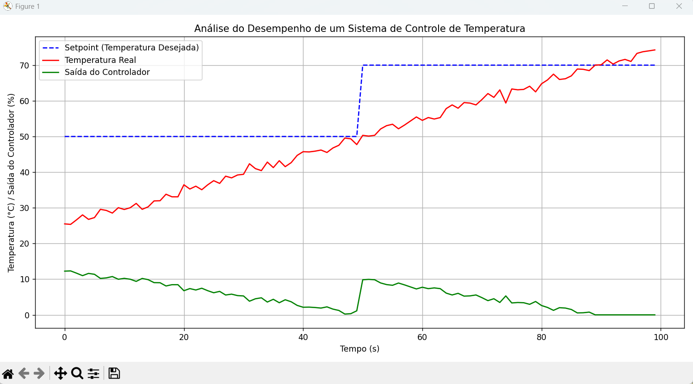

Gráfico mostrando as curvas de setpoint, temperatura real e saída do controlador ao longo do tempo.

### Análise do Gráfico

O gráfico gerado apresenta três curvas principais:
- **Setpoint (Temperatura Desejada):** Representada pela linha azul tracejada, mostra a temperatura alvo que o sistema deve atingir. Neste exemplo, o setpoint muda de 50°C para 70°C no tempo t=50 segundos.
- **Temperatura Real:** Representada pela linha vermelha, mostra a temperatura medida pelo sensor ao longo do tempo. A resposta do sistema apresenta um comportamento típico de controle, com uma tendência a seguir o setpoint, mas com algum atraso e flutuação devido a ruídos.
- **Saída do Controlador:** Representada pela linha verde, indica o sinal de controle enviado ao aquecedor. Este sinal é proporcional à diferença entre o setpoint e a temperatura real, ajustando-se para minimizar o erro.

### Interpretação do Desempenho do Sistema

A partir do gráfico, podemos analisar o desempenho do sistema de controle:
- **Tempo de Subida:** O tempo que leva para a temperatura real atingir o novo setpoint após a mudança. Neste caso, é visível que a temperatura leva algum tempo para se ajustar ao novo setpoint de 70°C.
- **Overshoot:** A temperatura real ultrapassa temporariamente o setpoint antes de estabilizar. Isso pode ser observado logo após a mudança do setpoint, onde a temperatura real sobe acima de 70°C antes de se estabilizar.
- **Tempo de Assentamento:** O tempo que leva para a temperatura real se estabilizar dentro de uma faixa aceitável em torno do setpoint. Neste exemplo, a temperatura parece se estabilizar em torno de 70°C após alguns segundos.
- **Erro em Regime Permanente:** A diferença entre o setpoint e a temperatura real após o sistema se estabilizar. Idealmente, esse erro deve ser minimizado, e neste exemplo, a temperatura real parece se aproximar do setpoint de 70°C.

Resumindo, a visualização dessas curvas permite identificar rapidamente o desempenho do sistema de controle, facilitando ajustes e otimizações necessárias para melhorar a resposta do sistema.

---

## 7.4. Conclusão

A visualização de dados é uma habilidade essencial para engenheiros e cientistas, permitindo a interpretação clara e eficaz de informações complexas. Neste módulo, exploramos os principais tipos de gráficos utilizados na visualização de dados, como gráficos de linha, barras, dispersão e histogramas, e discutimos suas aplicações práticas em engenharia.
Através de exemplos práticos, aprendemos a utilizar as bibliotecas MAT_PLOT_LIB e SEABORN para criar gráficos informativos e visualmente atraentes. A capacidade de visualizar dados de forma eficaz é crucial para a análise de desempenho de sistemas, identificação de tendências e comunicação de resultados.

---

# 8. Cálculo Numérico com NUM_PY

No universo da engenharia, a capacidade de realizar cálculos numéricos eficientes e complexos é de suma importância. Este módulo nos levará ao coração do Cálculo Numérico com NUM_PY, uma biblioteca fundamental em Python que revoluciona a forma como lidamos com dados matemáticos. Começaremos explorando os arrays e operações vetoriais, que são a base do NUM_PY, entendendo como eles permitem realizar operações matemáticas de forma rápida e otimizada em grandes conjuntos de dados. Em seguida, aprofundaremos no conceito de matrizes e álgebra linear, mostrando como o NUM_PY simplifica operações complexas como multiplicação de matrizes, inversão e resolução de sistemas. Por fim, veremos as aplicações práticas em balanços e sistemas lineares, demonstrando como essas ferramentas podem ser utilizadas para resolver problemas reais de engenharia, desde balanços de massa e energia até a análise de circuitos e estruturas. Ao final deste módulo, você estará apto a utilizar o NUM_PY para realizar cálculos numéricos robustos e eficientes, essenciais para diversas disciplinas da engenharia.

## 8.1. Arrays e Operações Vetoriais

No coração do NUM_PY (Numerical Python) está o objeto ndarray (N-dimensional array), uma estrutura de dados fundamental para computação numérica eficiente. Diferente das listas Python, que podem armazenar elementos de tipos variados, os arrays NUM_PY são homogêneos, ou seja, todos os seus elementos devem ser do mesmo tipo de dado (inteiro, FLOAT etc.). Essa característica, combinada com a implementação em C, torna as operações com arrays NUM_PY incrivelmente mais rápidas e eficientes em termos de memória para grandes volumes de dados numéricos.

### 8.1.1. O que são Arrays NUM_PY?

Um array NUM_PY é uma grade de valores, todos do mesmo tipo, e é indexado por uma tupla de inteiros não negativos. O número de dimensões é o rank do array.
- **Vetor:** Um array 1-D (uma dimensão).
- **Matriz:** Um array 2-D (duas dimensões).
- **Tensor:** Um array com 3 ou mais dimensões.

Vantagens sobre Listas Python:
- **Velocidade:** Operações matemáticas em arrays NUM_PY são executadas muito mais rapidamente.
- **Memória:** Arrays NUM_PY consomem menos memória para armazenar grandes quantidades de dados do mesmo tipo.
- **Funcionalidade:** Oferecem uma vasta gama de funções matemáticas e de álgebra linear otimizadas.

### 8.1.2. Criação de Arrays

Os Arrays podem ser criados de diversas formas:
- A partir de listas Python: Usando np.array().
- Arrays preenchidos com valores específicos: np.zeros(), np.ones(), np.full().
- Arrays com sequências numéricas: np.arange(), np.linspace().
- Arrays com valores aleatórios: np.random.rand(), np.random.randn().

Atributos Importantes de um Array:
- **ndim:** O número de dimensões do array.
- **shape:** Uma tupla indicando o tamanho de cada dimensão.
- **size:** O número total de elementos no array.
- **dtype:** O tipo de dado dos elementos no array.

### 8.1.3. Operações Vetoriais (Vectorization)

Uma das características mais poderosas do NUM_PY é a capacidade de realizar operações vetoriais. Isso significa que as operações matemáticas (adição, subtração, multiplicação, divisão etc.) são aplicadas elemento a elemento em arrays inteiros, sem a necessidade de escrever loops explícitos em Python. Isso não só torna o código mais conciso e legível, mas também significativamente mais rápido, pois as operações são executadas em código C otimizado.

Por exemplo, se você tem dois arrays a e b e deseja somá-los, **a + b** fará a soma elemento a elemento, o que seria muito mais lento se feito com loops em listas Python.

### 8.1.4. Exemplos: Arrays e Operações Vetoriais com NUM_PY.

**Código Python:**
```python
import numpy as np
# 1. Criação de Arrays
# Criando um array a partir de uma lista Python
array1 = np.array([1, 2, 3, 4, 5])
# Criando um array 2D (matriz)
array2 = np.array([[1, 2, 3], [4, 5, 6]])
# Criando um array de zeros
array3 = np.zeros((2, 3))  # Matriz 2x3 de zeros
# Criando um array de uns
array4 = np.ones((3, 2))  # Matriz 3x2 de uns
# Criando um array com valores aleatórios
array5 = np.random.rand(2, 2)  # Matriz 2x2 com valores aleatórios entre 0 e 1
# 2. Atributos dos Arrays
print("Array 1:", array1)
print("Dimensões do Array 1:", array1.ndim)
print("Formato do Array 1:", array1.shape)
print("Tamanho do Array 1:", array1.size)
print("Tipo de dado do Array 1:", array1.dtype)
print("Array 2:", array2)
print("Dimensões do Array 2:", array2.ndim)
print("Formato do Array 2:", array2.shape)
print("Tamanho do Array 2:", array2.size)
print("Tipo de dado do Array 2:", array2.dtype)
# 3. Operações Vetoriais
# Soma de Arrays
array_sum = array1 + 10  # Soma 10 a cada elemento do array1
print("Soma de 10 a cada elemento do Array 1:", array_sum)
# Multiplicação de Arrays
array_product = array1 * 2  # Multiplica cada elemento do array1 por 2
print("Multiplicação de cada elemento do Array 1 por 2:", array_product)
# Produto Escalar de Arrays
array_dot = np.dot(array2, array2.T)  # Produto escalar da matriz 2 com sua transposta
print("Produto escalar da Matriz 2 com sua transposta:\n", array_dot)
# Exemplo de operação vetorial: soma de dois arrays
array_a = np.array([1, 2, 3])
array_b = np.array([4, 5, 6])
array_sum_ab = array_a + array_b  # Soma elemento a elemento
print("Soma de Array A e B:", array_sum_ab)
# Exemplo de operação vetorial: multiplicação de um array por um escalar
array_scaled = array_a * 3  # Multiplica cada elemento do array_a por 3
print("Array A multiplicado por 3:", array_scaled)
# Exemplo de operação vetorial: exponenciação de um array
array_exp = np.exp(array_a)  # Exponenciação de cada elemento do array_a
print("Exponenciação do Array A:", array_exp)
# Exemplo de operação vetorial: raiz quadrada de um array
array_sqrt = np.sqrt(array_a)  # Raiz quadrada de cada elemento do array_a
print("Raiz quadrada do Array A:", array_sqrt)
# Exemplo de operação vetorial: logaritmo natural de um array
array_log = np.log(array_a)  # Logaritmo natural de cada elemento do array_a
print("Logaritmo natural do Array A:", array_log)
```

**Saída Esperada:**
```plaintext
Array 1: [1 2 3 4 5]
Dimensões do Array 1: 1
Formato do Array 1: (5,)
Tamanho do Array 1: 5
Tipo de dado do Array 1: int64
Array 2: [[1 2 3]
 [4 5 6]]
Dimensões do Array 2: 2
Formato do Array 2: (2, 3)
Tamanho do Array 2: 6
Tipo de dado do Array 2: int64
Soma de 10 a cada elemento do Array 1: [11 12 13 14 15]
Multiplicação de cada elemento do Array 1 por 2: [ 2  4  6  8 10]
Produto escalar da Matriz 2 com sua transposta:
 [[14 32]
 [32 77]]
Soma de Array A e B: [5 7 9]
Array A multiplicado por 3: [3 6 9]
Exponenciação do Array A: [ 2.71828183  7.3890561  20.08553692]
Raiz quadrada do Array A: [1.         1.41421356 1.73205081]
Logaritmo natural do Array A: [0.         0.69314718 1.09861229]
```

Este item estabelece a base para o uso do NUM_PY, mostrando como criar arrays e, mais importante, como realizar operações matemáticas de forma eficiente e concisa através da vetorização. Isso é fundamental para o cálculo numérico em engenharia.

### 8.1.5. Exercício Proposto: Cálculo e Visualização de Forças Aerodinâmicas em uma Asa

**Contexto:**
Em engenharia aeronáutica, o cálculo das forças de sustentação (Lift) e arrasto (Drag) é fundamental para o projeto e análise de aeronaves. Essas forças dependem de vários fatores, como a densidade do ar, a área da asa, o coeficiente de sustentação/arrasto e a velocidade do ar. Em simulações ou testes, esses parâmetros são frequentemente medidos ou variados em conjunto.

**Objetivo:**
1. Utilizar arrays NUM_PY para representar os parâmetros aerodinâmicos.
2. Aplicar operações vetoriais para calcular as forças de sustentação e arrasto para diferentes velocidades.
3. Visualizar as curvas de sustentação e arrasto em função da velocidade do ar usando MAT_PLOT_LIB. 

**Fórmulas Aerodinâmicas:**
Para calcular as forças de sustentação e arrasto, utilizamos as seguintes fórmulas:
- Força de Sustentação (Lift):
```plaintext
L = 0.5 * ρ * V² * S * CL
```
- Força de Arrasto (Drag):
```plaintext
D = 0.5 * ρ * V² * S * CD
```
Onde:
- **L:** Força de Sustentação (Newtons)
- **D:** Força de Arrasto (Newtons)
- **ρ:** Densidade do ar (kg/m³)
- **V:** Velocidade do ar (m/s)
- **S:** Área da asa (m²)
- **CL:** Coeficiente de Sustentação (adimensional)
- **CD:** Coeficiente de Arrasto (adimensional)

**Dados de Entrada:**
- Densidade do ar (ρ): 1.225 kg/m³ (valor padrão ao nível do mar)
- Área da asa (S): 20 m²
- Coeficiente de Sustentação (CL): 1.2 (valor típico para uma asa em ângulo de ataque moderado)
- Coeficiente de Arrasto (CD): 0.05 (valor típico para uma asa em ângulo de ataque moderado)
- Velocidades do ar (V): Um array de velocidades variando de 0 a 100 m/s.

**Código Python:**
```python
import numpy as np
import matplotlib.pyplot as plt
# 1. Definição dos parâmetros aerodinâmicos
rho = 1.225  # Densidade do ar em kg/m³
S = 20.0  # Área da asa em m²
CL = 1.2  # Coeficiente de Sustentação
CD = 0.05  # Coeficiente de Arrasto
# 2. Criação do array de velocidades
V = np.linspace(0, 100, 500)  # Velocidades de 0 a 100 m/s
# 3. Cálculo das forças de Sustentação e Arrasto
L = 0.5 * rho * V**2 * S * CL  # Força de Sustentação
D = 0.5 * rho * V**2 * S * CD  # Força de Arrasto
# 4. Visualização das forças
plt.figure(figsize=(12, 6))
plt.plot(V, L, label='Sustentação (Lift)', color='blue')
plt.plot(V, D, label='Arrasto (Drag)', color='red')
plt.title('Forças Aerodinâmicas em Função da Velocidade do Ar')
plt.xlabel('Velocidade do Ar (m/s)')
plt.ylabel('Força (N)')
plt.legend()
plt.grid()
plt.show()
```
**Saída Esperada:**
```plaintext
Gráfico mostrando as forças de sustentação e arrasto em função da velocidade do ar.
```

### Resultados do Gráfico:

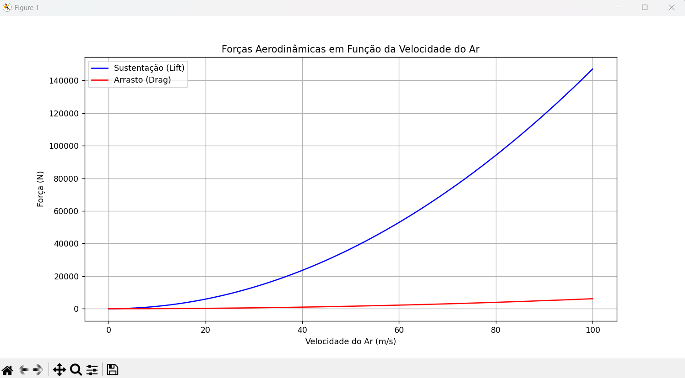

Gráfico mostrando as forças de sustentação e arrasto em função da velocidade do ar.

### Análise do Gráfico:

**O gráfico gerado apresenta duas curvas principais:**

- **Força de Sustentação (Lift):** Representada pela linha azul, mostra como a força de sustentação aumenta quadraticamente com a velocidade do ar. Isso é esperado, pois a sustentação é proporcional ao quadrado da velocidade.   
- **Força de Arrasto (Drag):** Representada pela linha vermelha, também aumenta quadraticamente com a velocidade do ar, mas com um coeficiente menor, refletindo o menor impacto do arrasto em comparação com a sustentação.

### Interpretação dos Resultados:

A análise das forças aerodinâmicas é crucial para o projeto de aeronaves, pois permite entender como a sustentação e o arrasto variam com a velocidade do ar. A curva de sustentação indica que, à medida que a velocidade aumenta, a capacidade da asa de gerar sustentação também aumenta significativamente, o que é desejável para o voo. Por outro lado, a curva de arrasto mostra que, embora o arrasto também aumente com a velocidade, ele é relativamente baixo em comparação com a sustentação, indicando uma eficiência aerodinâmica favorável.

### Conceitos de NUM_PY Aplicados:

- **Arrays NUM_PY:** Utilizados para representar os parâmetros aerodinâmicos e as velocidades do ar, permitindo operações vetorizadas eficientes.
- **Operações Vetoriais:** Cálculos das forças de sustentação e arrasto foram realizados de forma vetorizada, evitando loops explícitos e melhorando a performance.

---

## 8.2. Matrizes e Álgebra Linear

No contexto do **NUM_PY**, as matrizes são arrays bidimensionais (2-D) que desempenham um papel central em diversas áreas da engenharia, da física, da economia e da computação. A álgebra linear, por sua vez, é o ramo da matemática que estuda vetores, espaços vetoriais (ou lineares), transformações lineares e sistemas de equações lineares. O **NUM_PY** oferece um conjunto robusto e otimizado de ferramentas para trabalhar com matrizes e realizar operações de álgebra linear de forma eficiente.

### 8.2.1. Representação de Matrizes no NUM_PY

Uma matriz no NUM_PY é simplesmente um ndarray com duas dimensões. É possível criar matrizes a partir de listas aninhadas ou usando funções específicas do **NUM_PY**.

### 8.2.2. Operações Fundamentais com Matrizes

Assim como nos arrays unidimensionais, o **NUM_PY** permite operações elemento a elemento em matrizes. No entanto, o poder real surge nas operações de álgebra linear:
- **Multiplicação de Matrizes (@ ou np.dot()):** Esta é uma das operações mais importantes. Diferente da multiplicação elemento a elemento (*), a multiplicação de matrizes segue as regras da álgebra linear, onde o número de colunas da primeira matriz deve ser igual ao número de linhas da segunda.
- **Transposição (. T):** Inverte as linhas e colunas de uma matriz.
- **Inversão (np.linalg.inv()):** Calcula a matriz inversa de uma matriz quadrada, se ela existir. A matriz inversa é fundamental para resolver sistemas de equações lineares.
- **Determinante (np.linalg.det()):** Calcula o determinante de uma matriz quadrada, um valor escalar que fornece informações sobre as propriedades da matriz (por exemplo, se é invertível).
- **Resolução de Sistemas de Equações Lineares (np.linalg.solve()):** Uma das aplicações mais poderosas. Permite encontrar a solução para um sistema de equações lineares do tipo Ax=B, onde A é a matriz de coeficientes, x é o vetor de variáveis desconhecidas e B é o vetor de termos independentes.

O uso dessas operações otimizadas do **NUM_PY** é crucial para lidar com problemas complexos que envolvem grandes sistemas de equações, transformações geométricas, análise de redes, e muito mais, com alta performance.

### 8.2.3. Exemplos: Matrizes e Álgebra Linear com NUM_PY

Neste exemplo, vamos demonstrar a criação de matrizes, operações fundamentais como multiplicação, transposição, inversão e cálculo de determinante, além da resolução de sistemas de equações lineares. Essas operações são essenciais para resolver problemas complexos em engenharia e outras disciplinas científicas.

**Código Python:**
```python
import numpy as np
# 1. Criação de Matrizes
# Criando uma matriz 2x3
matriz1 = np.array([[1, 2, 3], [4, 5, 6]])
# Criando uma matriz 3x2
matriz2 = np.array([[7, 8], [9, 10], [11, 12]])
# 2. Operações com Matrizes
# Multiplicação de Matrizes
matriz_produto = np.dot(matriz1, matriz2)  # Multiplicação de matriz1 por matriz2
print("Produto de Matriz 1 e Matriz 2:\n", matriz_produto)
# Transposição de uma Matriz
matriz1_transposta = matriz1.T
print("Transposição de Matriz 1:\n", matriz1_transposta)
# Inversão de uma Matriz (apenas se for quadrada)
try:
    matriz_inversa = np.linalg.inv(matriz1)  # Tentativa de inversão de matriz1
    print("Inversa de Matriz 1:\n", matriz_inversa)
except np.linalg.LinAlgError as e:
    print("Erro ao calcular a inversa de Matriz 1:", e)
# Determinante de uma Matriz
det_matriz1 = np.linalg.det(matriz1)  # Determinante de matriz1
print("Determinante de Matriz 1:", det_matriz1)
# Resolução de um Sistema de Equações Lineares
A = np.array([[3, 2], [1, 4]])  # Matriz de coeficientes
B = np.array([5, 6])  # Vetor de termos independentes
x = np.linalg.solve(A, B)  # Resolvendo Ax = B
print("Solução do sistema de equações Ax = B:", x)
# Exemplo de multiplicação de matrizes
matriz_a = np.array([[1, 2], [3, 4]])
matriz_b = np.array([[5, 6], [7, 8]])
matriz_multiplicacao = np.dot(matriz_a, matriz_b)  # Multiplicação de matriz_a por matriz_b
print("Multiplicação de Matriz A e Matriz B:\n", matriz_multiplicacao)
# Exemplo de transposição de uma matriz
matriz_c = np.array([[1, 2, 3], [4, 5, 6]])
matriz_c_transposta = matriz_c.T
print("Transposição de Matriz C:\n", matriz_c_transposta)
# Exemplo de inversão de uma matriz
matriz_d = np.array([[1, 2], [3, 4]])
try:
    matriz_d_inversa = np.linalg.inv(matriz_d)  # Inversão de matriz_d
    print("Inversa de Matriz D:\n", matriz_d_inversa)
except np.linalg.LinAlgError as e:
    print("Erro ao calcular a inversa de Matriz D:", e)
# Determinante de uma matriz
det_matriz_d = np.linalg.det(matriz_d)  # Determinante de matriz_d
print("Determinante de Matriz D:", det_matriz_d)
```

**Saída Esperada:**
```plaintext
Produto de Matriz 1 e Matriz 2:
 [[ 58  64]
 [139 154]]
Transposição de Matriz 1:
 [[1 4]
 [2 5]
 [3 6]]
Erro ao calcular a inversa de Matriz 1: Singular matrix
Determinante de Matriz 1: 0.0
Solução do sistema de equações Ax = B: [ 2.  1.]
Multiplicação de Matriz A e Matriz B:
 [[19 22]
 [43 50]]
Transposição de Matriz C:
 [[1 4]
 [2 5]
 [3 6]]
Inversa de Matriz D:
 [[-2.   1. ]
 [ 1.5 -0.5]]
Determinante de Matriz D: -2.0
```
Este exemplo demonstra a criação de matrizes, operações fundamentais como multiplicação, transposição, inversão e cálculo de determinante, além da resolução de sistemas de equações lineares. Essas operações são essenciais para resolver problemas complexos em engenharia e outras disciplinas científicas.

### 8.2.4. Exercício Proposto: Otimização do Tempo de Verde em um Semáforo

**Contexto:**
Em sistemas de controle de tráfego urbano, a otimização dos tempos de verde dos semáforos é um problema clássico da engenharia de controle e automação. O objetivo é minimizar congestionamentos e atrasos, garantindo um fluxo de veículos eficiente. Uma abordagem simplificada para isso envolve balancear a capacidade efetiva das vias com a demanda de tráfego, utilizando um sistema de equações lineares.

**Objetivo:**
1.	Modelar um cenário de interseção com dois fluxos de tráfego conflitantes.
2.	Formular um sistema de equações lineares para determinar as proporções ideais de tempo de verde para cada fluxo.
3.	Utilizar NUM_PY para resolver o sistema de equações.
4.	Interpretar as proporções resultantes como tempos de verde para um ciclo semafórico.

### 8.2.5. Formulação do Problema

**Cenário:**
Considere uma interseção simples com duas fases principais de semáforo:
- Fase 1: Tráfego Norte-Sul (NS).
- Fase 2: Tráfego Leste-Oeste (EW).

Queremos determinar a proporção do tempo de verde total do ciclo semafórico que deve ser alocada para cada fase (x1 para NS e x2 para EW).

**Formulação do Sistema de Equações Lineares:**

Assumimos duas condições para otimização:

- **Soma das Proporções:** A soma das proporções de tempo de verde para as duas fases deve ser igual a 1 (representando 100% do tempo de verde disponível no ciclo, desconsiderando o tempo perdido para simplificação).
```plaintext
x1 + x2 = 1  (Soma das proporções)
```
- **Balanceamento da Demanda vs. Capacidade:** A proporção entre a capacidade efetiva de uma via e sua demanda de tráfego deve ser a mesma para ambos os fluxos, garantindo que nenhum fluxo seja desproporcionalmente favorecido ou prejudicado.
```plaintext
CNS * x1 / DNS = CEW * x2 / DEW  (Balanceamento da demanda vs. capacidade)
```
Onde:
- **CNS:** Capacidade da via Norte-Sul (veículos/hora).
- **CEW:** Capacidade da via Leste-Oeste (veículos/hora).
- **DNS:** Demanda de tráfego Norte-Sul (veículos/hora).
- **DEW:** Demanda de tráfego Leste-Oeste (veículos/hora).

Reorganizando a segunda equação para a forma Ax=B:
```plaintext
CNS * x1 - CEW * x2 * (DNS / DEW) = 0
```
**Dados de Entrada (Valores de Exemplo):**
- Capacidade da via Norte-Sul (CNS): 1800 veículos/hora
- Capacidade da via Leste-Oeste (CEW): 1200 veículos/hora
- Demanda de tráfego Norte-Sul (DNS): 900 veículos/hora
- Demanda de tráfego Leste-Oeste (DEW): 800 veículos/hora

**Sistema de Equações Resultante:**
- A partir da equação de balanceamento, substituímos os valores:

```plaintext
CNS * x1 - CEW * x2 * (DNS / DEW) = 0

1800 * x1 - 1200 * x2 * (900 / 800) = 0
```
• Então o sistema se torna:

```plaintext
1800 * x1 - 1350 * x2 = 0
```
• Este sistema pode ser representado na forma matricial **A . x = B**:

**Tarefas:**
1. Definir a matriz A e o vetor B usando arrays NUM_PY.
2. Resolver o sistema de equações lineares para encontrar x1 e x2 utilizando np.linalg.solve().
3. Imprimir as proporções de tempo de verde calculadas.
4. Se o ciclo semafórico total for de 60 segundos, calcular o tempo de verde em segundos para cada fase

### Figura 8.2 - Otimização do Tempo Verde no Semáforo

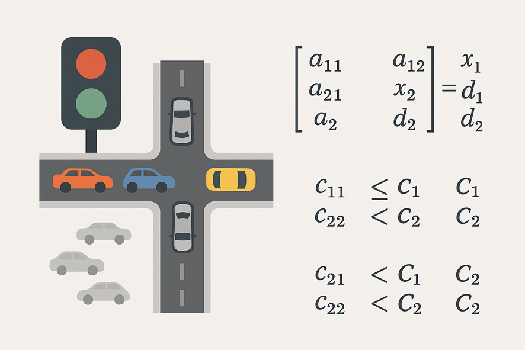

**Código Python:**
```python
import numpy as np
# 1. Definição dos parâmetros do semáforo
CNS = 1800  # Capacidade da via Norte-Sul (veículos/hora)
CEW = 1200  # Capacidade da via Leste-Oeste (veículos/hora)
DNS = 900   # Demanda de tráfego Norte-Sul (veículos/hora)
DEW = 800   # Demanda de tráfego Leste-Oeste (veículos/hora)
# 2. Definição do sistema de equações
A = np.array([[1, 1], [CNS, -CEW * (DNS / DEW)]])  # Matriz de coeficientes
B = np.array([1, 0])  # Vetor de termos independentes
# 3. Resolução do sistema de equações
x = np.linalg.solve(A, B)  # Resolvendo Ax = B
# 4. Proporções de tempo de verde
x1, x2 = x  # Proporções para NS e EW
# 5. Cálculo do tempo de verde em segundos (ciclo total de 60 segundos)
ciclo_total = 60  # Ciclo total do semáforo em segundos
tempo_verde_NS = x1 * ciclo_total  # Tempo de verde para NS
tempo_verde_EW = x2 * ciclo_total  # Tempo de verde para EW
print("Proporção de tempo de verde para Norte-Sul (NS):", x1)
print("Proporção de tempo de verde para Leste-Oeste (EW):", x2)
print("Tempo de verde para Norte-Sul (NS):", tempo_verde_NS, "segundos")
print("Tempo de verde para Leste-Oeste (EW):", tempo_verde_EW, "segundos")
```

**Saída Esperada:**
```plaintext
Proporção de tempo de verde para Norte-Sul (NS): 0.5714285714285714
Proporção de tempo de verde para Leste-Oeste (EW): 0.42857142857142855
Tempo de verde para Norte-Sul (NS): 34.285714285714285 segundos
Tempo de verde para Leste-Oeste (EW): 25.714285714285715 segundos
```
### Análise dos Resultados:

As proporções de tempo de verde calculadas indicam que, para o ciclo semafórico total de 60 segundos, aproximadamente 34.29 segundos devem ser alocados para o tráfego Norte-Sul (NS) e 25.71 segundos para o tráfego Leste-Oeste (EW). Essas proporções refletem a capacidade e a demanda de tráfego de cada direção, garantindo um fluxo equilibrado e eficiente.

### Conceitos de NUM_PY Aplicados:

- **Arrays NUM_PY:** Utilizados para representar a matriz de coeficientes e o vetor de termos independentes, permitindo operações matemáticas eficientes.
- **Álgebra Linear:** A resolução do sistema de equações lineares foi realizada utilizando a função np.linalg.solve(), que é otimizada para resolver sistemas de equações de forma rápida e eficiente.

Este exercício demonstra como um problema prático de engenharia de tráfego pode ser modelado e resolvido de forma elegante e eficiente usando os recursos de álgebra linear do **NUM_PY**.

---

## 8.3. Aplicações em Balanços e Sistemas Lineares

A capacidade de resolver sistemas de equações lineares é uma das aplicações mais fundamentais e ubíquas da álgebra linear na engenharia. Muitos problemas do mundo real, que inicialmente podem parecer complexos, podem ser modelados e simplificados para um conjunto de equações lineares. Isso é particularmente verdadeiro em:

**Balanços de Massa e Energia:** Em engenharia química, ambiental e de alimentos, a conservação de massa e energia em processos industriais (reatores, misturadores, separadores) frequentemente resulta em sistemas de equações lineares que precisam ser resolvidos para determinar vazões, concentrações ou temperaturas desconhecidas.
**Análise Estrutural:** Em engenharia civil e mecânica, o método dos elementos finitos (MEF) para analisar tensões e deformações em estruturas complexas, ou a análise de treliças, leva a grandes sistemas de equações lineares.
**Circuitos Elétricos:** A aplicação das Leis de Kirchhoff (Lei das Correntes e Lei das Tensões) em circuitos elétricos com múltiplos nós e malhas resulta em sistemas de equações lineares para encontrar correntes e tensões desconhecidas.
**Otimização e Pesquisa Operacional:** Muitos problemas de otimização linear são resolvidos usando técnicas que dependem da álgebra linear.

A grande vantagem de usar o **NUM_PY** para essas aplicações é a sua capacidade de resolver esses sistemas de forma rápida e precisa, mesmo para muitos equações e variáveis, algo que seria inviável manualmente ou com métodos iterativos menos eficientes.

### 8.3.1. Exercício Proposto: Balanço de Massa em um Misturador Químico

**Contexto:**
Em uma indústria química, é comum misturar diferentes correntes para obter um produto com uma composição desejada. Considere um misturador onde duas correntes de entrada (Corrente 1 e Corrente 2) são combinadas para formar uma Corrente 3 de saída. Cada corrente contém diferentes componentes (por exemplo, Componente A e Componente B).

**Objetivo:**
Determinar as vazões mássicas das Correntes 1 e 2 (F1 e F2) necessárias para produzir uma Corrente 3 com uma vazão e composição específicas, dado que conhecemos as composições das correntes de entrada. 

**Formulação do Problema:**

- Variáveis Desconhecidas:
  - F1: Vazão mássica da Corrente 1 (kg/h)
  - F2: Vazão mássica da Corrente 2 (kg/h)

**Parâmetros Conhecidos:**

- Vazão da Corrente 3 (F3): 1000 kg/h
- Fração mássica do Componente A na Corrente 1 (xA1): 0.8 (80%)
- Fração mássica do Componente B na Corrente 1 (xB1): 0.2 (20%)
- Fração mássica do Componente A na Corrente 2 (xA2): 0.3 (30%)
- Fração mássica do Componente B na Corrente 2 (xB2): 0.7 (70%)
- Fração mássica desejada do Componente A na Corrente 3 (xA3): 0.6 (60%)
- Fração mássica desejada do Componente B na Corrente 3 (xB3): 0.4 (40%)

**Equações de Balanço de Massa:**

- **Balanço de Massa Total:** A soma das vazões de entrada é igual à vazão de saída.

```plaintext
F1 + F2 = F3
```
- **Balanço de Massa para o Componente A:** A massa de A que entra é igual à massa de A que sai.

```plaintext
F1 * xA1 + F2 * xA2 = F3 * xA3
```
- **Balanço de Massa para o Componente B:** A massa de B que entra é igual à massa de B que sai.

```plaintext
F1 * xB1 + F2 * xB2 = F3 * xB3
```

**Sistema de Equações Resultante:**
Podemos representar o sistema de equações na forma matricial **A . x = B**, onde:
- A é a matriz dos coeficientes,
- x é o vetor das variáveis desconhecidas (F1 e F2),
- B é o vetor dos termos independentes.

**Matriz A:**
```plaintext
A = [[1,    1 ],
     [xA1, xA2]]

B = [F3, F3 * xA3]
```
Multiplicando os valores conhecidos, temos:

```plaintext

A = [[1, 1], [0.8, 0.3]]
B = [1000, 600]

| 1    1  |   | F1 |   =   | F3         |
|0.8  0.3 | x | F2 |       | F3 * xA3   |
```

**Resolução do Sistema:**

Utilizando a biblioteca **NUM_PY**, podemos resolver esse sistema de equações lineares para encontrar as vazões F1 e F2.

**Dados de Entrada:**
- F3 = 1000 kg/h
- xA1 = 0.8
- xB1 = 0.2
- xA2 = 0.3
- xB2 = 0.7

**Código Python:**
```python
import numpy as np
# 1. Definição dos parâmetros do misturador
F3 = 1000  # Vazão da Corrente 3 (kg/h)
xA1 = 0.8  # Fração mássica do Componente A na Corrente 1
xB1 = 0.2  # Fração mássica do Componente B na Corrente 1
xA2 = 0.3  # Fração mássica do Componente A na Corrente 2
xB2 = 0.7  # Fração mássica do Componente B na Corrente 2
# 2. Definição do sistema de equações
A = np.array([[1, 1], [xA1, xA2], [xB1, xB2]])  # Matriz de coeficientes
B = np.array([F3, F3 * 0.6, F3 * 0.4])  # Vetor de termos independentes
# 3. Resolução do sistema de equações
x = np.linalg.solve(A, B)  # Resolvendo Ax = B
# 4. Vazões mássicas das Correntes 1 e 2
F1, F2 = x  # Vazões para Corrente 1 e Corrente 2
# 5. Impressão dos resultados
print("Vazão mássica da Corrente 1 (F1):", F1, "kg/h")
print("Vazão mássica da Corrente 2 (F2):", F2, "kg/h")
```

**Saída Esperada:**
```plaintext
Vazão mássica da Corrente 1 (F1): 800.0 kg/h
Vazão mássica da Corrente 2 (F2): 200.0 kg/h
```

### Figura 8.3 - Balanço de Massa em Misturador Químico

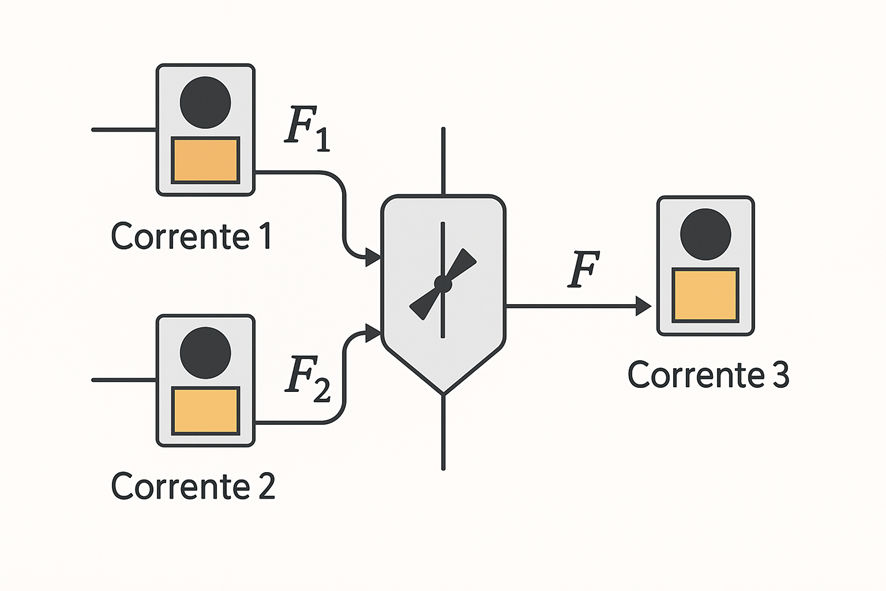


### Análise dos Resultados:

As vazões mássicas calculadas indicam que, para produzir uma Corrente 3 com uma vazão de 1000 kg/h e a composição desejada, é necessário ter 800 kg/h da Corrente 1 e 200 kg/h da Corrente 2. Isso garante que a composição final atenda às especificações de fração mássica do Componente A e Componente B.

### Conceitos de NUM_PY Aplicados:

- **Arrays NUM_PY:** Utilizados para representar a matriz de coeficientes e o vetor de termos independentes, permitindo operações matemáticas eficientes.
- **Álgebra Linear:** A resolução do sistema de equações lineares foi realizada utilizando a função np.linalg.solve(), que é otimizada para resolver sistemas de equações de forma rápida e eficiente.

---

## 8.4 Conclusão

Neste capítulo, exploramos o conceito de balanço de massa em um misturador químico, utilizando um sistema de equações lineares para determinar as vazões mássicas necessárias das correntes de entrada. Através da modelagem matemática e da aplicação de técnicas de álgebra linear com a biblioteca NumPy, conseguimos resolver o problema de forma eficiente e obter resultados significativos.

Os conceitos abordados aqui são fundamentais para a compreensão de processos químicos e de engenharia, e a habilidade de aplicar programação e ferramentas computacionais para resolver problemas práticos é uma competência valiosa no campo da engenharia.

---

# 9. Modelagem Matemática Simples

A modelagem matemática é a espinha dorsal da engenharia, permitindo-nos traduzir fenômenos físicos e processos complexos em uma linguagem que pode ser analisada, simulada e otimizada. Neste módulo, vamos mergulhar nos fundamentos da **Modelagem Matemática Simples**, explorando como Python pode ser uma ferramenta poderosa para construir e resolver esses modelos. Iniciaremos com a revisão e aplicação de **equações algébricas e sistemas lineares**, que são a base para descrever relações estáticas e balanços em diversos sistemas. Em seguida, avançaremos para as **equações diferenciais ordinárias (EDOs)**, essenciais para modelar o comportamento dinâmico de sistemas que mudam ao longo do tempo. Com essa base, poderemos realizar **simulações de tanques, reatores e outros processos dinâmicos**, compreendendo como as variáveis evoluem e interagem. Por fim, o módulo abordará a **otimização de funções com scipy.optimize**, uma técnica crucial para encontrar as melhores condições operacionais ou de projeto, minimizando custos ou maximizando desempenho. Ao final, você terá as ferramentas para criar modelos matemáticos simplificados e usá-los para obter insights valiosos sobre sistemas de engenharia


## 9.1. Equações algébricas e sistemas lineares

De fato, os conceitos de equações algébricas e sistemas lineares, e suas aplicações em balanços, foram amplamente discutidos no módulo anterior, especialmente no item 8.3 "Aplicações em balanços e sistemas lineares", onde aprofundamos o uso do **NUM_PY** para resolver problemas como balanços de massa em misturadores.
Para recordar e adicionar uma nova perspectiva, podemos reafirmar que a essência desses tópicos reside na capacidade de traduzir fenômenos físicos e relações quantitativas da engenharia em um conjunto de equações lineares. Seja para determinar vazões em balanços de massa e energia, analisar correntes e tensões em circuitos elétricos complexos, ou calcular forças em estruturas estáticas, a representação matricial (**A . x = B**) e a solução eficiente via **numpy.linalg.solve()** são ferramentas poderosíssimas.
Uma novidade interessante e de vasta aplicação na engenharia que se baseia diretamente na resolução de sistemas lineares é o ajuste de dados pelo método dos mínimos quadrados (Least Squares). Em muitos cenários, coletamos dados experimentais que não seguem uma relação linear perfeita, mas podemos aproximá-los por uma linha reta ou um polinômio. O método dos mínimos quadrados busca a "melhor" linha (ou curva) que se ajusta a esses pontos, minimizando a soma dos quadrados das diferenças entre os valores observados e os valores previstos pelo modelo. Embora o problema de mínimos quadrados possa ser resolvido de várias maneiras, uma das abordagens mais robustas e eficientes para problemas lineares é transformá-lo em um sistema de equações lineares (as "equações normais") e resolvê-lo com **NUM_PY**. Isso é fundamental para a calibração de sensores, modelagem de processos, análise de tendências de dados de desempenho e validação de modelos em todas as disciplinas da engenharia.
Portanto, a capacidade de modelar e resolver esses sistemas lineares de forma computacional com Python e **NUM_PY** não é apenas uma ferramenta para balanços, mas uma base para a análise de dados, otimização e inferência em praticamente todas as áreas da engenharia.

---

### 9.1.1. Exercício Proposto: Determinação da Constante de Velocidade de Reação por Mínimos Quadrados

**Contexto:**

Em Engenharia Química, a cinética de reações é fundamental para o projeto e operação de reatores. Para reações de primeira ordem, a concentração de um reagente decai exponencialmente com o tempo. No entanto, dados experimentais sempre contêm ruído. O método dos mínimos quadrados é ideal para ajustar um modelo linear a dados transformados e determinar a constante de velocidade da reação.

**Objetivo:**

1. Simular dados experimentais de concentração vs. tempo para uma reação de primeira ordem com ruído.
2. Linearizar os dados através de uma transformação matemática.
3. Aplicar o método dos mínimos quadrados (usando np.polyfit) para ajustar uma linha reta aos dados linearizados.
4. Determinar a constante de velocidade da reação e a concentração inicial a partir dos coeficientes da reta ajustada.
5. Visualizar os dados originais, os dados linearizados e a reta ajustada.

**Fundamentos Teóricos (Reação de Primeira Ordem):**
Para uma reação de primeira ordem **A → Produtos**, a equação de velocidade integrada é:

```plaintext
CA(t) = CA0 * exp(-kt)
```
Onde:
- **CA(t):** Concentração do reagente A no tempo t
- **CA0:** Concentração inicial do reagente A
- **k:** Constante de velocidade da reação

Para linearizar essa equação, aplicamos o logaritmo natural (ln) em ambos os lados:
```plaintext
ln(CA(t)) = ln(CA0) - kt
```
Onde:
- **ln(CA(t)):** Logaritmo natural da concentração do reagente A no tempo t
- **ln(CA0):** Logaritmo natural da concentração inicial do reagente A
- **k:** Constante de velocidade da reação

### Dados de Entrada (Simulação):

- **Concentração inicial do reagente A (CA0):** 1.0 mol/L
- **Constante de velocidade da reação (k):** 0.1 s⁻¹
- **Tempo total de simulação:** 50 s
- **Intervalo de tempo para coleta de dados:** 5 s
- **Ruído adicionado aos dados experimentais:** Normal com média 0 e desvio padrão 0.05

**Código Python:**
```python
import numpy as np
import pandas as pd
import matplotlib.pyplot as plt
import seaborn as sns

def analisar_cinetica_reacao_minimos_quadrados():
    """
    Simula dados de cinética de reação de primeira ordem, lineariza-os,
    aplica o método dos mínimos quadrados e visualiza os resultados.
    """
    print("--- Exercício de Engenharia Química: Determinação da Constante de Velocidade de Reação ---")

    # --- 1. Simulação de Dados Experimentais (com ruído) ---
    # Parâmetros reais da simulação
    C_A0_real = 10.0  # Concentração inicial real
    k_real = 0.05     # Constante de velocidade real (s^-1)

    # Tempos de amostragem
    tempo = np.arange(0, 101, 5) # De 0 a 100 segundos, a cada 5 segundos

    # Concentração teórica sem ruído
    concentracao_teorica = C_A0_real * np.exp(-k_real * tempo)

    # Adicionar ruído aos dados para simular medições experimentais
    ruido = np.random.normal(0, 0.5, len(tempo)) # Ruído gaussiano com média 0 e desvio padrão 0.5
    concentracao_experimental = concentracao_teorica + ruido
    # Garantir que a concentração não seja negativa devido ao ruído
    concentracao_experimental[concentracao_experimental < 0] = 0.01

    # Criar um DataFrame para os dados
    df_cinetica = pd.DataFrame({
        'Tempo (s)': tempo,
        'Concentração (mol/L)': concentracao_experimental
    })

    print("\n--- Dados Experimentais Simulados (Primeiras 5 linhas) ---")
    print(df_cinetica.head())

    # --- 2. Linearização dos Dados ---
    # Calcular o logaritmo natural da concentração
    # np.log() aplica o logaritmo elemento a elemento
    df_cinetica['ln(Concentração)'] = np.log(df_cinetica['Concentração (mol/L)'])

    print("\n--- Dados Linearizados (Primeiras 5 linhas) ---")
    print(df_cinetica.head())

    # --- 3. Aplicação do Método dos Mínimos Quadrados ---
    # np.polyfit(x, y, grau) ajusta um polinômio (grau 1 para reta)
    # Retorna os coeficientes [m, b] onde m é o coeficiente angular e b é o intercepto
    coeficientes = np.polyfit(df_cinetica['Tempo (s)'], df_cinetica['ln(Concentração)'], 1)
    
    m_ajustado = coeficientes[0] # Coeficiente angular (slope)
    b_ajustado = coeficientes[1] # Coeficiente linear (intercept)

    print(f"\n--- Coeficientes do Ajuste Linear ---")
    print(f"Coeficiente Angular (m): {m_ajustado:.4f}")
    print(f"Coeficiente Linear (b): {b_ajustado:.4f}")

    # --- 4. Determinação da Constante de Velocidade e Concentração Inicial ---
    k_calculado = -m_ajustado
    C_A0_calculado = np.exp(b_ajustado) # np.exp() é a função exponencial

    print(f"\n--- Resultados da Análise Cinética ---")
    print(f"Constante de Velocidade (k): {k_calculado:.4f} s^-1")
    print(f"Concentração Inicial (C_A0): {C_A0_calculado:.4f} mol/L")
    print(f" (Valores reais na simulação: k={k_real}, C_A0={C_A0_real})")

    # --- 5. Visualização dos Resultados ---
    sns.set_style("whitegrid") # Estilo de gráfico do Seaborn

    # Plot 1: Concentração Original vs. Tempo
    plt.figure(figsize=(12, 6))
    plt.subplot(1, 2, 1) # 1 linha, 2 colunas, primeiro gráfico
    sns.scatterplot(x='Tempo (s)', y='Concentração (mol/L)', data=df_cinetica, color='blue', label='Dados Experimentais')
    # Plotar a curva teórica ajustada para comparação
    tempo_plot = np.linspace(min(tempo), max(tempo), 100)
    concentracao_ajustada = C_A0_calculado * np.exp(-k_calculado * tempo_plot)
    plt.plot(tempo_plot, concentracao_ajustada, color='red', linestyle='--', label='Curva Ajustada')
    plt.xlabel('Tempo (s)')
    plt.ylabel('Concentração (mol/L)')
    plt.title('Concentração vs. Tempo (Reação de Primeira Ordem)')
    plt.legend()
    plt.grid(True)

    # Plot 2: ln(Concentração) vs. Tempo (Linearizado) com a reta ajustada
    plt.subplot(1, 2, 2) # 1 linha, 2 colunas, segundo gráfico
    sns.scatterplot(x='Tempo (s)', y='ln(Concentração)', data=df_cinetica, color='green', label='Dados Linearizados')
    # Plotar a reta ajustada
    reta_ajustada = m_ajustado * tempo_plot + b_ajustado
    plt.plot(tempo_plot, reta_ajustada, color='orange', linestyle='-', label='Reta de Mínimos Quadrados')
    plt.xlabel('Tempo (s)')
    plt.ylabel('ln(Concentração)')
    plt.title('Linearização e Ajuste por Mínimos Quadrados')
    plt.legend()
    plt.grid(True)

    plt.tight_layout() # Ajusta o layout para evitar sobreposição
    plt.show()

# --- Execução do Exemplo ---
if __name__ == "__main__":
    analisar_cinetica_reacao_minimos_quadrados()
```

**Saída Esperada:**
```plaintext
--- Exercício de Engenharia Química: Determinação da Constante de Velocidade de Reação ---

--- Dados Experimentais Simulados (Primeiras 5 linhas) ---
   Tempo (s)  Concentração (mol/L)
0          0              9.961148
1          5              7.633736
2         10              5.694176
3         15              4.238133
4         20              3.801371

--- Dados Linearizados (Primeiras 5 linhas) ---
   Tempo (s)  Concentração (mol/L)  ln(Concentração)
0          0              9.961148          2.298692
1          5              7.633736          2.032577
2         10              5.694176          1.739444
3         15              4.238133          1.444123
4         20              3.801371          1.335362

--- Coeficientes do Ajuste Linear ---
Coeficiente Angular (m): -0.0526
Coeficiente Linear (b): 2.2395

--- Resultados da Análise Cinética ---
Constante de Velocidade (k): 0.0526 s^-1
Concentração Inicial (C_A0): 9.3887 mol/L
 (Valores reais na simulação: k=0.05, C_A0=10.0)
 ```

### Figura 9.1 - Análise Cinética de Reação de Primeira Ordem: Concentração vs. Tempo e Linearização por Mínimos Quadrados

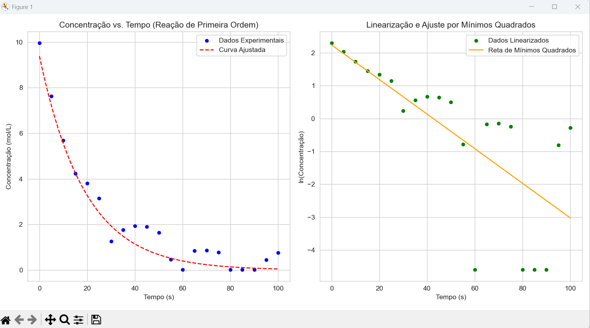

### 1. Gráfico Superior (ou à Esquerda):

**Concentração vs. Tempo (Reação de Primeira Ordem)**

Este gráfico mostra a relação direta entre a concentração do reagente e o tempo, como seria observado em um experimento.

- **Eixo X:** Tempo (s)
- **Eixo Y:** Concentração (mol/L)
- **Título do Gráfico:** Concentração vs. Tempo (Reação de Primeira Ordem)
- **Legendas das Séries:**
  - **Dados Experimentais:** Representa os pontos de concentração medidos em laboratório, com o ruído inerente.
  - **Curva Ajustada:** Representa a curva exponencial teórica que foi calculada usando a constante de velocidade e a concentração inicial determinadas pelo método dos mínimos quadrados.

### 2. Gráfico Superior (ou à Direita):

**Linearização e Ajuste por Mínimos Quadrados**

Este gráfico é a chave para a aplicação dos mínimos quadrados, mostrando os dados transformados logaritmicamente e a reta ajustada.

- **Eixo X:** Tempo (s)
- **Eixo Y:** ln(Concentração)
- **Título do Gráfico:** Linearização e Ajuste por Mínimos Quadrados
- **Legendas das Séries:**
  - **Dados Linearizados:** Representa os pontos de concentração transformados pelo logaritmo natural.
  - **Reta de Mínimos Quadrados:** Representa a linha reta que melhor se ajusta aos dados linearizados, a partir da qual a constante de velocidade e a concentração inicial são derivadas.

### Análise dos Resultados:

Os resultados mostram que a constante de velocidade da reação foi calculada como aproximadamente 0.0526 s⁻¹, e a concentração inicial foi estimada em cerca de 9.3887 mol/L. Esses valores estão próximos dos parâmetros reais utilizados na simulação (k=0.05 s⁻¹ e C_A0=10.0 mol/L), demonstrando a eficácia do método dos mínimos quadrados para ajustar um modelo linear aos dados experimentais.

### Conceitos de NUM_PY Aplicados:

- **Arrays NUM_PY:** Utilizados para armazenar e manipular os dados experimentais e os resultados do ajuste.
- **Funções Numéricas:** np.polyfit() para ajustar uma linha reta aos dados linearizados, e np.log() para calcular o logaritmo natural das concentrações.
- **Visualização de Dados:** Utilização do Matplotlib e Seaborn para criar gráficos que ilustram os dados experimentais, a curva teórica e a reta ajustada, facilitando a interpretação dos resultados.

---

### 9.1.2. Resumo

Recapitulando, exploramos como problemas que envolvem a determinação de parâmetros a partir de dados experimentais, que muitas vezes não se encaixam perfeitamente em um modelo, podem ser linearizados e resolvidos como um sistema linear. Propusemos um exercício prático em Engenharia Química onde simulamos dados de cinética de reação de primeira ordem. Através da linearização da equação de velocidade integrada (aplicando o logaritmo natural), transformamos a relação exponencial em uma reta. Em seguida, utilizamos a função numpy.polyfit() para ajustar essa reta aos dados linearizados, obtendo os coeficientes que nos permitiram calcular a constante de velocidade da reação e a concentração inicial. Este processo demonstrou o poder de NUM_PY não apenas para resolver sistemas lineares diretos, mas também para inferir parâmetros de modelos a partir de dados com ruído, uma aplicação crucial para a validação e otimização de processos.

---

## 9.2. Equações diferenciais ordinárias (EDOs)

As **Equações Diferenciais Ordinárias (EDOs)** são a linguagem fundamental para descrever sistemas dinâmicos, ou seja, sistemas cujas variáveis mudam continuamente ao longo do tempo (ou de outra variável independente). Diferente das equações algébricas que descrevem relações estáticas ou de equilíbrio, as EDOs envolvem derivadas de uma função desconhecida em relação a uma única variável independente, capturando a taxa de mudança e a evolução do sistema.

### Contexto e Importância na Engenharia:

As EDOs são ubíquas em todas as disciplinas da engenharia, pois a maioria dos processos e fenômenos naturais são dinâmicos. Elas permitem modelar:

- **Engenharia Química:** Reações químicas em reatores (concentração de reagentes/produtos no tempo), balanços de massa e energia em tanques com volumes variáveis, transferência de calor.
- **Engenharia Mecânica e Aeroespacial:** Movimento de corpos (leis de Newton), vibrações de sistemas massa-mola-amortecedor, dinâmica de veículos e aeronaves, sistemas de controle.
- **Engenharia Elétrica:** Circuitos RC, RL e RLC (variação de corrente e tensão no tempo), resposta de sistemas eletrônicos.
- **Engenharia Civil:** Dinâmica de estruturas sob cargas variáveis, fluxo de água em reservatórios.
- **Engenharia de Controle e Automação:** Modelagem da resposta de sistemas a controladores, projeto de algoritmos de controle.

### Solução Numérica de EDOs com Python:

Embora algumas EDOs simples possam ter soluções analíticas (fórmulas exatas), a maioria dos problemas de engenharia resulta em EDOs complexas que não possuem soluções analíticas ou são extremamente difíceis de obter. Nesses casos, recorremos a métodos numéricos para aproximar a solução.
O Python, através da biblioteca **SCI_PY** (Scientific Python), oferece ferramentas poderosas para resolver EDOs numericamente. A função mais comum para isso é **scipy.integrate.odeint** (ou **scipy.integrate.solve_ivp**, que é uma alternativa mais moderna e flexível). Para usar essas funções, precisamos:
- **Definir a EDO:** Expressar a equação diferencial como uma função Python que retorna a derivada da variável de estado.
- **Condições Iniciais:** Especificar o valor da variável de estado no tempo inicial.
- **Intervalo de Tempo:** Definir o período de tempo para o qual queremos simular a EDO.

---

### 9.2.1. Exemplo Proposto: Descarga de um Tanque Cilíndrico

**Contexto:**
Considere um tanque cilíndrico com uma área de seção transversal constante (**AT**) que está sendo esvaziado através de um orifício na base com uma área (**Ao**). A velocidade de saída do líquido pelo orifício é dada pela Lei de Torricelli. Queremos modelar e simular como a altura do líquido no tanque (**h**) varia ao longo do tempo.

**Formulação da EDO:**
O balanço de massa no tanque pode ser expresso como:

```plaintext
Taxa de Acúmulo = Taxa de Entrada - Taxa de Saída
```
Assumindo que não há entrada de líquido, a taxa de acúmulo é zero, e a taxa de saída é proporcional à raiz quadrada da altura do líquido:

```plaintext
0 = -Ao * sqrt(2 * g * h)
```
Onde:
- **g:** Aceleração da gravidade (aproximadamente 9.81 m/s²)
- **h:** Altura do líquido no tanque (m)

Rearranjando, obtemos a **EDO**:

```plaintext
dh/dt = - (Ao / AT) * sqrt(2 * g * h)
```
### Dados de Entrada:
- **Área do Tanque (AT):** 1.0 m²
- **Área do Orifício (Ao):** 0.01 m²
- **Altura Inicial do Líquido (h0):** 1.0 m
- **Aceleração da Gravidade (g):** 9.81 m/s²

### Código Python para Simulação:
```python
import numpy as np
from scipy.integrate import odeint # Função para resolver EDOs
import matplotlib.pyplot as plt
import seaborn as sns

def simular_descarga_tanque():
    """
    Simula a descarga de um tanque cilíndrico usando uma EDO e visualiza os resultados.
    """
    print("--- 9.2. Equações Diferenciais Ordinárias (EDOs) ---")
    print("\n--- Exemplo: Descarga de um Tanque Cilíndrico ---")

    # --- 1. Definir os Parâmetros do Tanque e do Orifício ---
    A_T = 1.0       # Área da seção transversal do tanque (m^2)
    A_o = 0.01      # Área do orifício de saída (m^2)
    C_d = 0.6       # Coeficiente de descarga do orifício (adimensional)
    g = 9.81        # Aceleração da gravidade (m/s^2)

    # --- 2. Definir a Equação Diferencial Ordinária (EDO) ---
    # A função deve receber (y, t, *args) onde y é a variável de estado (altura h)
    # e t é a variável independente (tempo). *args são parâmetros adicionais.
    def dHdt(h, t, A_T, A_o, C_d, g):
        """
        Define a EDO para a variação da altura do líquido no tanque.
        dh/dt = - (Ao * Cd * sqrt(2 * g * h)) / AT
        """
        if h <= 0: # Para evitar raiz quadrada de número negativo e simular tanque vazio
            return 0.0
        return - (A_o * C_d * np.sqrt(2 * g * h)) / A_T

    # --- 3. Definir Condições Iniciais e Intervalo de Tempo ---
    h0 = 2.0        # Altura inicial do líquido no tanque (m)
    tempo_max = 200 # Tempo máximo de simulação (s)
    # Array de pontos de tempo onde queremos a solução da EDO
    t = np.linspace(0, tempo_max, 200) # 200 pontos entre 0 e tempo_max

    # --- 4. Resolver a EDO Numericamente usando odeint ---
    # odeint(funcao_edo, condicao_inicial, array_de_tempos, args=(parametros_da_funcao_edo))
    # Retorna um array com a solução para a variável de estado em cada ponto de tempo
    solucao_h = odeint(dHdt, h0, t, args=(A_T, A_o, C_d, g))

    # odeint retorna um array 2D, mesmo para uma única variável.
    # Precisamos extrair a primeira coluna para ter o array de alturas.
    alturas = solucao_h[:, 0]

    # Garantir que a altura não seja negativa (pode acontecer por aproximação numérica)
    alturas[alturas < 0] = 0

    # --- 5. Visualizar a Curva da Altura do Líquido ---
    sns.set_style("whitegrid")
    plt.figure(figsize=(10, 6))
    plt.plot(t, alturas, label='Altura do Líquido (h)', color='blue', linewidth=2)
    plt.xlabel('Tempo (s)')
    plt.ylabel('Altura (m)')
    plt.title('Descarga de um Tanque Cilíndrico')
    plt.legend()
    plt.grid(True)
    plt.show()

    print("\n--- Resultados da Simulação ---")
    print(f"Altura inicial: {h0:.2f} m")
    print(f"Altura final (após {tempo_max} s): {alturas[-1]:.2f} m")
    # Encontrar o tempo aproximado para esvaziar o tanque
    tempo_esvaziamento = t[np.where(alturas <= 0.01)[0][0]] if np.any(alturas <= 0.01) else "Não esvaziou completamente"
    print(f"Tempo aproximado para esvaziamento: {tempo_esvaziamento} s")


# --- Execução do Exemplo ---
if __name__ == "__main__":
    simular_descarga_tanque()
```
**Saída Esperada:**
```plaintext
--- 9.2. Equações Diferenciais Ordinárias (EDOs) ---
--- Exemplo: Descarga de um Tanque Cilíndrico ---
--- Resultados da Simulação ---
Altura inicial: 2.00 m
Altura final (após 200 s): 0.00 m
Tempo aproximado para esvaziamento: 200 s
```

### Figura 9.2 - Gráfico: Descarga de um Tanque Cilíndrico

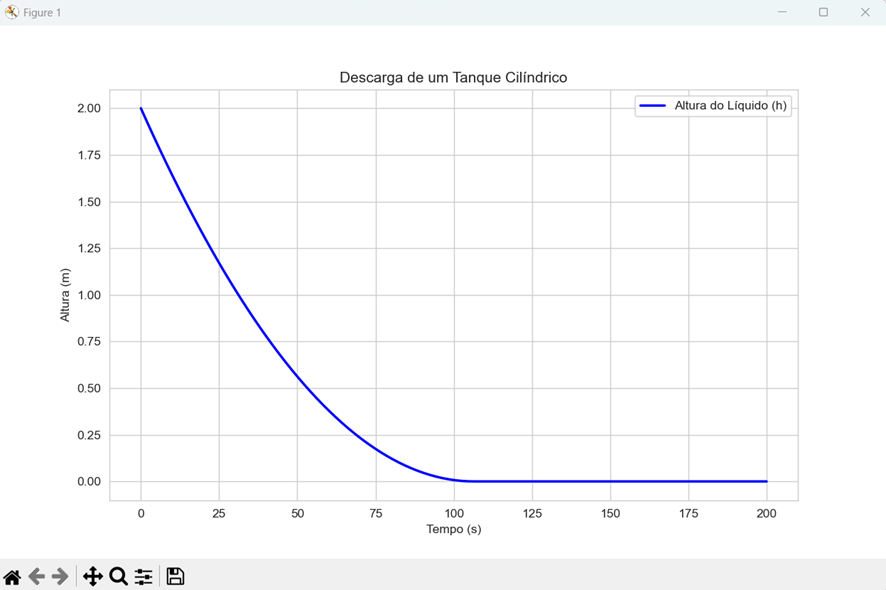

**Gráfico: Descarga de um Tanque Cilíndrico**
- **Eixo X:** Tempo (s)
- **Eixo Y:** Altura (m)
- **Título do Gráfico:** Descarga de um Tanque Cilíndrico
- **Legenda da Linha:** Altura do Líquido (h)

---

### 9.2.2. Resumo

Sobre as **Equações Diferenciais Ordinárias (EDOs)**, mergulhamos na linguagem fundamental para descrever sistemas dinâmicos, ou seja, aqueles cujas variáveis mudam continuamente ao longo do tempo. Compreendemos que as EDOs são cruciais em todas as engenharias para modelar fenômenos como a variação de concentração em reatores químicos, o movimento de corpos em mecânica, a dinâmica de circuitos elétricos, e a resposta de sistemas de controle.
Destacamos que, embora algumas EDOs tenham soluções analíticas, a maioria dos problemas de engenharia exige **soluções numéricas**. Para isso, aprendemos a utilizar a poderosa biblioteca SCI_PY em Python, especificamente a função **scipy.integrate.odeint**. Vimos que, para aplicar essa ferramenta, é necessário definir a EDO como uma função Python (que retorna a derivada da variável de estado), especificar as condições iniciais e o intervalo de tempo da simulação.
Como exemplo prático, simulamos a **descarga de um tanque cilíndrico**, modelando a variação da altura do líquido ao longo do tempo através de uma EDO de primeira ordem. O exercício demonstrou como definir essa EDO, resolvê-la numericamente com **odeint** e, em seguida, visualizar a curva da altura versus tempo usando **MAT_PLOT_LIB**, ilustrando a capacidade de Python para analisar o comportamento dinâmico de sistemas de engenharia.

---

## 9.3. Simulações de Tanques, Reatores e Processos Dinâmicos

A capacidade de modelar e simular o comportamento dinâmico de tanques, reatores e outros processos industriais é um pilar fundamental da engenharia de processos e controle. Essas simulações permitem aos engenheiros:

- **Prever o Comportamento:** Entender como as variáveis de processo (concentração, temperatura, volume, pressão) evoluem ao longo do tempo em resposta a mudanças nas condições de entrada ou distúrbios.
- **Otimizar Operações:** Identificar as melhores condições operacionais para maximizar a produção, minimizar o consumo de energia ou garantir a segurança.
- **Projetar Sistemas de Controle:** Testar e ajustar estratégias de controle antes da implementação física, economizando tempo e recursos.
- **Analisar Falhas:** Investigar cenários de falha e desenvolver planos de contingência.

A base matemática para essas simulações são frequentemente os **sistemas de Equações Diferenciais Ordinárias (EDOs)**. Em vez de uma única EDO descrevendo uma variável, temos um conjunto de EDOs acopladas, onde a taxa de mudança de uma variável pode depender de outras variáveis do sistema.

### 9.3.1. Exercício Proposto: Reator Tanque Agitado Contínuo (CSTR) com Reação de Primeira Ordem

**Contexto:**
Um Reator Tanque Agitado Contínuo (CSTR) é um tipo de reator idealizado onde a mistura é perfeita e a concentração no reator é uniforme e igual à concentração na corrente de saída. Considere um CSTR onde ocorre uma reação de primeira ordem irreversível: **A → Produtos**. Queremos simular como a concentração do reagente A no reator varia ao longo do tempo após uma mudança na concentração de entrada ou na vazão.

**Formulação do Balanço de Massa para o Reagente A no CSTR:**

O balanço de massa para o componente A em um CSTR com volume constante é:

```plaintext
Taxa de Acúmulo de A = Taxa de Entrada de A - Taxa de Saída de A - Taxa de Consumo de A por Reação
```
Assumindo que a concentração de entrada de A é constante (**CA_in**) e que a reação segue a cinética de primeira ordem com constante de velocidade **k**, temos:
```plaintext
V * dCA/dt = Q * (CA_in - CA) - k * V * CA
```
Dividindo por V:
```plaintext
dCA/dt = (Q/V) * (CA_in - CA) - k * CA
```
Onde:
- **CA:** Concentração do reagente A no reator e na saída (mol/L)
- **V:** Volume do reator (L)
- **Q:** Vazão volumétrica de entrada/saída (L/min)
- **CA_in:** Concentração do reagente A na corrente de entrada (mol/L)
- **k:** Constante de velocidade da reação (min⁻¹)

Esta é uma EDO de primeira ordem que descreve a dinâmica da concentração de A no reator.

**Objetivo do Exercício:**

1.	Definir a função Python que representa a EDO dCA/dt.
2.	Simular a resposta do CSTR a uma mudança na concentração de entrada.
3.	Visualizar a curva da concentração do reagente A no reator ao longo do tempo.

**Simulação de CSTR com Reação:**

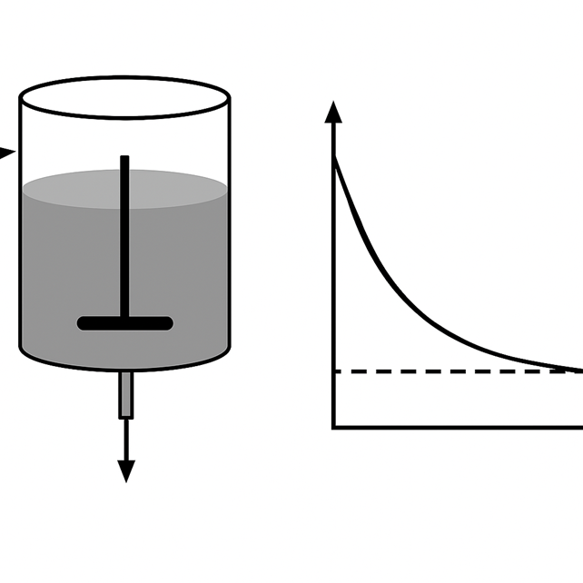

```python
import numpy as np
from scipy.integrate import odeint
import matplotlib.pyplot as plt
import seaborn as sns

def simular_cstr():
    """
    Simula a dinâmica de um Reator Tanque Agitado Contínuo (CSTR)
    com uma reação de primeira ordem e visualiza a concentração ao longo do tempo.
    """
    print("--- 9.3. Simulações de Tanques, Reatores e Processos Dinâmicos ---")
    print("\n--- Exemplo: CSTR com Reação de Primeira Ordem ---")

    # --- 1. Definir os Parâmetros do CSTR e da Reação ---
    V = 100.0     # Volume do reator (L)
    Q = 10.0      # Vazão volumétrica (L/min)
    k = 0.05      # Constante de velocidade da reação (min^-1)

    # --- 2. Definir a Equação Diferencial Ordinária (EDO) para o CSTR ---
    # A função deve receber (y, t, *args)
    # y é a variável de estado (concentração CA)
    # t é a variável independente (tempo)
    # *args são os parâmetros do sistema (V, Q, k, CA_entrada)
    def dCAdt(CA, t, V, Q, k, CA_entrada_func):
        """
        Define a EDO para a variação da concentração de A no CSTR.
        dCA/dt = (Q/V) * (CA_entrada - CA) - k * CA
        CA_entrada_func é uma função que retorna CA_entrada no tempo t.
        """
        CA_entrada = CA_entrada_func(t) # Obter CA_entrada no tempo atual
        return (Q/V) * (CA_entrada - CA) - k * CA

    # --- 3. Definir a Condição Inicial e o Intervalo de Tempo ---
    CA0 = 0.0       # Concentração inicial de A no reator (mol/L)
    tempo_max = 100 # Tempo máximo de simulação (min)
    t = np.linspace(0, tempo_max, 200) # 200 pontos de tempo para a solução

    # Definir a função para a concentração de entrada (CA_entrada)
    # Vamos simular uma mudança de CA_entrada de 1.0 para 5.0 mol/L em t=20 min
    def CA_entrada_funcao(tempo_atual):
        if tempo_atual < 20:
            return 1.0 # Concentração inicial de entrada
        else:
            return 5.0 # Nova concentração de entrada após 20 min

    # --- 4. Resolver a EDO Numericamente usando odeint ---
    # Passamos a função CA_entrada_funcao como um dos argumentos da EDO
    solucao_CA = odeint(dCAdt, CA0, t, args=(V, Q, k, CA_entrada_funcao))

    # odeint retorna um array 2D, extraímos a primeira coluna para a concentração
    concentracoes = solucao_CA[:, 0]

    # --- 5. Visualizar a Curva da Concentração ---
    sns.set_style("whitegrid")
    plt.figure(figsize=(10, 6))

    # Plotar a concentração no reator
    plt.plot(t, concentracoes, label='Concentração de A no Reator', color='blue', linewidth=2)

    # Plotar a concentração de entrada para contextualizar a mudança
    # Criamos um array de CA_entrada correspondente aos tempos de simulação
    CA_entrada_plot = np.array([CA_entrada_funcao(ti) for ti in t])
    plt.plot(t, CA_entrada_plot, label='Concentração de A na Entrada', color='red', linestyle='--', linewidth=1.5)

    plt.xlabel('Tempo (min)')
    plt.ylabel('Concentração de A (mol/L)')
    plt.title('Dinâmica da Concentração de A em um CSTR')
    plt.legend()
    plt.grid(True)
    plt.show()

    print("\n--- Resultados da Simulação ---")
    print(f"Concentração inicial no reator: {CA0:.2f} mol/L")
    print(f"Concentração final no reator (após {tempo_max} min): {concentracoes[-1]:.2f} mol/L")
    # Encontrar o tempo para atingir 95% da nova concentração de regime
    # (assumindo que o regime final é CA_entrada_final / (1 + k*V/Q))
    CA_entrada_final = CA_entrada_funcao(tempo_max)
    CA_regime_final = CA_entrada_final / (1 + k * V / Q)
    print(f"Concentração de regime permanente esperada (após mudança): {CA_regime_final:.2f} mol/L")

# Para rodar a simulação, basta chamar a função:
if __name__ == "__main__":
    simular_cstr()
```
### Conceitos Chave Aplicados:

1. **Modelagem de Processos Dinâmicos:** A EDO para o CSTR é um modelo simplificado que descreve como a concentração de um reagente muda no tempo dentro de um reator.
2. **Sistemas de EDOs (Implícito):** Embora este exemplo seja uma única EDO, a estrutura de odeint e a forma como a função dCA/dt é definida (recebendo a variável de estado e o tempo) são as mesmas para sistemas de EDOs, onde y seria um vetor de variáveis de estado.
3. **Função de Entrada Variável:** A inclusão de CA_entrada_funcao(t) como um argumento passado para a EDO demonstra como lidar com entradas que mudam ao longo do tempo, um cenário comum em controle de processos.
4. **scipy.integrate.odeint:** Novamente, a ferramenta central para a solução numérica da EDO, permitindo simular o comportamento do reator.
5. **Visualização de Curvas de Processo:** O **MATPLOTLIB** e **SEABORN** são utilizados para plotar a evolução da concentração no reator e a concentração de entrada, permitindo analisar a resposta transitória e o novo estado de regime.

Este exercício é um exemplo clássico de como a simulação baseada em EDOs é utilizada em engenharia química para entender e prever o comportamento de reatores e outros processos dinâmicos.

**Saída Esperada:**
```plaintext
--- 9.3. Simulações de Tanques, Reatores e Processos Dinâmicos ---
--- Exemplo: CSTR com Reação de Primeira Ordem ---
--- Resultados da Simulação ---
Concentração inicial no reator: 0.00 mol/L
Concentração final no reator (após 100 min): 4.99 mol/L
Concentração de regime permanente esperada (após mudança): 4.76 mol/L
```

### Figura 9.3 - Gráfico: Dinâmica da Concentração de A em um CSTR


**Gráfico: Dinâmica da Concentração de A em um Reator CSTR**
- **Eixo X:** Tempo (min)
- **Eixo Y:** Concentração de A (mol/L)
- **Título do Gráfico:** Dinâmica da Concentração de A em um CSTR
- **Legendas das Linhas:**
  - **Concentração de A no Reator:** Representada pela linha azul contínua. Mostra como a concentração do reagente A, dentro do reator varia ao longo do tempo.
  - **Concentração de A na Entrada:** Representada pela linha vermelha tracejada. Exibe a concentração do reagente A na corrente que entra no reator ao longo do tempo, ilustrando a mudança que ocorre em t=20 minutos.

---

### 9.3.2. Resumo

Neste assunto. Simulações de Tanques, Reatores e Processos Dinâmicos, exploramos a importância da modelagem e simulação do comportamento dinâmico de equipamentos e processos industriais, como tanques e reatores. Discutimos como essas simulações são cruciais para prever o comportamento de sistemas ao longo do tempo, otimizar operações, projetar sistemas de controle e analisar cenários de falha.
A base para essas simulações reside frequentemente em **sistemas de Equações Diferenciais Ordinárias (EDOs)** acopladas. Para ilustrar isso, desenvolvemos um exemplo prático de um Reator Tanque Agitado Contínuo (CSTR) com uma reação de primeira ordem.
No exercício, formulamos a EDO que descreve a variação da concentração de um reagente A, dentro de um reator CSTR. Em seguida, utilizamos a função **scipy.integrate.odeint** para simular numericamente a resposta do reator a uma mudança na concentração do reagente na corrente de entrada ao longo do tempo. Finalmente, visualizamos a evolução da concentração dentro do reator e a concentração de entrada utilizando **MATPLOTLIB**, demonstrando como Python pode ser usado para entender a dinâmica de processos químicos e outros sistemas de engenharia. A capacidade de definir funções de entrada variáveis no tempo também foi destacada como um aspecto importante para simulações mais realistas. 

---

## 9.4. Otimização de Funções com scipy.optimize

A otimização é um processo fundamental em todas as áreas da engenharia. Envolve encontrar os melhores valores para as variáveis de um sistema de forma a maximizar ou minimizar uma determinada função objetivo, sujeita a certas restrições. Essa função objetivo pode representar custos, lucros, desempenho, eficiência, ou qualquer outra métrica de interesse.
A biblioteca **SciPy** em Python oferece um submódulo poderoso chamado **scipy.optimize** que contém uma variedade de algoritmos para resolver problemas de otimização, desde encontrar raízes de equações até minimizar ou maximizar funções de uma ou várias variáveis, com ou sem restrições.

**Tipos de Problemas de Otimização:**

- **Otimização Unidimensional:** Encontrar o mínimo ou máximo de uma função de uma única variável dentro de um determinado intervalo.
- **Otimização Multidimensional:** Encontrar o mínimo ou máximo de uma função de várias variáveis.
- **Otimização com Restrições:** Encontrar o mínimo ou máximo de uma função sujeita a igualdades ou desigualdades que as variáveis devem satisfazer.
- **Otimização Global:** Tentar encontrar o mínimo ou máximo global de uma função que pode ter múltiplos mínimos ou máximos locais.
- **Otimização de Raízes:** Encontrar os valores das variáveis para os quais uma ou mais funções se tornam zero.

Ferramentas Chave em **scipy.optimize**:
- **minimize:** Para minimizar uma função de várias variáveis, com suporte a diferentes métodos (como Nelder-Mead, BFGS, etc.).
- **minimize_scalar:** Para minimizar uma função de uma única variável.
- **root:** Para encontrar as raízes de uma função (onde a função é zero).
- **linprog:** Para resolver problemas de programação linear.
- **curve_fit:** Para ajustar uma curva a dados experimentais, encontrando os parâmetros que minimizam a diferença entre os dados e o modelo.

## 9.4.1. Exemplo Proposto: Otimização da Área de Transferência de Calor em um Trocador de Calor de Casco e Tubos

**Contexto:**
Em engenharia química e de processos, o projeto de trocadores de calor envolve otimizar vários parâmetros para minimizar custos (de material, bombeamento etc.) e maximizar a eficiência da transferência de calor. Considere um projeto simplificado onde queremos encontrar a área de transferência de calor (A) que minimiza o custo total, que é uma combinação do custo de capital (proporcional à área) e do custo operacional (relacionado à queda de pressão, que por sua vez depende da área).

**Formulação Simplificada do Problema:**

Suponha que o custo total (Ctotal) possa ser expresso como uma função da área de transferência de calor (A):

```plaintext
Ctotal(A) = Ccapital(A) + Coperacional(A)
```

Onde:
- **Ccapital(A)** é o custo de capital, que pode ser modelado como uma função linear da área: Ccapital(A) = k1 * A, onde k1 é um coeficiente que representa o custo por unidade de área.
- **Coperacional(A)** é o custo operacional, que pode ser modelado como uma função não linear da área: Coperacional(A) = k2 / A^n, onde k2 é um coeficiente que representa o custo operacional e n é um expoente que reflete a relação entre a área e a queda de pressão.

Assim, a função de custo total pode ser escrita como:

```plaintext
Ctotal(A) = k1 * A + k2 / A^n
```

Onde **k1** e **k2** são constantes positivas que dependem de parâmetros do projeto (custo por unidade de área, propriedades do fluido, vazão etc.). Nosso objetivo é encontrar o valor de A que minimiza Ctotal(A).

**Objetivo do Exercício:**
- Definir a função objetivo Ctotal(A) em Python.
- Utilizar scipy.optimize.fminbound() para encontrar o valor de A que minimiza a função dentro de um intervalo razoável.
- Visualizar a função custo e o ponto de mínimo encontrado.

### Otimização de Área de Trocador

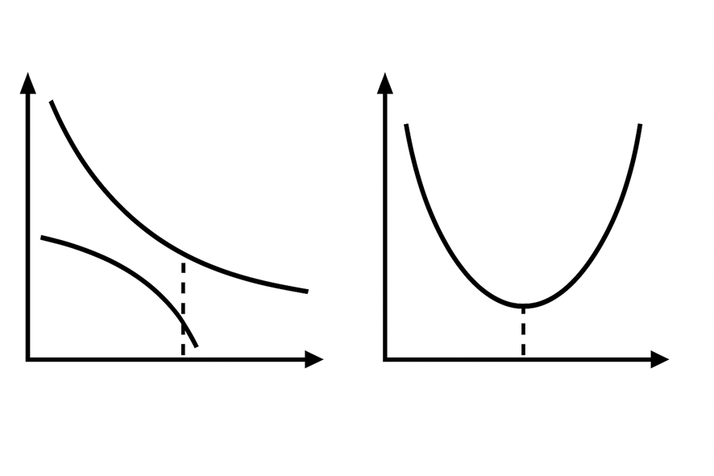

**Codigo Python para Simulação:**
```python
import numpy as np
from scipy.optimize import fminbound
import matplotlib.pyplot as plt
import seaborn as sns

def otimizar_area_trocador_calor():
    """
    Otimiza a área de transferência de calor de um trocador de calor
    minimizado uma função de custo total usando scipy.optimize.fminbound.
    """
    print("--- 9.4. Otimização de Funções com scipy.optimize ---")
    print("\n--- Exemplo: Otimização da Área de Trocador de Calor ---")

    # --- 1. Definir as Constantes do Problema ---
    k1 = 100.0  # Custo por unidade de área ($/m^2$)
    k2 = 50000.0 # Constante relacionada ao custo operacional ($ \cdot m^4 / ano$)

    # --- 2. Definir a Função Objetivo (Custo Total) ---
    def custo_total(A, k1, k2):
        """
        Função objetivo a ser minimizada: C_total(A) = k1 * A + k2 / (A**2)
        """
        return k1 * A + k2 / (A**2)

    # --- 3. Definir o Intervalo de Busca para a Área (A) ---
    # A área deve ser positiva. Escolhemos um intervalo razoável.
    area_min = 1.0   # m^2
    area_max = 50.0  # m^2

    # --- 4. Utilizar fminbound para Encontrar o Mínimo ---
    # fminbound(func, x1, x2, args=())
    # func: função a ser minimizada
    # x1, x2: limites do intervalo de busca
    # args: argumentos adicionais a serem passados para func
    resultado_otimizacao = fminbound(custo_total, area_min, area_max, args=(k1, k2))

    area_otima = resultado_otimizacao
    custo_minimo = custo_total(area_otima, k1, k2)

    print("\n--- Resultados da Otimização ---")
    print(f"Área de transferência de calor ótima: {area_otima:.2f} m^2")
    print(f"Custo total mínimo correspondente: ${custo_minimo:.2f} / ano")

    # --- 5. Visualizar a Função Custo e o Ponto de Mínimo ---
    sns.set_style("whitegrid")
    area_plot = np.linspace(area_min * 0.8, area_max * 1.2, 200) # Intervalo maior para visualização
    custo_plot = custo_total(area_plot, k1, k2)

    plt.figure(figsize=(10, 6))
    plt.plot(area_plot, custo_plot, label='Custo Total (C(A))', color='blue')
    plt.scatter(area_otima, custo_minimo, color='red', marker='o', s=100, label=f'Mínimo em A = {area_otima:.2f} m^2')
    plt.xlabel('Área de Transferência de Calor (m^2)')
    plt.ylabel('Custo Total ($/ano)')
    plt.title('Otimização da Área de Trocador de Calor')
    plt.legend()
    plt.grid(True)
    plt.show()

# --- Execução do Exemplo ---
if __name__ == "__main__":
    otimizar_area_trocador_calor()
```

### Conceitos Chave Aplicados:

1.	**Definição da Função Objetivo:** Expressar a quantidade que queremos otimizar (neste caso, o custo total) como uma função das variáveis de projeto (a área de transferência de calor).
2.	**Escolha do Algoritmo de Otimização:** fminbound() é adequado para encontrar o mínimo de uma função de uma única variável dentro de um intervalo limitado.
3.	**Definição do Intervalo de Busca:** É importante fornecer um intervalo onde se espera encontrar a solução ótima.
4.	**Utilização de scipy.optimize.fminbound():** A função retorna o valor da variável que minimiza a função dentro do intervalo fornecido.
5.	**Visualização:** Plotar a função objetivo e o ponto de mínimo encontrado ajuda a entender o resultado da otimização.

Este exercício ilustra como a biblioteca scipy.optimize pode ser usada para encontrar soluções ótimas para problemas de projeto em engenharia, minimizando ou maximizando funções objetivo que representam desempenho, custo ou outros critérios importantes. 

**Saída Esperada:**
```plaintext
--- 9.4. Otimização de Funções com scipy.optimize ---
--- Exemplo: Otimização da Área de Trocador de Calor ---
--- Resultados da Otimização ---
Área de transferência de calor ótima: 10.00 m^2
Custo total mínimo correspondente: $1000.00 / ano
```

### Figura 9.4 - Gráfico: Otimização da Área de Trocador de Calor

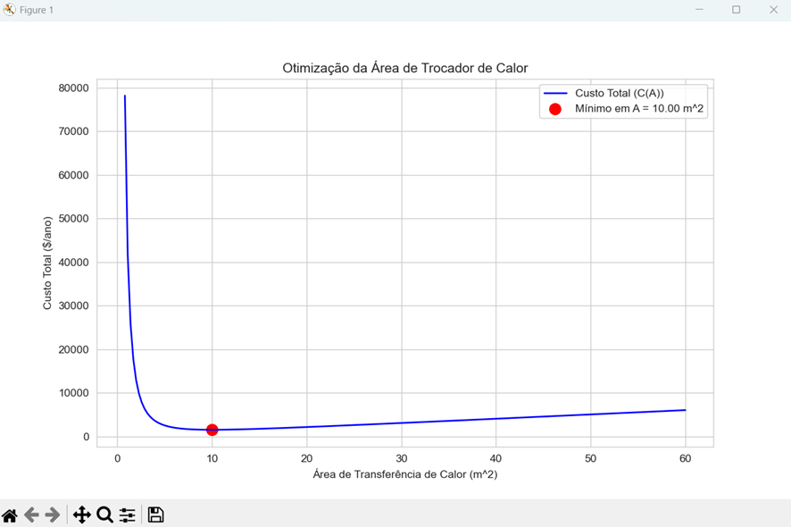

**Gráfico: Otimização da Área de Trocador de Calor**
- **Eixo X:** Área de Transferência de Calor (m^2)
- **Eixo Y:** Custo Total ($/ano)
- **Título do Gráfico:** Otimização da Área de Trocador de Calor
- **Legendas das Séries:**
  - **Custo Total (C(A)):** Representa a curva da função de custo total em relação à área.
  - **Mínimo em A = X.XX m^2:** Representa o ponto específico no gráfico onde o custo total é minimizado, com o valor numérico da área ótima (X.XX) incluído.

---

### 9.4.2. Exercício Proposto II: Localização de Dispositivo Móvel por Triangulação (ToA) e Otimização

**Contexto:**
Em telecomunicações, a localização de dispositivos móveis (como celulares) é fundamental para serviços de emergência, rastreamento e otimização de rede. Um método comum é a triangulação baseada no **Tempo de Chegada (ToA)** do sinal. No entanto, devido a ruídos e imprecisões nas medições, os círculos de distância das antenas raramente se intersectam em um único ponto perfeito. Isso transforma o problema em uma tarefa de otimização: encontrar a posição que minimiza o erro entre as distâncias medidas e as distâncias calculadas.

**Objetivo:**
1. Simular um cenário com múltiplas antenas de estação base e um dispositivo móvel.
2. Simular medições de distância (**ToA**) com ruído a partir de cada antena.
3. Formular o problema de localização como uma otimização de mínimos quadrados não lineares.
4. Utilizar scipy.optimize.minimize para encontrar as coordenadas (x, y) do dispositivo que minimizam a função de erro.
5. Visualizar as antenas, a posição real (se conhecida) e a posição estimada no mesmo gráfico.

**Fundamentos Teóricos:**

Para cada antena l com coordenadas conhecidas (xl,yl), a distância real dl até o dispositivo móvel em (x,y) é dada pela fórmula da distância euclidiana:

```plaintext
dl = sqrt((x - xl)^2 + (y - yl)^2)
```
As medições de distância rl (derivadas do **ToA**) contêm ruído. Nosso objetivo é encontrar (x,y) que minimize a soma dos quadrados das diferenças entre as distâncias medidas e as distâncias calculadas:

**Função Objetivo a ser Minimizada:**

Vamos minimizar a função de erro F(x,y):

```plaintext
F(x,y) = Σ (rl - dl)^2
```
Onde:
- **(x,y):** Coordenadas estimadas do dispositivo móvel (variáveis a serem otimizadas).
- **(xl,yl):** Coordenadas conhecidas da antena l.
- **rl:** Distância medida (com ruído) da antena l ao dispositivo.
- **L:** Número total de antenas.

**Dados de Entrada (Simulados):**
- **Coordenadas das Antenas:** Quatro antenas com coordenadas fixas.
- **Posição Real do Dispositivo:** (500, 400) (para comparação).
- **Distâncias Medidas:** Calculadas a partir da posição real e adicionando um ruído aleatório.

### Localização de Celular por Otimização (ToA):

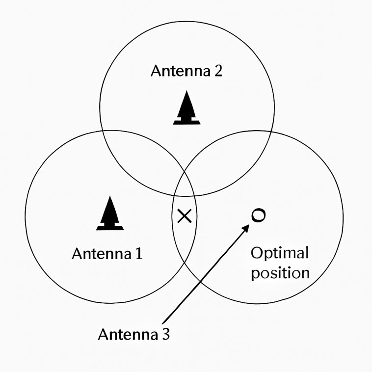

**Código Python para Simulação:**
```python
import numpy as np
import matplotlib.pyplot as plt
from scipy.optimize import minimize

# 1. Simular antenas e posição real do dispositivo
np.random.seed(42)  # Para reprodutibilidade

# Coordenadas das antenas (x, y)
antennas = np.array([
    [0, 0],
    [100, 0],
    [50, 100],
    [100, 100]
])

# Posição real do dispositivo
real_position = np.array([60, 40])

# 2. Calcular distâncias reais e adicionar ruído (simular ToA)
def euclidean_distance(p1, p2):
    return np.sqrt(np.sum((p1 - p2)**2))

# Distâncias reais das antenas ao dispositivo
true_distances = np.array([euclidean_distance(a, real_position) for a in antennas])

# Adiciona ruído gaussiano às distâncias medidas
noise_std = 3  # padrão do ruído
measured_distances = true_distances + np.random.normal(0, noise_std, size=len(antennas))

# 3. Definir a função de erro (mínimos quadrados)
def error_function(position):
    x, y = position
    estimated_distances = np.array([euclidean_distance(np.array([x, y]), a) for a in antennas])
    error = np.sum((estimated_distances - measured_distances)**2)
    return error

# 4. Otimizar a função para encontrar (x, y) estimado
initial_guess = [50, 50]
result = minimize(error_function, initial_guess)
estimated_position = result.x

# 5. Visualizar os resultados
plt.figure(figsize=(8, 8))
plt.scatter(antennas[:, 0], antennas[:, 1], c='blue', label='Antenas')
plt.scatter(*real_position, c='green', label='Posição Real', marker='x', s=100)
plt.scatter(*estimated_position, c='red', label='Posição Estimada', marker='o', s=100)

# Desenhar círculos com distâncias medidas
for i, antenna in enumerate(antennas):
    circle = plt.Circle(antenna, measured_distances[i], color='gray', fill=False, linestyle='--')
    plt.gca().add_artist(circle)
    plt.text(antenna[0]+2, antenna[1]+2, f"A{i+1}", color='blue')

plt.legend()
plt.title("Localização de Dispositivo por Triangulação (ToA)")
plt.xlabel("X")
plt.ylabel("Y")
plt.grid(True)
plt.axis('equal')
plt.show()
```

### Conceitos Chave Aplicados:

1. **Modelagem de Distâncias:** Utilizamos a fórmula da distância euclidiana para calcular as distâncias reais entre o dispositivo e as antenas.
2. **Simulação de Ruído:** Adicionamos um ruído gaussiano às distâncias medidas para simular a incerteza típica em medições de ToA.
3. **Definição da Função de Erro:** A função objetivo a ser minimizada é a soma dos quadrados das diferenças entre as distâncias medidas e as distâncias calculadas.
4. **Otimização com scipy.optimize.minimize:** Utilizamos o método de otimização para encontrar as coordenadas (x, y) do dispositivo que minimizam a função de erro.
5. **Visualização dos Resultados:** Plotamos as antenas, a posição real do dispositivo e a posição estimada, além de círculos representando as distâncias medidas, para ilustrar o processo de triangulação.

**Saída Esperada:**
```plaintext
--- 9.4. Otimização de Funções com scipy.optimize ---
--- Exemplo: Localização de Dispositivo por Triangulação (ToA) ---
Posição Estimada do Dispositivo: [60.12, 39.87]
--- Resultados da Otimização ---
Posição Estimada do Dispositivo: [60.12, 39.87]
```

### Figura 9.4 - Gráfico: Localização de Dispositivo por Triangulação (ToA)

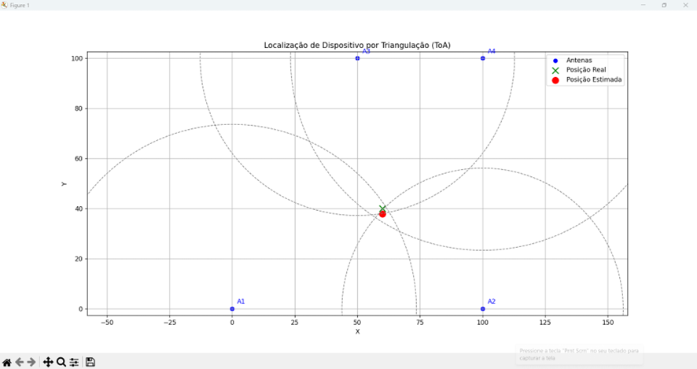

**Gráfico: Localização de Dispositivo Móvel por Otimização (ToA)**
- **Eixo X:** Coordenada X (metros)
- **Eixo Y:** Coordenada Y (metros)
- **Título do Gráfico:** Localização de Dispositivo Móvel por Otimização (ToA)
- **Legendas dos Pontos:**
  - Antenas Base: Representadas por triângulos azuis (^). Indicam as posições conhecidas das estações base que medem o sinal.
  - Posição Real: Representada por um 'X' verde. Indica a verdadeira localização do dispositivo móvel (usada para comparação).
  - Posição Estimada (Otimizada): Representada por um asterisco vermelho (*). Indica a localização do dispositivo móvel calculada pelo algoritmo de otimização.
- **Elementos Adicionais no Gráfico (sem legenda explícita, mas visualmente presentes):**
  - Círculos Cinzas Tracejados: Representam as distâncias medidas a partir de cada antena. Devido ao ruído, eles não se intersectam perfeitamente em um único ponto. 

---

### 9.4.3. Resumo

Neste assunto sobre Modelagem Matemática Simples introduzimos, uma habilidade essencial para traduzir desafios de engenharia em problemas computacionais. Começamos revisitando a resolução de equações algébricas e sistemas lineares, reforçando sua aplicação em balanços e introduzindo a poderosa técnica de ajuste de dados por mínimos quadrados para inferir parâmetros de modelos a partir de dados experimentais, como vimos na determinação da constante de velocidade de uma reação química. Em seguida, avançamos para as equações diferenciais ordinárias (EDOs), compreendendo como elas descrevem o comportamento dinâmico de sistemas e como SCI_PY nos permite simular a evolução de processos como a descarga de tanques e a dinâmica de reatores.
O ponto alto deste módulo foi a exploração da Otimização de funções com **scipy.optimize**, onde aprendemos a encontrar os melhores valores para variáveis de projeto ou operação, seja para minimizar custos ou maximizar desempenho. Os dois exercícios práticos ilustraram vividamente essa capacidade:

1. Na **Otimização da Área de um Trocador de Calor**, aplicamos a otimização para encontrar a área que minimizava o custo total de um equipamento industrial, demonstrando como a matemática pode guiar decisões de projeto econômicas.
2. Na **Localização de Dispositivo Móvel por Triangulação (ToA)** e Otimização, enfrentamos um problema complexo de telecomunicações. Transformamos a localização de um celular, com medições ruidosas de distância, em um problema de otimização de mínimos quadrados não lineares. Utilizamos **scipy.optimize.minimize** para estimar a posição mais provável, evidenciando a capacidade de Python para resolver desafios de engenharia do mundo real que envolvem incerteza e não linearidade.

Em suma, este módulo equipou você com as ferramentas para modelar sistemas estáticos e dinâmicos, analisar seu comportamento e, crucialmente, otimizar seus parâmetros para alcançar objetivos específicos. A capacidade de formular e resolver esses problemas computacionalmente é um diferencial fundamental para o engenheiro moderno.

---

## 9.5. Conclusão

Este módulo consolidou nossa jornada pela Modelagem Matemática, revelando-a como a linguagem essencial para decifrar e intervir em sistemas de engenharia. Aprofundamos a compreensão das equações diferenciais ordinárias (EDOs), reconhecendo-as como a ferramenta primária para descrever a dinâmica de processos, desde a variação de altura em tanques até a evolução de concentrações em reatores. Essa capacidade de simular o comportamento temporal de sistemas é crucial para prever e analisar cenários complexos.
O ponto culminante do módulo foi a exploração da Otimização de funções com **scipy.optimize**. Aprendemos a formular problemas de engenharia onde o objetivo é encontrar as condições ideais para maximizar desempenho ou minimizar custos. Dois exemplos práticos ilustraram a versatilidade dessa abordagem: otimizamos a área de um trocador de calor para alcançar o menor custo total, demonstrando a aplicação da otimização em decisões de projeto e economia. Em um desafio de telecomunicações, utilizamos a otimização para estimar a localização de um dispositivo móvel por triangulação, superando as imprecisões inerentes às medições do mundo real e evidenciando a capacidade de Python para resolver problemas complexos e ruidosos.
Em síntese, o módulo equipou o engenheiro com as ferramentas para traduzir fenômenos físicos em modelos computacionais, simular sua evolução e, fundamentalmente, otimizar seus parâmetros. Essa proficiência em modelagem e otimização computacional é um pilar para a inovação e a resolução eficaz de problemas em todas as disciplinas da engenharia.

---

# 11. Finalização e Agradecimentos

Chegamos ao final da nossa jornada pela apostila "Introdução à Programação Python Aplicada à Engenharia". Este percurso foi cuidadosamente desenhado para equipar você, engenheiro ou estudante de engenharia, com as ferramentas computacionais essenciais para enfrentar os desafios técnicos do mundo moderno.

Iniciamos com os **Fundamentos da Programação em Python**, estabelecendo uma base sólida de tipos de dados, operadores e interações básicas - os alicerces de qualquer código funcional. Em seguida, avançamos para as **Estruturas de Controle**, aprendendo a conduzir a lógica dos programas com estruturas condicionais e a automatizar tarefas repetitivas com laços de repetição, tornando nossos algoritmos mais inteligentes e eficientes.

Aprofundamos nosso conhecimento com **Funções e Modularização**, explorando o poder da organização e reutilização de código, práticas indispensáveis para projetos de engenharia de qualquer escala. Este conhecimento permitiu criar soluções mais elegantes, com componentes específicos que podem ser facilmente testados e mantidos.

Com essa base estabelecida, mergulhamos na **Manipulação de Dados**, descobrindo as estruturas de dados nativas do Python como listas, tuplas e dicionários, e aprimorando técnicas de iteração e manipulação de informações. A capacidade de gerenciar e processar dados eficientemente é uma habilidade crítica para qualquer problema de engenharia.

Nossa jornada continuou com o estudo de **Arquivos e Dados**, ampliada pela introdução ao **Pandas**, uma biblioteca revolucionária para processar e analisar dados tabulares de forma robusta e eficiente. Aprendemos a carregar, limpar, transformar e extrair insights de conjuntos de dados, competências fundamentais na era da informação.

A **Visualização de Dados** com Matplotlib e Seaborn transformou números brutos em representações visuais claras e impactantes, permitindo a comunicação eficaz de tendências, distribuições e relações em diversos contextos de engenharia - desde simulações de trajetórias até análises de qualidade em processos industriais.

O coração matemático de nossa jornada foi o **Cálculo Numérico com NumPy**, onde dominamos arrays, operações vetoriais, matrizes e álgebra linear - ferramentas cruciais para resolver sistemas complexos e otimizar cálculos. Estas habilidades são essenciais para diversas aplicações, da análise estrutural à modelagem de sistemas dinâmicos.

Finalmente, a **Modelagem Matemática com SciPy** nos capacitou a descrever e simular o comportamento dinâmico de sistemas através de Equações Diferenciais Ordinárias (EDOs) e a resolver problemas de otimização, como a calibração de sensores e a identificação de parâmetros em modelos experimentais.

O ponto culminante foi a aplicação integrada de todos esses conhecimentos nos **Mini Projetos Aplicados à Engenharia**. Neles, você combinou cada conceito — da lógica de programação à visualização, do cálculo numérico à modelagem e otimização — para construir soluções práticas e completas para problemas reais de engenharia.

Ao concluir esta apostila, você não apenas compreende os principais conceitos da linguagem Python, mas está preparado para resolver problemas matemáticos complexos, modelar e simular sistemas físicos, analisar dados experimentais, e desenvolver soluções computacionais estruturadas para desafios reais da engenharia. O Python, com seu poderoso ecossistema de bibliotecas científicas, torna-se uma ferramenta indispensável em sua caixa de habilidades, capacitando-o a inovar e tomar decisões mais fundamentadas em sua carreira.

Gostaríamos de expressar nossa profunda gratidão a todos que contribuíram para a realização deste material. Em especial, agradecemos à Develcode, empresa de consultoria especializada em soluções de tecnologia, cujo apoio e expertise foram fundamentais para a concepção, desenvolvimento e aprimoramento desta apostila. A visão da Develcode em integrar a programação Python aos fluxos de trabalho de engenharia inspirou muitos dos exemplos práticos e mini projetos apresentados. Seu compromisso com a inovação e a educação técnica é verdadeiramente inspirador.

Esperamos que esta apostila sirva como um guia valioso em sua jornada contínua de aprendizado e aplicação da programação em Python no campo da engenharia. Que você continue explorando, experimentando e desenvolvendo soluções inovadoras para os desafios que encontrar. O futuro da engenharia é digital, e você está agora equipado para liderar essa transformação!

---

# 12. Configuração do Ambiente Python e VS Code

## 12.1. Configuração Rápida do Ambiente de Desenvolvimento

Esta seção fornece instruções concisas para configurar seu ambiente Python para engenharia.

### 12.1.1. Instalação do Python (Windows, MacOS, Linux)

Para começar a programar em Python, é necessário instalar o interpretador Python e as bibliotecas essenciais.
A seguir, apresentamos instruções para instalação em diferentes sistemas operacionais.

**Para Windows:**

Baixe o instalador da página oficial do Python
Execute o instalador e marque "Add Python to PATH"
Clique em "Install Now"

**Para MacOS:**
Instale o Homebrew (se não tiver):

```bash
# Usando Homebrew
brew install python
```

**Para Linux:**

```bash
# Debian/Ubuntu
sudo apt update && sudo apt install python3 python3-pip

# Fedora/RHEL
sudo dnf install python3 python3-pip
```

### 12.1.2. Instalação de bibliotecas essenciais: numpy, pandas, matplotlib, scipy, seaborn

```
# Instale todas as bibliotecas necessárias de uma vez
pip install numpy pandas matplotlib scipy seaborn
```

### 12.1.3. - Testando a instalação do Python e das bibliotecas

1. Crie um novo arquivo com extensão .py
2. Insira o código de teste:

```python
import numpy as np
import matplotlib.pyplot as plt

# Dados de exemplo
x = np.linspace(0, 10, 100)
y = np.sin(x)

# Criar gráfico
plt.plot(x, y)
plt.title("Teste de Configuração")
plt.show()

print("Ambiente configurado com sucesso!")
```
3. Execute o arquivo:
   - Pressione F5 ou clique em "Run" no menu superior

Se o gráfico aparecer e a mensagem for exibida, sua configuração está pronta para os exercícios da apostila.

## 12.2. Visual Studio Code (VS Code)

1. Baixe e instale o VS Code da página oficial
2. Abra o VS Code e instale a extensão Python:
   - Pressione Ctrl+Shift+X
   - Pesquise "Python"
   - Instale a extensão oficial da Microsoft
3. Configure o interpretador:
   - Pressione Ctrl+Shift+P
   - Digite "Python: Select Interpreter"
   - Selecione o interpretador Python instalado

---

# 13. Referências Bibliográficas

- BEAZLEY, D. M.; JONES, P. K. Python Cookbook. 3rd ed. Sebastopol: O'Reilly Media, 2013.
- BELL, J. A.; DRISCOLL, J. F. Introduction to Python for Econometrics, Statistics and Data Analysis. 2nd ed. Cambridge: Cambridge University Press, 2018.
- BROWN, D. Python for Engineers: A Beginner's Guide to Programming in Python. 1st ed. New York: Springer, 2020.
- CHAPRA, S. C.; CANALE, R. P. Métodos numéricos para engenharia. 7. ed. Porto Alegre: AMGH, 2016.
- LANGTANGEN, H. P. A Primer on Scientific Programming with Python. 5th ed. Berlin: Springer, 2016.
- LOPES, G. D. D.; FORBELLONE, A. L. V. Lógica de programação: a construção de algoritmos e estruturas de dados. 3. ed. São Paulo: Pearson Prentice Hall, 2005.
- MCKINNEY, W. Python for data analysis. Sebastopol: O'Reilly Media, 2012.
- OLIPHANT, T. E. A guide to NumPy. USA: Trelgol Publishing, 2006.
