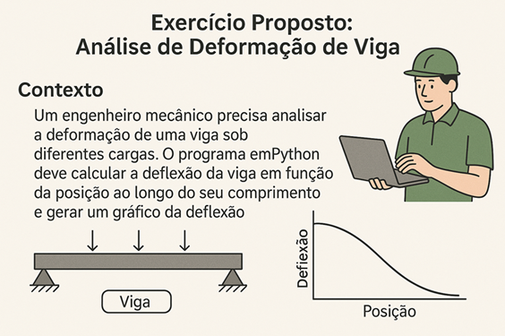

---


---


---

### Título: Introdução à Programação Python Aplicada à Engenharia

### Sumário

1. [Apresentação](#1-apresentação)
2. [Fundamentos da Programação em Python](#2-fundamentos-da-programação-em-python)
    - [2.1. Tipos de dados (INT, FLOAT, STR, BOOL)](#21-tipos-de-dados-em-python)
    - [2.2. Operadores aritméticos e lógicos](#22-operadores-aritméticos-e-lógicos-em-python)
    - [2.3. Entrada e saída de dados](#23-entrada-e-saída-de-dados)
    - [2.4. Primeiros cálculos aplicados à engenharia](#24-primeiros-cálculos-aplicados-à-engenharia)
    - [2.5. Conclusão](#25-conclusão)
3. [Estruturas de Controle](#3-estruturas-de-controle)
    - [3.1. Condicionais: IF, ELIF, ELSE](#31-condicionais-if-elif-else)
    - [3.2. Laços de repetição: FOR, WHILE](#32-laços-de-repetição-for-while)
    - [3.3. Aplicações práticas em verificação de condições operacionais](#33-aplicações-práticas-em-verificação-de-condições-operacionais)
    - [3.4. Conclusão](#34-conclusão)
4. [Funções e Modularização](#4-funções-e-modularização)
    - [4.1. Definição de funções](#41-definição-de-funções)
    - [4.2. Parâmetros e retorno](#42-parâmetros-e-retorno)
    - [4.3. Organização de código em módulos reutilizáveis](#43-organização-de-código-em-módulos-reutilizáveis)
    - [4.4. Conclusão](#44-conclusão)
5. [Estruturas de Dados](#5-estruturas-de-dados)
    - [5.1. Listas, tuplas e dicionários](#51-listas-tuplas-e-dicionários)
    - [5.2. Iteração e manipulação de dados](#52-iteração-e-manipulação-de-dados)
    - [5.3. Aplicações em vetores de parâmetros de processo](#53-aplicações-em-vetores-de-parâmetros-de-processo)
    - [5.4. Conclusão](#54-conclusão)
6. [Manipulação de Arquivos e Dados](#6-manipulação-de-arquivos-e-dados)
    - [6.1. Leitura e escrita de arquivos .txt e .csv](#61-leitura-e-escrita-de-arquivos-txt-e-csv)
    - [6.2. Introdução ao PANDAS](#62-introdução-ao-pandas)
    - [6.3. Análise de dados experimentais e de simulações](#63-análise-de-dados-experimentais-e-de-simulações)
    - [6.4. Conclusão](#64-conclusão)
7. [Visualização de Dados](#7-visualização-de-dados)
    - [7.1. MAT_PLOT_LIB e SEABORN](#71-mat_plot_lib-e-seaborn)
    - [7.2. Gráficos de linha, barras, dispersão e histogramas](#72-gráficos-de-linha-barras-dispersão-e-histogramas)
    - [7.3. Visualização de curvas e resultados de processos](#73-visualização-de-curvas-e-resultados-de-processos)
    - [7.4. Conclusão](#74-conclusão)
8. [Cálculo Numérico com NUM_PY](#8-cálculo-numérico-com-num_py)
    - [8.1. Arrays e operações vetoriais](#81-arrays-e-operações-vetoriais)
    - [8.2. Matrizes e álgebra linear](#82-matrizes-e-álgebra-linear)
    - [8.3. Aplicações em balanços e sistemas lineares](#83-aplicações-em-balanços-e-sistemas-lineares)
    - [8.4. Conclusão](#84-conclusão)
9. [Modelagem Matemática Simples](#9-modelagem-matemática-simples)
    - [9.1. Equações algébricas e sistemas lineares](#91-equações-algébricas-e-sistemas-lineares)
    - [9.2. Equações diferenciais ordinárias (EDOs)](#92-equações-diferenciais-ordinárias-edos)
    - [9.3. Simulações de tanques, reatores e processos dinâmicos](#93-simulações-de-tanques-reatores-e-processos-dinâmicos)
    - [9.4. Otimização de funções com scipy.optimize](#94-otimização-de-funções-com-scipyoptimize)
    - [9.5. Conclusão](#95-conclusão)
10. [Mini Projetos Aplicados à Engenharia](#10-mini-projetos-aplicados-à-engenharia)
    - [10.1. Estudo de caso: tanque com entrada e saída](#101-estudo-de-caso-tanque-com-entrada-e-saída)
    - [10.2. Balanço de massa e energia com dados reais ou simulados](#102-balanço-de-massa-e-energia-com-dados-reais-ou-simulados)
    - [10.3. Integração de módulos anteriores em soluções prática](#103-integração-de-módulos-anteriores-em-soluções-prática)
    - [10.4. Conclusão](#104-conclusão)
11. [Finalização e Agradecimentos](#11-finalização-e-agradecimentos)
12. [Adendo: Configuração do Ambiente Python e VS Code](#12-adendo-configuração-do-ambiente-python-e-vs-code)
13. [Referências Bibliográficas](#13-referências-bibliográficas)

---

### 1. Apresentação

A presente apostila tem como objetivo introduzir os conceitos fundamentais de programação em linguagem Python com foco na aplicação em problemas práticos de engenharia. Python é uma linguagem moderna, acessível e amplamente adotada nas áreas de ciência, tecnologia e automação de processos industriais. Seu ecossistema rico em bibliotecas permite que engenheiros realizem desde simples análises numéricas até simulações e otimizações complexas com rapidez e precisão.
O conteúdo foi organizado em módulos progressivos, partindo dos fundamentos da programação até aplicações reais por meio de projetos. A ideia é desenvolver a lógica de programação, incentivar a experimentação e fortalecer a capacidade de modelar problemas de engenharia utilizando ferramentas computacionais.

Ao final, o leitor será capaz de:

- Compreender os principais conceitos da linguagem Python.
- Resolver problemas matemáticos aplicados à engenharia com auxílio de bibliotecas como NUM_PY, PANDAS, MAT_PLOT_LIB e SCI_PY.
- Modelar, simular e visualizar sistemas físicos e processos.
- Desenvolver soluções computacionais práticas com uma abordagem estruturada.

Esta apostila é indicada para estudantes de cursos técnicos e superiores em engenharia e áreas afins, bem como profissionais que desejam iniciar no uso da programação para aplicações técnicas.

Boa leitura e bons estudos!

- Christian V. Uhdre Mulato
- Engenheiro Químico e Desenvolvedor de Sistemas

Campo Largo – PR

---

### 2. Fundamentos da Programação em Python

Este primeiro módulo tem como objetivo estabelecer uma base sólida em programação Python, essencial para todas as aplicações que veremos ao longo desta apostila. Dominar os fundamentos da linguagem é crucial para compreender e desenvolver soluções computacionais eficazes para problemas de engenharia.
Neste módulo, vamos explorar os tipos de dados fundamentais em Python, como números inteiros (INT), números de ponto flutuante (FLOAT), cadeias de caracteres (STR) e valores booleanos (BOOL). Entender como representar e manipular esses diferentes tipos de dados é o primeiro passo para realizar cálculos e processar informações em Python.
Além disso, abordaremos os operadores aritméticos e lógicos, que nos permitem realizar operações matemáticas e tomar decisões lógicas dentro dos nossos programas. A capacidade de realizar cálculos e avaliar condições é fundamental para resolver problemas de engenharia, desde a análise de dados experimentais até a modelagem de sistemas físicos.
Finalmente, introduziremos os conceitos de entrada e saída de dados, ensinando como interagir com o usuário e como ler e escrever informações. Também daremos os primeiros passos na aplicação desses conhecimentos em cálculos simples voltados para a engenharia, preparando o terreno para problemas mais complexos nos módulos seguintes.
Ao concluir estes módulos, você estará apto a escrever programas Python simples, mas poderosos, que podem realizar cálculos, manipular dados e interagir com o mundo exterior, lançando as bases para sua jornada na programação aplicada à engenharia.

---

### 2.1. Tipos de Dados em Python

Em Python, assim como em outras linguagens de programação, os dados são classificados em diferentes tipos. Cada tipo de dado possui características e comportamentos específicos, o que permite ao computador interpretar e manipular as informações corretamente. Nesta seção, vamos explorar os quatro tipos de dados fundamentais: inteiros (INT), números de ponto flutuante (FLOAT), cadeias de caracteres (STR) e booleanos (BOOL). 

### 2.1.1. Inteiros (INT)

O tipo de dado int representa números inteiros, ou seja, números que não possuem parte decimal. Eles podem ser positivos, negativos ou zero. 

Exemplos em engenharia: 

- Número de peças em um sistema: numero_pecas = 150
- Quantidade de andares de um edifício: andares = 12
- Número de iterações em um cálculo: iteracoes = 1000

### 2.1.2. Números de Ponto Flutuante (FLOAT)

O tipo de dado float representa números reais, ou seja, números que podem possuir uma parte decimal. 

• Exemplos em engenharia:

- Aceleração da gravidade: gravidade = 9.81 (m/s²)
- Tensão em um circuito elétrico: tensao = 220.5 (V)
- Coeficiente de atrito: atrito = 0.25
- Vazão de um fluido: vazao = 2.75 (m³/s)

### 2.1.3. Cadeias de Caracteres (STR)

O tipo de dado str representa texto, ou seja, uma sequência de caracteres. As cadeias de caracteres são delimitadas por aspas simples (') ou aspas duplas (").

• Exemplos em engenharia: 

- Nome de um material: material = "Aço Carbono"
- Descrição de um componente: componente = "Válvula de Segurança"
- Unidade de medida: unidade = "MPa" (MegaPascal)
- Resultado de um ensaio: resultado_ensaio = "Aprovado"

### 2.1.4. Booleanos (BOOL)

O tipo de dado bool representa valores lógicos, ou seja, verdadeiro (True) ou falso (False). Eles são fundamentais para realizar testes condicionais e controlar o fluxo de execução de um programa.

• Exemplos em engenharia:

- Status de um sensor: sensor_ligado = True
- Verificação de um limite: temperatura_acima_limite = False
- Condição de falha: falha_detectada = False
- Estado de uma válvula: valvula_aberta = True

Compreender esses tipos de dados é essencial para escrever programas que manipulem informações de forma correta e eficiente em aplicações de engenharia.

### 2.1.5. Exemplo: Cálculo da Tensão em um Resistor

Imagine que você precisa calcular a tensão em um resistor usando a Lei de Ohm (V = I * R), onde:
• V é a tensão (em Volts)
• I é a corrente (em Amperes)
• R é a resistência (em Ohms)

Além disso, vamos verificar se a potência dissipada no resistor (P = V * I) excede um valor limite. 

**Código em Python:**
```python
# Definição das variáveis

# Corrente elétrica (float)
corrente = 2.0  # Amperes

# Resistência elétrica (float)
resistencia = 10.0  # Ohms

# Limite de potência (float)
potencia_limite = 20.0  # Watts

# Nome do resistor (string)
nome_resistor = "R1"

# Cálculo da tensão (float)
tensao = corrente * resistencia

# Cálculo da potência (float)
potencia = tensao * corrente

# Verificação da potência (bool)
potencia_excede_limite = potencia > potencia_limite

# Exibição dos resultados
print("Cálculo da Tensão e Potência em um Resistor")
print("------------------------------------------")
print("Nome do Resistor:", nome_resistor)
print("Corrente (A):", corrente)
print("Resistência (Ω):", resistencia)
print("Tensão (V):", tensao)
print("Potência (W):", potencia)
print("Potência excede o limite?", potencia_excede_limite)

# Conversão de tipo (demonstração)
# Converter a tensão para inteiro (truncando a parte decimal)
tensao_inteira = int(tensao)
print("Tensão (V, inteiro):", tensao_inteira)
```

**Como usar este código no Visual Studio Code:**

**1.	Abra o Visual Studio Code.**
**2.	Crie um arquivo** (Arquivo > Novo Arquivo) e salve-o com um nome como calculo_resistor.py. A extensão .py é importante para que o **VS Code** reconheça que é um arquivo Python.
**3.	Copie e cole o código** acima no arquivo.
**4.	Execute o código:**
- Você pode clicar com o botão direito na janela do editor e selecionar "Executar Python no Terminal".
- Ou você pode usar o atalho Ctrl+Shift+B (ou Cmd+Shift+B no MacOS) se você já tiver configurado uma "Build Task" para Python.
- Ou você pode abrir o terminal integrado do VS Code (Visualizar > Terminal) e digitar python calculo_resistor.py e pressionar Enter.
**5.	Observe a saída no terminal:** O programa irá imprimir os valores da tensão, potência e a verificação do limite.

**Explicação do Código:**

**Tipos de Dados:** O código demonstra claramente o uso de float para grandezas físicas como corrente, resistência, tensão e potência, str para o nome do resistor, e bool para o resultado da comparação da potência com o limite.
**Cálculos:** Realiza cálulos típicos de engenharia elétrica usando os operadores aritméticos * (multiplicação).
**Tomada de Decisão:** Utiliza uma expressão booleana (potencia > potencia_limite) para simular uma verificação de segurança ou especificação de projeto.
**Saída Formatada:** Imprime os resultados de forma clara e identificada, o que é crucial para a comunicação de resultados em engenharia.
**Conversão de Tipo:** A última parte (conversão para int) é um exemplo de como você pode converter um tipo de dado em outro. Note que, neste caso, a parte decimal da tensão é truncada.

Este exemplo prático mostra como os tipos de dados fundamentais são aplicados em um problema simples de engenharia, combinando cálculo, lógica e representação de informações do mundo real.

**Resultado:**

```plaintext
Cálculo da Tensão e Potência em um Resistor
Nome do Resistor: R1
Corrente (A): 2.0
Resistência (Ω): 10.0
Tensão (V): 20.0
Potência (W): 40.0
Potência excede o limite? True
Tensão (V, inteiro): 20
```
---

### 2.1.6. Exemplo: Simulação da Trajetória de um Projétil

Neste exemplo, vamos simular a trajetória de um projétil lançado sob um ângulo e com uma velocidade inicial, e gerar um gráfico da trajetória. Este exemplo combina física básica com a visualização de dados.

**Código em Python:**
```python
import matplotlib.pyplot as plt
import math

# Dados de entrada (tipos float e int)
velocidade_inicial = 20.0  # m/s
angulo_graus = 45       # graus
angulo_radianos = math.radians(angulo_graus) # conversão para radianos
gravidade = 9.81       # m/s²
tempo_total = (2 * velocidade_inicial * math.sin(angulo_radianos)) / gravidade

# Listas para armazenar os pontos da trajetória (listas de floats)
tempos = []
posicoes_x = []
posicoes_y = []

# Cálculo da trajetória
intervalo_tempo = 0.1  # segundos
tempo = 0.0

while tempo <= tempo_total:
    tempos.append(tempo)
    posicao_x = velocidade_inicial * math.cos(angulo_radianos) * tempo
    posicao_y = velocidade_inicial * math.sin(angulo_radianos) * tempo - 0.5 * gravidade * tempo**2
    posicoes_x.append(posicao_x)
    posicoes_y.append(posicao_y)
    tempo += intervalo_tempo

# Nome do projétil (string)
nome_projétil = "Projétil A"

# Geração do gráfico
plt.plot(posicoes_x, posicoes_y)
plt.title("Trajetória de um Projétil")
plt.xlabel("Distância Horizontal (m)")
plt.ylabel("Altura (m)")
plt.grid(True)

# Adicionando informações textuais ao gráfico
plt.text(0, max(posicoes_y) * 0.9, f"Velocidade Inicial: {velocidade_inicial} m/s", fontsize=9)
plt.text(0, max(posicoes_y) * 8, f"Ângulo: {angulo_graus} graus", fontsize=9)
plt.text(0, max(posicoes_y) * 0.7, nome_projétil, fontsize=12, color='red')

plt.show()

# Imprimindo informações relevantes (demonstração de uso de tipos)
print(f"Tempo total de voo: {tempo_total:.2f} s")  # Formatação de float
print(f"Tipo da variável 'nome_projétil': {type(nome_projétil)}") # Mostrando o tipo
print(f"A altura máxima atingida foi: {max(posicoes_y):.2f} m")
```
**Como usar este código no Visual Studio Code:**

1. **Abra o Visual Studio Code.**
2. **Crie um arquivo** e salve-o como trajetoria_projetil.py.
3. **Copie e cole o código** acima no arquivo.
4. **Certifique-se de ter o Matplotlib instalado.** Se não tiver, abra o terminal no VS Code e digite: pip install matplotlib e pressione Enter.
5. **Execute o código** da mesma forma que no exemplo anterior.
6. **Observe a saída:** Além da saída no terminal, uma janela com o gráfico da trajetória do projétil será exibida.

**Explicação do Código:**
    **Tipos de Dados:**
        **FLOAT:** Usado para velocidade, ângulo (em radianos), gravidade, tempo e as posições x e y.
        **INT:** Usado para o ângulo em graus.
        **STR:** Usado para o nome do projétil.
        **LIST:** Usado para armazenar sequências de valores de tempo, posições x e posições y. Listas são estruturas de dados que armazenam múltiplos valores do mesmo tipo (neste caso, float).
    **Cálculos:** O código realiza cálculos de física para determinar a trajetória do projétil, decompondo a velocidade inicial em componentes horizontal e vertical e usando as equações do movimento uniformemente variado.
    **Visualização:** A biblioteca matplotlib.pyplot é usada para criar o gráfico da trajetória. plt.plot() desenha a linha, plt.title(), plt.xlabel(), plt.ylabel() e plt.grid() definem o título, rótulos dos eixos e a grade do gráfico, respectivamente. plt.show() exibe o gráfico. plt.text() adiciona texto informativo ao gráfico.
    **Estruturas de Dados:** As listas tempos, posicoes_x e posicoes_y são usadas para armazenar múltiplos valores de dados, o que é essencial para plotar o gráfico.
    **Conversão de Tipo:** A função math.radians() converte o ângulo de graus para radianos, demonstrando a conversão entre tipos relacionados.
    **Formatação de Saída:** O uso de f-strings (strings formatadas) com especificadores de formatação (:.2f) permite controlar o número de casas decimais na saída. type() é usado para exibir o tipo de uma variável.

Este exemplo é mais complexo e demonstra como os tipos de dados são usados em conjunto com cálculos matemáticos e bibliotecas de visualização para resolver e apresentar um problema de engenharia de forma completa.

**Resultado:**


---

## 2.2. Operadores Aritméticos e Lógicos em Python

Em Python, operadores são símbolos especiais que realizam operações em valores (chamados de operandos). Eles são essenciais para realizar cálculos, comparações e manipular dados em geral. Nesta seção, vamos explorar os operadores aritméticos e lógicos, que são fundamentais para a programação em engenharia.

### 2.2.1. Operadores Aritméticos

**Código Python:**
```python
# Exemplo de uso de operadores aritméticos
a = 10
b = 5

soma = a + b
subtracao = a - b
multiplicacao = a * b
divisao = a / b

print("Soma:", soma)
print("Subtração:", subtracao)
print("Multiplicação:", multiplicacao)
print("Divisão:", divisao)
```

Os operadores aritméticos são usados para realizar operações matemáticas básicas.

**Adição (+):** Soma dois valores. 
        Exemplo: forca1 + forca2
 (soma de duas forças)

**Subtração (-):** Subtrai o segundo valor do primeiro. 
        Exemplo: temperatura_final - temperatura_inicial
 (variação de temperatura)

**Multiplicação (*):** Multiplica dois valores. 
        Exemplo: comprimento * largura
(área de uma superfície)

**Divisão (/):** Divide o primeiro valor pelo segundo (sempre retorna um FLOAT). 
        Exemplo: distancia / tempo
 (velocidade média)

**Divisão Inteira (//):** Divide o primeiro valor pelo segundo e retorna a parte inteira do resultado (truncando a parte decimal). 
        Exemplo: total_pecas // pecas_por_caixa
 (número de caixas completas)

**Módulo (%):** Retorna o resto da divisão do primeiro valor pelo segundo. 
        Exemplo: total_segundos % 60
 (obter os segundos restantes após dividir por 60)

**Exponenciação (**):** Eleva o primeiro valor à potência do segundo valor. 
        Exemplo: base ** altura

### 2.2.2. Operadores Lógicos

Os operadores lógicos são usados para combinar ou negar expressões lógicas (valores booleanos True ou False).

**AND (and):** Retorna True se ambas as expressões forem True. 
        Exemplo: temperatura > temperatura_minima and pressao < pressao_maxima
 (verificar se a temperatura está dentro da faixa e a pressão também)

**OR (or):** Retorna True se pelo menos uma das expressões for True. 
        Exemplo: nivel_tanque < nivel_minimo or valvula_emergencia_aberta
 (verificar se o nível do tanque está baixo ou a válvula de emergência está aberta)
 
**NOT (not):** Nega uma expressão (inverte seu valor lógico). 
        Exemplo: not sensor_ativado
 (verificar se o sensor não está ativado)

 ---

 ### 2.2.3. Exemplos Aplicados à Engenharia

**1) Cálculo da Área de um Retângulo:**

```python
comprimento = 10.5  # metros (float)
largura = 5.0     # metros (float)
area = comprimento * largura  # metros quadrados (float)
print("Área do retângulo:", area, "m²")
```

**Resultado:**
```plaintext
Área do retângulo: 52.5 m²
```
**2) Verificação de Condições de Segurança:**

```python
pressao = 250.0  # PSI (float)
temperatura = 120.0 # graus Celsius (float)
pressao_maxima = 240.0 # PSI (float)
temperatura_maxima = 110.0 # graus Celsius (float)

seguro = pressao <= pressao_maxima and temperatura <= temperatura_maxima # bool

print("Condições de operação seguras:", seguro)
```
**Resultado:**
```plaintext
Condições de operação seguras: False
```
**3) Cálculo de Força Resultante:**
```python
massa = 5.0  # kg (float)
aceleracao = 9.8  # m/s² (float)
forca_resultante = massa * aceleracao  # N (float)
print("Força resultante:", forca_resultante, "N")
```
**Resultado:**
```plaintext
Força resultante: 49.0 N
```

Este texto fornece uma base sólida sobre operadores aritméticos e lógicos, juntamente com exemplos práticos de como eles são usados em contextos de engenharia.

---

### 2.2.4. Exercício Proposto:

**Cálculo de Área e Perímetro de um Terreno e Verificação de Viabilidade**

**Descrição:**

Um engenheiro civil precisa desenvolver um programa em Python para auxiliar no cálculo da área e perímetro de um terreno retangular e verificar se ele atende a certos critérios de viabilidade para construção.

**Requisitos:**

1. **Entrada de Dados:**
        - O programa deve solicitar ao usuário que insira o comprimento e a largura do terreno em metros.
        - O programa deve solicitar ao usuário a área mínima permitida para construção no local.
2. **Cálculos:**
        - Calcular a área do terreno (área = comprimento * largura).
        - Calcular o perímetro do terreno (perímetro = 2 * (comprimento + largura)).
3. **Verificação de Viabilidade:**
        - Verificar se a área do terreno é maior ou igual à área mínima permitida para construção.
        - Verificar se o perímetro do terreno é menor que um valor máximo (por exemplo, 100 metros - este valor pode ser fixo no programa).
4. **Saída de Dados:**
        - Exibir a área e o perímetro do terreno com duas casas decimais.
        - Exibir uma mensagem indicando se o terreno é viável para construção, com base nos critérios de área e perímetro.

**Exemplo de Interação:**
```plaintext
Digite o comprimento do terreno (m): 50
Digite a largura do terreno (m): 30
Digite a área mínima permitida para construção (m²): 1000
Área do terreno: 1500.00 m²
Perímetro do terreno: 160.00 m
Terreno viável para construção: Sim
```

**Dicas:**
    - Use os tipos de dados FLOAT para representar as medidas do terreno e a área mínima.
    - Use os operadores aritméticos *, + e \ para realizar os cálculos.
    - Use os operadores lógicos >= e < e o operador and para realizar as verificações de viabilidade.
    - Use a função input() para obter os dados do usuário.
    - Use a função print() para exibir os resultados.
    - Use f-strings para formatar a saída com duas casas decimais.

**Código Python de Exemplo:**
```python
# Solicitar entrada do usuário
comprimento = float(input("Digite o comprimento do terreno (m): "))
largura = float(input("Digite a largura do terreno (m): "))
area_minima = float(input("Digite a área mínima permitida para construção (m²): "))

# Calcular área e perímetro
area = comprimento * largura
perimetro = 2 * (comprimento + largura)

# Verificar viabilidade
viavel = area >= area_minima and perimetro < 100

# Exibir resultados
print(f"Área do terreno: {area:.2f} m²")
print(f"Perímetro do terreno: {perimetro:.2f} m")
print(f"Terreno viável para construção: {'Sim' if viavel else 'Não'}")
```
**Resultado:**
```plaintext
Área do terreno: 1500.00 m²
Perímetro do terreno: 160.00 m
Terreno viável para construção: Sim
```

Este exercício combina o uso de tipos de dados, operadores aritméticos e lógicos em um contexto prático de engenharia civil, proporcionando uma aplicação mais completa dos conceitos aprendidos.

---

### 2.2.5. Exercício Proposto: Análise da Deformação de uma Viga

**Descrição:**

Um engenheiro mecânico precisa analisar a deformação de uma viga sob diferentes cargas. O programa em Python deve calcular a deflexão da viga em função da posição ao longo do seu comprimento e gerar um gráfico da deflexão.

**Requisitos:**

1. **Entrada de Dados:**

- O programa deve solicitar ao usuário que insira o comprimento da viga (L) em metros.
- O programa deve solicitar ao usuário o módulo de elasticidade do material da viga (E) em Pascal (Pa).
- O programa deve solicitar ao usuário o momento de inércia da seção transversal da viga (I) em m⁴.
- O programa deve solicitar ao usuário o tipo de carregamento (1 para carga uniforme, 2 para carga pontual no meio).
- Se o carregamento for uniforme, solicitar a intensidade da carga (w) em N/m.
- Se o carregamento for pontual, solicitar a magnitude da carga (P) em N.

2. **Cálculos:**

   - Calcular a deflexão (y) da viga em função da posição (x) ao longo do comprimento, usando as seguintes fórmulas:

    - Deflexão para Carga Uniforme:

    y = (w / (24 * E * I)) * (-x⁴ + 2 * L * x³ - L³ * x)
        
    - Deflexão para Carga Pontual:

        • Para 0 ≤ x ≤ L/2:
        
    y = (P * x / (48 * E * I)) * (3 * L² - 4 * x²)

        • Para L/2 < x ≤ L:

    y = (P * (L - x) / (48 * E * I)) * (3 * L² - 4 * (L - x)²)

Onde:

   - Deflexão para Carga Uniforme:
        
    y = (w / (24 * E * I)) * (-x⁴ + 2 * L * x³ - L³ * x)
        
    - Deflexão para Carga Pontual:
        
        • Para 0 ≤ x ≤ L/2:
      
    y = (P * x / (48 * E * I)) * (3 * L² - 4 * x²)

        • Para L/2 < x ≤ L:

    y = (P * (L - x) / (48 * E * I)) * (3 * L² - 4 * (L - x)²)

Onde:
   y = Deflexão da viga
   x = Posição ao longo do comprimento da viga
   w = Intensidade da carga uniforme
   P = Magnitude da carga pontual
   L = Comprimento da viga
   E = Módulo de elasticidade
   I = Momento de inércia

3. **Geração do Gráfico:**

Usar a biblioteca MAT_PLOT_LIB para gerar um gráfico da deflexão (y) em função da posição (x).
O gráfico deve ter título, rótulos nos eixos e grade.

4. **Saída de Dados:**

    - Exibir os valores de entrada (L, E, I, w ou P).
    - Exibir o valor máximo da deflexão.
    - Salvar o gráfico em um arquivo PNG.



**Exemplo de Interação:**


**Código em Python:**
```python
import matplotlib.pyplot as plt

# Entrada de dados
L = float(input("Digite o comprimento da viga (m): "))
E = float(input("Digite o módulo de elasticidade (Pa): "))
I = float(input("Digite o momento de inércia (m^4): "))
tipo_carregamento = int(input("Digite o tipo de carregamento (1-Uniforme, 2-Pontual): "))

if tipo_carregamento == 1:
    w = float(input("Digite a intensidade da carga uniforme (N/m): "))
    P = 0  # Apenas para manter a consistência das variáveis
elif tipo_carregamento == 2:
    P = float(input("Digite a magnitude da carga pontual (N): "))
    w = 0  # Apenas para manter a consistência das variáveis
else:
    print("Tipo de carregamento inválido.")
    exit()

# Cálculo da deflexão
num_pontos = 100  # Número de pontos para calcular a deflexão
x_valores = [i * L / num_pontos for i in range(num_pontos + 1)]  # Lista de posições x
y_valores = []  # Lista para armazenar os valores de deflexão

for x in x_valores:
    if tipo_carregamento == 1:
        y = (w / (24 * E * I)) * (-x**4 + 2 * L * x**3 - L**3 * x)
    elif tipo_carregamento == 2:
        if 0 <= x <= L / 2:
            y = (P * x / (48 * E * I)) * (3 * L**2 - 4 * x**2)
        else:
            y = (P * (L - x) / (48 * E * I)) * (3 * L**2 - 4 * (L - x)**2)
    y_valores.append(y)

# Geração do gráfico
plt.plot(x_valores, y_valores)
plt.title("Deflexão da Viga")
plt.xlabel("Posição (m)")
plt.ylabel("Deflexão (m)")
plt.grid(True)
plt.savefig("deflexao_viga.png")  # Salva o gráfico como PNG
plt.show()

# Saída de dados
print("\nComprimento da viga:", L, "m")
print("Módulo de elasticidade:", E, "Pa")
print("Momento de inércia:", I, "m^4")
if tipo_carregamento == 1:
    print("Carga uniforme:", w, "N/m")
elif tipo_carregamento == 2:
    print("Carga pontual:", P, "N")
print("Deflexão máxima:", max(y_valores), "m")
print("Gráfico da deflexão salvo como deflexao_viga.png")
```

**Resultado:**
```plaintext
Digite o comprimento da viga (m): 5
Digite o módulo de elasticidade (Pa): 200000000000
Digite o momento de inércia (m^4): 0.0001
Digite o tipo de carregamento (1-Uniforme, 2-Pontual): 1
Digite a intensidade da carga (N/m): 1000
Deflexão máxima da viga: 0.01042 m
Gráfico da deflexão salvo como deflexao_viga.png
```
**Gráfico:**
 


Este exercício é mais completo e envolve:
- Entrada de dados variados (comprimento, propriedades do material, tipo e intensidade de carregamento).
- Cálculos condicionais (usando IF e ELIF) para aplicar a fórmula correta de deflexão.
- Uso de listas para armazenar múltiplos valores de X e Y para plotagem.
- Geração de um gráfico com MAT_PLOT_LIB para visualizar a deformação da viga.
- Saída formatada dos resultados.

Este tipo de problema é representativo de análises comuns em engenharia mecânica e demonstra a utilidade da programação para resolver problemas complexos e visualizar resultados

---

### 2.2.6. Curiosidade – Mecânica dos Sólidos

No exemplo do cálculo da deflexão da viga, a teoria física aplicada é a da **Mecânica dos Sólidos**, especificamente a **Teoria da Elasticidade Linear** para vigas. As fórmulas utilizadas derivam das equações da linha elástica, que descrevem o comportamento de vigas sob flexão.

**Fórmulas e Teoria Detalhada:**

1.	**Deflexão para Carga Uniforme:**

**Fórmula:**
    y = (w / (24 * E * I)) * (-x⁴ + 2 * L * x³ - L³ * x)

**Teoria:**
- Esta fórmula é derivada da equação diferencial da linha elástica para uma viga submetida a uma carga uniformemente distribuída.
- A equação da linha elástica relaciona a curvatura da viga com o momento fletor interno.
- As suposições incluem que o material da viga é linearmente elástico, homogêneo e isotrópico, e que as deflexões são pequenas em comparação com o comprimento da viga.

2.	**Deflexão para Carga Pontual:**

**Fórmula:**
    Para 0 <= x <= L/2:

    y = (P * x / (48 * E * I)) * (3 * L² - 4 * x²)

    Para L/2 < x <= L:
    y = (P * (L - x) / (48 * E * I)) * (3 * L² - 4 * (L - x)²)

**Teoria:**
- Estas fórmulas são derivadas da equação da linha elástica para uma viga com uma carga concentrada aplicada no meio do vão.
- Existem duas equações porque o comportamento da viga é diferente à esquerda e à direita da carga pontual.
- As mesmas suposições da teoria da carga uniforme se aplicam aqui.

Onde:
    y = Deflexão da viga (deslocamento vertical)
    x = Posição ao longo do comprimento da viga
    L = Comprimento total da viga
    E = Módulo de elasticidade do material (resistência do material à deformação elástica)
    I = Momento de inércia da seção transversal da viga (resistência da seção da viga à flexão)
    w = Intensidade da carga uniforme (força por unidade de comprimento)
    P = Magnitude da carga pontual (força concentrada)

**Importância na Engenharia:**

Essas fórmulas e a teoria da flexão de vigas são fundamentais na engenharia estrutural e mecânica. Engenheiros usam esses princípios para:

    - Dimensionar vigas: Determinar as dimensões e o material de uma viga para suportar cargas com segurança e dentro de limites aceitáveis de deflexão.
    - Analisar estruturas: Calcular as tensões e deformações em estruturas que contêm vigas.
    - Projetar máquinas: Garantir que os componentes de máquinas que atuam como vigas (eixos, suportes etc.) funcionem corretamente.

Compreender a teoria por trás das fórmulas é crucial para aplicar corretamente os resultados dos cálculos e garantir a segurança e a eficiência dos projetos de engenharia.

---


